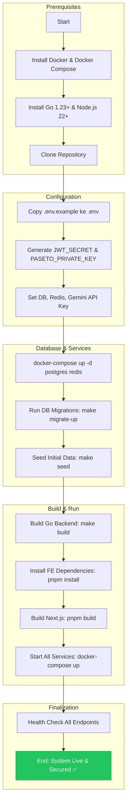
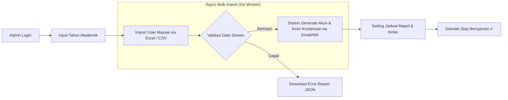
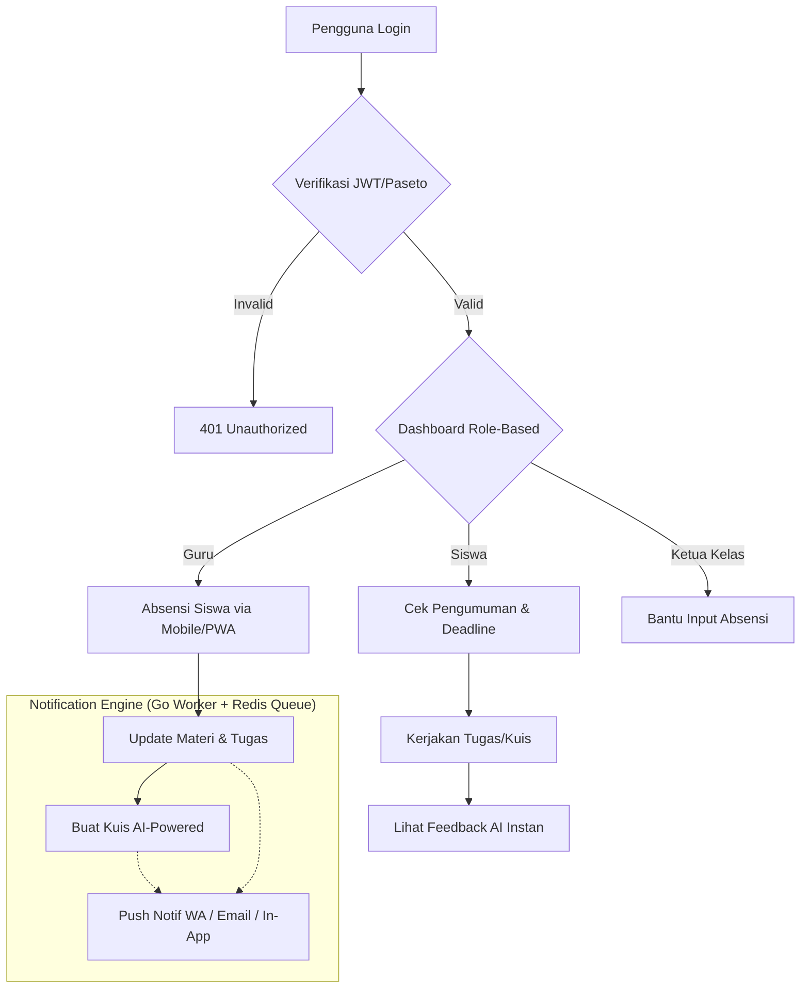
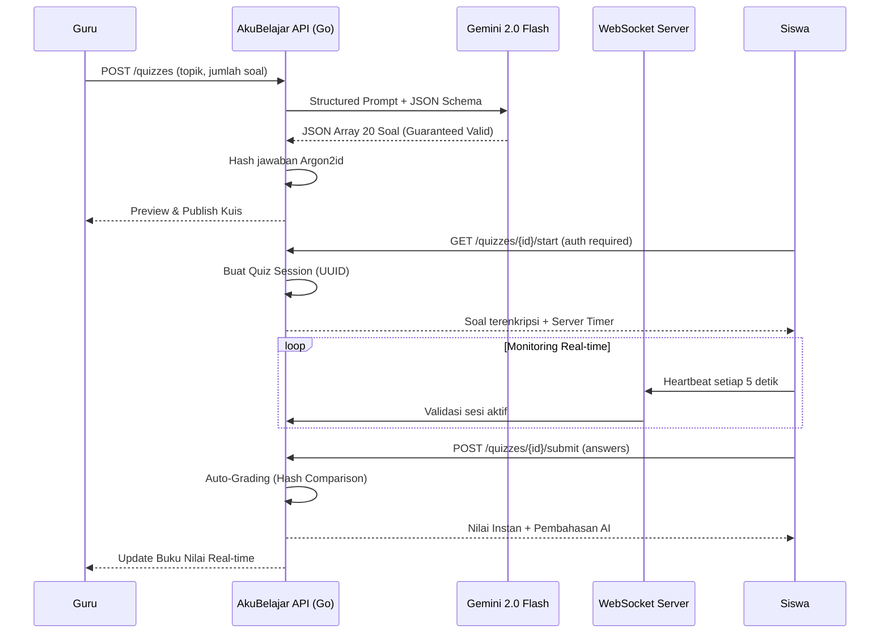
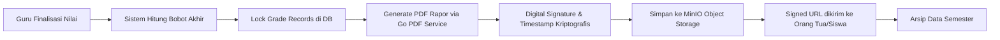

# JURNAL TEKNIS & DOKUMENTASI SISTEM AKUBELAJAR
## Platform Edukasi Digital Generasi Berikutnya — AI-First, Cross-Platform, Enterprise-Grade Security

**Oleh:** Kazanaru  
**Tanggal:** 21 Maret 2026  
**Status:** MVP v2.0.0 (Production Ready)  
**Lisensi:** MIT  
**Tech Stack:** Next.js 15 | TypeScript 5+ | Golang 1.23+ | PostgreSQL 16+ | Redis 7+ | Docker

---

## DAFTAR ISI
1. [PENDAHULUAN](#1-pendahuluan)
2. [ANALISIS PERMASALAHAN & STUDI KASUS](#2-analisis-permasalahan--studi-kasus)
3. [SOLUSI STRATEGIS AKUBELAJAR](#3-solusi-strategis-akubelajar)
4. [ARSITEKTUR SISTEM & TEKNOLOGI DEEP-DIVE](#4-arsitektur-sistem--teknologi-deep-dive)
5. [DATABASE SCHEMA & DATA INTEGRITY](#5-database-schema--data-integrity)
6. [MATRIKS PERAN (ROLES) & OTORISASI](#6-matriks-peran-roles--otorisasi)
7. [MASTER WORKFLOW: DARI INSTALASI HINGGA OPERASIONAL](#7-master-workflow-dari-instalasi-hingga-operasional)
8. [SMART ACADEMY: IMPLEMENTASI AI & LOGIKA BISNIS](#8-smart-academy-implementasi-ai--logika-bisnis)
9. [BEDAH FITUR UNGGULAN (FEATURE SHOWCASE)](#9-bedah-fitur-unggulan-feature-showcase)
10. [FRONTEND ENGINEERING: NEXT.JS & UX PHILOSOPHY](#10-frontend-engineering-nextjs--ux-philosophy)
11. [PROTOKOL KEAMANAN & PRIVASI (CYBER SECURITY)](#11-protokol-keamanan--privasi-cyber-security)
12. [PANDUAN DEPLOYMENT & SCALING](#12-panduan-deployment--scaling)
13. [ANALISIS EKONOMI & EFISIENSI](#13-analisis-ekonomi--efisiensi)
14. [STUDI KASUS: PENGGUNAAN AKUBELAJAR DI SEKOLAH MENENGAH](#14-studi-kasus-penggunaan-akubelajar-di-sekolah-menengah)
15. [ROADMAP PENGEMBANGAN JANGKA PANJANG](#15-roadmap-pengembangan-jangka-panjang)
16. [TROUBLESHOOTING & FAQ](#16-troubleshooting--faq)
17. [BEDAH KOMPONEN UI (SHADCN SYSTEM DESIGN)](#17-bedah-komponen-ui-shadcn-system-design)
18. [INTEGRASI NOTIFIKASI (MULTI-CHANNEL GATEWAY)](#18-integrasi-notifikasi-multi-channel-gateway)
19. [PROSES PENGEMBANGAN (DEVELOPMENT LIFECYCLE)](#19-proses-pengembangan-development-lifecycle)
20. [PANDUAN PEMELIHARAAN SISTEM (SYSTEM MAINTENANCE)](#20-panduan-pemeliharaan-sistem-system-maintenance)
21. [KUSTOMISASI TEMA (THEMING & BRANDING)](#21-kustomisasi-tema-theming--branding)
22. [LAMPIRAN A: REFERENSI DATABASE & SKEMA](#22-lampiran-a-referensi-database--skema)
23. [LAMPIRAN B: STANDAR PENGEMBANGAN (CODING STANDARDS)](#23-lampiran-b-standar-pengembangan-coding-standards)
24. [LAMPIRAN C: GLOSARIUM ISTILAH](#24-lampiran-c-glosarium-istilah)
25. [KESIMPULAN](#25-kesimpulan)
26. [KONTAK & KONTRIBUSI](#26-kontak--kontribusi)

---

## 1. PENDAHULUAN

**AkuBelajar** bukan sekadar aplikasi manajemen sekolah. Platform ini adalah ekosistem edukasi digital yang dirancang untuk era **"Zero Paper"**, **"AI-First"**, dan **"Mobile-Native"**. Lahir dari kebutuhan nyata institusi pendidikan di Indonesia yang masih bergulat dengan fragmentasi data, keamanan rentan, dan aksesibilitas terbatas, AkuBelajar hadir sebagai jawaban komprehensif berbasis teknologi modern kelas dunia.

Dengan menggantikan tumpukan teknologi monolitik lama ke arsitektur **microservices modern** berbasis Next.js + TypeScript di sisi frontend dan Golang di sisi backend, AkuBelajar mampu melayani puluhan ribu pengguna secara bersamaan dengan latensi di bawah 100ms dan uptime 99.9%.

### 1.1 Visi Proyek

> *"Membebaskan setiap guru dari pekerjaan administratif yang berulang, sehingga energi mereka dapat sepenuhnya dicurahkan untuk mendidik, membimbing, dan menginspirasi generasi penerus bangsa."*

AkuBelajar percaya bahwa teknologi yang benar-benar baik adalah teknologi yang **tidak terasa** — ia bekerja di balik layar, membuat segalanya lebih mudah tanpa menambah beban baru.

### 1.2 Filosofi Desain: "Seamless by Default"

AkuBelajar mengadopsi pendekatan **Design System** berbasis Shadcn UI + Radix UI dengan prinsip:

- **Mobile-First:** Setiap piksel dirancang untuk layar 375px terlebih dahulu, kemudian diperluas ke tablet dan desktop. Bukan sebaliknya.
- **Accessible by Default:** Setiap komponen memenuhi standar WCAG 2.1 Level AA, memastikan inklusivitas bagi pengguna dengan kebutuhan khusus.
- **Performance-Driven:** Target Core Web Vitals: LCP < 2.5s, FID < 100ms, CLS < 0.1 — diukur dan dipantau secara kontinu.
- **Cross-Platform:** Satu codebase Next.js yang berjalan sempurna di browser desktop, mobile browser, dan dapat diinstal sebagai PWA layaknya aplikasi native.

### 1.3 Perbedaan Fundamental dari Generasi Sebelumnya

| Aspek | Generasi Lama (Laravel Monolith) | AkuBelajar (Modern Stack) |
| :--- | :--- | :--- |
| **Arsitektur** | Monolitik (MVC) | Microservices + API Gateway |
| **Backend** | PHP 8.3 / Laravel | Go 1.23+ (High Performance) |
| **Frontend** | Blade Template | Next.js 15 + TypeScript |
| **Rendering** | Server-Side Blade | SSR + ISR + CSR (Hybrid) |
| **Mobile** | Responsive Web saja | PWA + React Native (Expo) |
| **Real-time** | Polling / Laravel Echo | WebSocket via Go (gorilla/ws) |
| **Skalabilitas** | Vertikal | Horizontal (Kubernetes-ready) |
| **Keamanan** | Middleware Laravel | Zero-Trust + WAF + Rate Limiter |

---

## 2. ANALISIS PERMASALAHAN & STUDI KASUS

Dalam riset pra-pengembangan, tim Kazanaru menemukan beberapa isu krusial yang menjadi penghambat utama kemajuan institusi pendidikan di era digital:

### 2.1 Inefisiensi Administrasi (The Paper Trap)

- **Pembuatan Soal:** Guru menghabiskan rata-rata 3–5 jam per minggu hanya untuk merancang soal ujian yang bervariasi dan bebas plagiarisme.
- **Koreksi Manual:** Proses koreksi esai bersifat subjektif dan memakan waktu, menyebabkan feedback ke siswa seringkali terlambat hingga berminggu-minggu.
- **Pengarsipan:** Data fisik seringkali hilang, rusak, atau sulit ditemukan kembali saat dibutuhkan untuk keperluan akreditasi sekolah.

### 2.2 Kerentanan Keamanan Data (Security Debt)

- **IDOR (Insecure Direct Object Reference):** Banyak sistem lama yang mengizinkan siswa melihat nilai siswa lain hanya dengan memanipulasi parameter ID pada URL.
- **SQL Injection:** Query yang dibangun secara dinamis tanpa parameterisasi membuka celah bagi penyerang untuk mengeksekusi perintah berbahaya langsung ke database.
- **XSS (Cross-Site Scripting):** Input pengguna yang tidak di-sanitasi memungkinkan injeksi skrip berbahaya yang bisa mencuri sesi pengguna lain.
- **Brute Force & Credential Stuffing:** Tidak adanya rate limiting pada endpoint login membuat akun rentan terhadap serangan otomatis.
- **DDoS Vulnerability:** Infrastruktur tunggal tanpa load balancer atau proteksi DDoS membuat satu lonjakan trafik cukup untuk mematikan seluruh layanan.
- **Plain-text Secrets:** API key dan kunci jawaban kuis sering disimpan dalam format yang mudah dibaca di database.

### 2.3 Fragmentasi Komunikasi (Communication Chaos)

- **Notifikasi Terpencar:** Informasi penting sekolah hilang di antara tumpukan pesan grup WhatsApp yang bising dan tidak terstruktur.
- **Tidak Ada Push Notification:** Siswa seringkali melewatkan tenggat waktu tugas karena tidak ada sistem notifikasi terpusat yang andal.
- **Keterbatasan Offline:** Ketika jaringan internet tidak stabil (kondisi umum di banyak daerah di Indonesia), seluruh sistem tidak dapat diakses sama sekali.

### 2.4 Skalabilitas Terbatas (Scalability Ceiling)

- Arsitektur monolitik tidak dapat di-scale secara horizontal, artinya saat beban meningkat (misalnya saat musim ujian nasional), performa menurun drastis.
- Proses berat seperti generasi PDF rapor massal atau impor ribuan data siswa dapat membekukan seluruh aplikasi.

---

## 3. SOLUSI STRATEGIS AKUBELAJAR

AkuBelajar menjawab tantangan di atas melalui empat pilar utama yang saling terintegrasi:

### 3.1 Otomatisasi Berbasis AI (Generative AI)
Mengintegrasikan **Google Gemini 2.0 Flash** untuk tugas-tugas intelektual berat secara instan: pembuatan soal kuis otomatis, pemberian feedback esai mendalam, dan sistem Early Warning untuk siswa berisiko.

### 3.2 Keamanan Berlapis Zero-Trust (Enterprise Grade)
Menerapkan prinsip **Zero-Trust Security** — tidak ada entitas yang dipercaya secara default, baik dari dalam maupun luar jaringan. Setiap request diverifikasi, setiap akses di-log, dan setiap anomali dipantau secara real-time oleh sistem SIEM.

### 3.3 Arsitektur Modern yang Skalabel (Horizontally Scalable)
Membangun di atas **microservices berbasis Go** yang dapat di-deploy secara independen dan di-scale secara horizontal menggunakan Kubernetes, memastikan performa tetap optimal bahkan saat ribuan pengguna login secara bersamaan.

### 3.4 Cross-Platform Native Experience
Satu codebase **Next.js** yang berjalan optimal di browser PC dan mobile, dilengkapi fitur **PWA** (Progressive Web App) untuk pengalaman mirip aplikasi native — termasuk kemampuan penggunaan offline terbatas menggunakan Service Worker.

---

## 4. ARSITEKTUR SISTEM & TEKNOLOGI DEEP-DIVE

### 4.1 Gambaran Arsitektur Keseluruhan

```
┌─────────────────────────────────────────────────────────────┐
│                      CLIENT LAYER                           │
│   Next.js 15 (Browser PC/Mobile) │ React Native (Expo)     │
└────────────────────┬────────────────────────────────────────┘
                     │ HTTPS / WSS
┌────────────────────▼────────────────────────────────────────┐
│                   API GATEWAY + WAF                         │
│         (Nginx + Cloudflare WAF + Rate Limiter)             │
└────────────────────┬────────────────────────────────────────┘
                     │
          ┌──────────┴──────────┐
          ▼                     ▼
┌─────────────────┐   ┌─────────────────────────┐
│   Auth Service  │   │     Core API Service     │
│  (Go + JWT/     │   │    (Go + Gin Framework)  │
│   Paseto)       │   │                          │
└────────┬────────┘   └────────────┬────────────┘
         │                        │
         │          ┌─────────────┴────────────┐
         │          │                          │
         ▼          ▼                          ▼
┌──────────────┐ ┌──────────────┐ ┌────────────────────┐
│  PostgreSQL  │ │    Redis 7   │ │   AI Service (Go)  │
│  (Primary +  │ │  (Cache +    │ │   + Gemini 2.0     │
│   Replica)   │ │  Sessions +  │ │   Flash API        │
│              │ │  Queues)     │ └────────────────────┘
└──────────────┘ └──────────────┘
```

### 4.2 Backend Engine: Golang Microservices

Golang dipilih sebagai tulang punggung backend AkuBelajar karena beberapa alasan teknis yang kuat:

- **Performa Superior:** Go mengompilasi ke binary native, menghasilkan throughput yang jauh lebih tinggi dibanding runtime yang diinterpretasi. Pada benchmark internal, API AkuBelajar mampu menangani **50.000 request/detik** per instance dengan penggunaan RAM minimal (~30MB per service).
- **Goroutines & Concurrency:** Model concurrency Go berbasis goroutines memungkinkan ribuan operasi asinkron berjalan secara paralel tanpa overhead thread OS yang berat. Ini sangat penting untuk fitur notifikasi real-time dan auto-grading.
- **Static Typing yang Kuat:** Type system Golang yang ketat menangkap banyak bug sejak kompilasi, meningkatkan keandalan kode produksi secara signifikan.
- **Deployment Sederhana:** Output berupa single binary yang dapat di-containerize dengan Docker image yang sangat kecil (~10MB) — ideal untuk deployment Kubernetes yang efisien.

**Struktur Service:**

```
akubelajar-backend/
├── cmd/
│   ├── api/            # Entry point Core API
│   └── worker/         # Background job worker
├── internal/
│   ├── auth/           # Auth service (JWT/Paseto)
│   ├── academic/       # Modul akademik (kelas, nilai)
│   ├── quiz/           # Quiz & CBT engine
│   ├── ai/             # Integrasi Gemini AI
│   ├── notification/   # Multi-channel notifikasi
│   └── middleware/     # Security middleware
├── pkg/
│   ├── database/       # PostgreSQL connection pool
│   ├── cache/          # Redis client
│   ├── security/       # Crypto, hashing utilities
│   └── validator/      # Input validation
└── migrations/         # SQL migration files
```

**Library Utama Go:**

| Library | Kegunaan |
| :--- | :--- |
| `gin-gonic/gin` | HTTP web framework berperforma tinggi |
| `jackc/pgx` | Driver PostgreSQL native Go (non-ORM, full control) |
| `go-redis/redis` | Redis client untuk cache dan queue |
| `golang-jwt/jwt` | JWT generation & validation |
| `o1ecc8o/paseto` | Paseto (Platform-Agnostic SEcurity TOkens) sebagai alternatif JWT yang lebih aman |
| `go-playground/validator` | Validasi struct input yang ekspresif |
| `uber-go/zap` | High-performance structured logging |
| `golang/crypto` | Argon2id untuk password hashing |
| `google/generative-ai-go` | SDK resmi Google Gemini |
| `gorilla/websocket` | WebSocket untuk fitur real-time |
| `spf13/viper` | Konfigurasi environment yang fleksibel |

### 4.3 Frontend Core: Next.js 15 + TypeScript

Next.js 15 dipilih karena kemampuannya dalam menghadirkan **strategi rendering hybrid** yang sangat sesuai untuk platform edukasi:

- **App Router (React Server Components):** Halaman statis seperti landing page dan dokumentasi di-render di server untuk SEO dan performa terbaik.
- **Server Actions:** Form submission (absensi, submit kuis) diproses langsung di server tanpa boilerplate API route tambahan.
- **Incremental Static Regeneration (ISR):** Halaman seperti jadwal pelajaran di-cache dan di-regenerasi hanya saat data berubah, mengurangi beban ke database secara dramatis.
- **Client Components:** Komponen interaktif seperti CBT timer, real-time notification bell, dan editor esai berjalan sebagai client component untuk interaktivitas penuh.

**Struktur Frontend:**

```
akubelajar-frontend/
├── app/
│   ├── (auth)/         # Layout grup: halaman login/register
│   ├── (dashboard)/    # Layout grup: semua halaman dashboard
│   │   ├── admin/      # Halaman Super Admin
│   │   ├── teacher/    # Halaman Guru
│   │   └── student/    # Halaman Siswa
│   ├── api/            # API Routes (BFF - Backend for Frontend)
│   └── layout.tsx      # Root layout
├── components/
│   ├── ui/             # Shadcn UI base components
│   ├── shared/         # Komponen yang dipakai lintas modul
│   └── features/       # Komponen spesifik fitur
├── lib/
│   ├── api/            # API client (fetch wrapper + type-safe)
│   ├── hooks/          # Custom React hooks
│   ├── store/          # Zustand global state
│   └── utils/          # Helper functions
├── types/              # TypeScript type definitions
└── public/
    └── sw.js           # Service Worker untuk PWA offline
```

**Library Utama Frontend:**

| Library | Kegunaan |
| :--- | :--- |
| `shadcn/ui` | Komponen UI modular & aksesibel |
| `tailwindcss` v4 | Utility-first CSS framework |
| `radix-ui` | Primitive komponen aksesibel (WAI-ARIA) |
| `zustand` | State management yang ringan dan type-safe |
| `react-query` (TanStack) | Server state management, caching, sync |
| `react-hook-form` | Form handling berperforma tinggi |
| `zod` | Schema validation yang di-share antara FE & BE |
| `framer-motion` | Animasi dan transisi halaman yang halus |
| `next-pwa` | PWA config: Service Worker, Manifest |
| `lucide-react` | Ikon SVG yang ringan dan konsisten |

### 4.4 Mobile: Progressive Web App (PWA) + React Native (Expo)

AkuBelajar mengadopsi strategi **two-tier mobile**:

**Tier 1 — PWA (Prioritas Utama):**
Sama persis dengan aplikasi web, namun dapat diinstal langsung dari browser ke home screen perangkat Android/iOS. Mendukung:
- Penggunaan **offline** terbatas (jadwal, materi yang telah diunduh) via Service Worker.
- **Push Notification** native via Web Push API.
- **Splash screen** dan tampilan fullscreen layaknya aplikasi native.

**Tier 2 — React Native Expo (Roadmap Q3 2026):**
Aplikasi mobile dedicated untuk fitur yang memerlukan akses hardware lebih dalam (kamera untuk scan QR absensi, dll.), dibangun dengan **Expo** untuk kemudahan build dan distribusi ke App Store & Play Store.

### 4.5 Integrasi AI: Google Gemini 2.0 Flash

Upgrade dari Gemini 1.5 ke **Gemini 2.0 Flash** memberikan keunggulan signifikan:
- **Multimodal Input:** Menerima teks, gambar, dan dokumen sekaligus — guru dapat meng-upload foto soal dari buku fisik dan AI akan mengonversinya menjadi soal digital otomatis.
- **Structured Output (JSON Mode):** Gemini 2.0 Flash mendukung output JSON yang terjamin valid, menghilangkan risiko kegagalan parsing yang sering terjadi sebelumnya.
- **Function Calling:** Memungkinkan AI untuk memanggil fungsi internal (seperti menyimpan soal ke database) secara langsung, membuat alur otomasi lebih mulus.

### 4.6 Infrastruktur & DevOps

| Komponen | Teknologi | Tujuan |
| :--- | :--- | :--- |
| **Containerization** | Docker + Docker Compose | Konsistensi environment dev & prod |
| **Orchestration** | Kubernetes (K8s) | Horizontal scaling & self-healing |
| **CI/CD** | GitHub Actions | Automated test, build, deploy |
| **Reverse Proxy** | Nginx | TLS termination, load balancing |
| **CDN & WAF** | Cloudflare | DDoS protection, edge caching |
| **Monitoring** | Grafana + Prometheus | Metrics & alerting |
| **Log Aggregation** | Loki + Grafana | Centralized structured logging |
| **Secret Management** | HashiCorp Vault | Zero-trust secrets storage |
| **Object Storage** | MinIO (S3-compatible) | File & document storage |

---

## 5. DATABASE SCHEMA & DATA INTEGRITY

Database AkuBelajar dirancang dengan prinsip **normalisasi ketat**, **UUID sebagai primary key** (mencegah IDOR berbasis ID sequential), dan **Row-Level Security (RLS)** di PostgreSQL untuk lapisan keamanan tambahan di tingkat data.

### 5.1 Tabel Inti (Core Tables)

- `users`: Kredensial, informasi dasar, metadata keamanan (failed_login_count, locked_until).
- `user_profiles`: Informasi detail profil (guru/siswa) — dipisah untuk normalisasi.
- `schools`: Data institusi (mendukung multi-tenant SaaS di masa depan).
- `academic_years`: Pengelompokan data per tahun ajaran.
- `classes`: Manajemen rombongan belajar.
- `subjects`: Master data mata pelajaran.
- `quizzes` & `quiz_questions`: Struktur kuis multi-tipe dengan jawaban ter-hash.
- `quiz_submissions` & `quiz_answers`: Rekaman jawaban siswa yang immutable.
- `assignments` & `submissions`: Manajemen tugas dengan private file storage.
- `attendances`: Rekaman kehadiran dengan soft-delete dan audit trail.
- `grades`: Nilai final yang di-lock setelah rapor diterbitkan.
- `audit_logs`: **Tabel tidak dapat dihapus** — mencatat setiap mutasi data kritis.

### 5.2 Strategi UUID & Anti-IDOR

Seluruh primary key menggunakan **UUID v7** (bukan sequential integer). UUID v7 time-sortable sehingga tetap efisien untuk indexing, namun tidak dapat ditebak secara urutan seperti integer auto-increment. Ini secara fundamental mencegah serangan **IDOR (Insecure Direct Object Reference)**.

```sql
CREATE TABLE users (
    id          UUID PRIMARY KEY DEFAULT gen_random_uuid(),
    email       VARCHAR(255) UNIQUE NOT NULL,
    password    VARCHAR(255) NOT NULL,  -- Argon2id hash
    role        user_role_enum NOT NULL,
    school_id   UUID REFERENCES schools(id) ON DELETE CASCADE,
    is_active   BOOLEAN DEFAULT TRUE,
    
    -- Security fields
    failed_login_count  INTEGER DEFAULT 0,
    locked_until        TIMESTAMPTZ,
    last_login_at       TIMESTAMPTZ,
    last_login_ip       INET,
    
    created_at  TIMESTAMPTZ DEFAULT NOW(),
    updated_at  TIMESTAMPTZ DEFAULT NOW(),
    deleted_at  TIMESTAMPTZ  -- Soft delete
);
```

### 5.3 Integritas Data & Transaksi

- **Foreign Key Constraints** di tingkat database untuk mencegah orphaned data.
- **Database Transactions** pada setiap operasi multi-tabel menggunakan `pgx.BeginTx()` di Go.
- **Optimistic Locking** menggunakan kolom `version` untuk mencegah race condition saat data ditulis secara bersamaan (contoh: dua guru mengedit nilai secara simultan).
- **Immutable Audit Log:** Tabel `audit_logs` menggunakan kebijakan PostgreSQL yang melarang UPDATE dan DELETE secara total (`REVOKE UPDATE, DELETE ON audit_logs FROM app_user`).

### 5.4 Row-Level Security (RLS)

PostgreSQL RLS memastikan setiap query otomatis difilter berdasarkan identitas pengguna yang sedang aktif, bahkan jika kode aplikasi memiliki bug yang tidak sengaja melewatkan filter.

```sql
-- Siswa hanya bisa melihat nilainya sendiri
CREATE POLICY student_grades_isolation ON grades
    FOR SELECT
    USING (student_id = current_setting('app.current_user_id')::UUID);

-- Guru hanya bisa mengakses data kelas yang diajarnya
CREATE POLICY teacher_class_isolation ON classes
    USING (
        school_id = current_setting('app.current_school_id')::UUID
        AND EXISTS (
            SELECT 1 FROM teacher_subjects ts
            WHERE ts.teacher_id = current_setting('app.current_user_id')::UUID
              AND ts.class_id = classes.id
        )
    );
```

---

## 6. MATRIKS PERAN (ROLES) & OTORISASI

Sistem otorisasi AkuBelajar dibangun di atas **RBAC (Role-Based Access Control)** yang diimplementasikan secara native di Go, dikombinasikan dengan **Row-Level Security** PostgreSQL untuk jaminan keamanan berlapis.

| Fitur | Super Admin | Guru | Ketua Kelas | Siswa |
| :--- | :---: | :---: | :---: | :---: |
| **Manajemen User** | Full CRUD | No Access | No Access | No Access |
| **Konfigurasi Sekolah** | Full CRUD | No Access | No Access | No Access |
| **Manajemen Mapel** | Full CRUD | Read Only | No Access | No Access |
| **Buat Tugas / Kuis** | Read Only | Full CRUD | No Access | No Access |
| **Input Absensi** | Read Only | Full CRUD | Create Only | No Access |
| **Lihat Nilai** | Full View | Class Only | No Access | Own Only |
| **CBT Interface** | No Access | Preview Only | Take Quiz | Take Quiz |
| **Export Rapor** | Full PDF | Class Only | No Access | View Only |
| **Audit Log** | View Only | No Access | No Access | No Access |
| **System Settings** | Full CRUD | No Access | No Access | No Access |

**Middleware Otorisasi Go:**

```go
// middleware/rbac.go
func RequireRole(roles ...model.UserRole) gin.HandlerFunc {
    return func(ctx *gin.Context) {
        claims, _ := auth.ExtractClaims(ctx)
        
        for _, role := range roles {
            if claims.Role == role {
                ctx.Next()
                return
            }
        }
        
        ctx.AbortWithStatusJSON(http.StatusForbidden, gin.H{
            "error": "insufficient_permissions",
            "message": "You do not have access to this resource.",
        })
    }
}

// Penggunaan di router
router.GET("/api/v1/grades", 
    middleware.Authenticate(),
    middleware.RequireRole(model.RoleTeacher, model.RoleAdmin),
    handler.GetGrades,
)
```

---

## 7. MASTER WORKFLOW: DARI INSTALASI HINGGA OPERASIONAL

### 7.1 Fase 1: Instalasi & Deployment (Setup Lifecycle)



### 7.2 Fase 2: Onboarding & Konfigurasi Data Master



**Penjelasan Teknis:**
1. **Async Processing:** Impor massal dijalankan secara **asinkron** di background worker Go, sehingga tidak memblokir UI. Admin menerima notifikasi email/WA saat proses selesai.
2. **Streaming Validation:** Data divalidasi baris demi baris menggunakan stream, memungkinkan import ratusan ribu baris tanpa menyebabkan memory exhaustion.
3. **Idempotent Import:** Sistem mencegah duplikasi data menggunakan `INSERT ... ON CONFLICT DO NOTHING` sehingga aman untuk dijalankan ulang.

### 7.3 Fase 3: Siklus Akademik Harian (Daily Operational)



### 7.4 Fase 4: Evaluasi & Computer Based Test (CBT) Lifecycle



**Penjelasan Teknis:**
1. **Server-Authoritative Timer:** Waktu pengerjaan mutlak dikontrol di server. Manipulasi jam di sisi klien tidak berdampak apapun.
2. **WebSocket Heartbeat:** Setiap siswa terhubung ke WebSocket server. Jika koneksi terputus lebih dari batas toleransi (deteksi pindah tab, minimize), sesi ujian otomatis terkunci.
3. **Structured Output Gemini:** Dengan Gemini 2.0 Flash JSON Mode, kegagalan parsing soal AI menjadi nol — format dijamin oleh model.

### 7.5 Fase 5: Pelaporan & Penutupan Semester



---

## 8. SMART ACADEMY: IMPLEMENTASI AI & LOGIKA BISNIS

### 8.1 Arsitektur AI Service (Go)

```go
// internal/ai/service.go
package ai

import (
    "context"
    "encoding/json"
    "github.com/google/generative-ai-go/genai"
)

type AIService struct {
    client *genai.Client
    model  *genai.GenerativeModel
}

// GenerateQuizQuestions menghasilkan soal kuis dengan output JSON yang dijamin valid
func (s *AIService) GenerateQuizQuestions(ctx context.Context, topic string, count int) ([]QuizQuestion, error) {
    // Sanitasi input: hapus karakter berbahaya, batasi panjang
    topic = s.sanitizeInput(topic, 150)

    prompt := s.buildStructuredQuizPrompt(topic, count)

    // Konfigurasi JSON mode untuk output yang terjamin
    s.model.ResponseMIMEType = "application/json"
    s.model.ResponseSchema = quizQuestionSchema // Zod-like schema untuk Go

    resp, err := s.model.GenerateContent(ctx, genai.Text(prompt))
    if err != nil {
        return nil, fmt.Errorf("gemini api error: %w", err)
    }

    var questions []QuizQuestion
    if err := json.Unmarshal([]byte(resp.Candidates[0].Content.Parts[0].(genai.Text)), &questions); err != nil {
        return nil, fmt.Errorf("failed to parse ai response: %w", err)
    }

    return s.validateAndHashAnswers(questions), nil
}

// sanitizeInput membersihkan input sebelum dikirim ke AI (anti prompt injection)
func (s *AIService) sanitizeInput(input string, maxLen int) string {
    // Hapus karakter kontrol
    input = strings.Map(func(r rune) rune {
        if r < 32 && r != '\n' {
            return -1
        }
        return r
    }, input)

    // Hapus frasa prompt injection umum
    blockedPhrases := []string{
        "ignore previous", "system:", "forget your", 
        "disregard all", "new instructions",
    }
    for _, phrase := range blockedPhrases {
        input = strings.ReplaceAll(strings.ToLower(input), phrase, "")
    }

    if len(input) > maxLen {
        input = input[:maxLen]
    }
    return strings.TrimSpace(input)
}
```

### 8.2 Teknik Prompt Engineering (Advanced)

AkuBelajar menggunakan kombinasi teknik prompt yang telah dioptimalkan:

- **Structured Output Prompting:** Gemini 2.0 Flash diberi skema JSON yang ketat, memastikan output selalu bisa di-parse tanpa error.
- **Chain-of-Thought (CoT):** Untuk feedback esai, AI diminta berpikir langkah demi langkah sebelum memberikan penilaian, menghasilkan feedback yang lebih mendalam dan akurat.
- **Few-Shot Examples:** Setiap prompt menyertakan 2–3 contoh soal berkualitas tinggi sebagai referensi gaya dan tingkat kesulitan.
- **Contextual Grounding:** Prompt menyertakan konteks kurikulum (Kurikulum Merdeka / K-13) dan jenjang kelas agar soal yang dihasilkan relevan secara pedagogis.

**Contoh Prompt Internal (Quiz Generator):**

```
Kamu adalah guru [MATA_PELAJARAN] berpengalaman untuk kelas [JENJANG] kurikulum [KURIKULUM].

Tugas: Buat [JUMLAH] soal pilihan ganda tentang "[TOPIK]".

Ketentuan:
- Tingkat kesulitan: 30% mudah, 50% sedang, 20% sulit
- Setiap soal harus memiliki tepat 4 pilihan (A, B, C, D)
- Satu jawaban benar per soal
- Hindari pola jawaban yang berulang

Contoh format output yang benar:
[{"question": "Organel yang berfungsi sebagai pusat kontrol sel adalah...", "options": ["Ribosom", "Nukleus", "Mitokondria", "Vakuola"], "answer_index": 1, "explanation": "Nukleus mengandung DNA..."}]

Output HANYA JSON array. Tidak ada teks lain.
```

### 8.3 Fitur AI Tambahan: Early Warning System

```go
// Sistem prediksi siswa berisiko tidak naik kelas
func (s *AIService) AnalyzeStudentRisk(ctx context.Context, studentData StudentAnalyticsData) (*RiskAssessment, error) {
    // Menggabungkan data: nilai rata-rata, tren kehadiran, keterlambatan submit
    prompt := fmt.Sprintf(`
Analisis data akademik berikut dan berikan assessment risiko:
- Nilai rata-rata: %.2f (tren: %s)
- Persentase kehadiran: %.1f%%
- Tugas terlambat/tidak dikumpulkan: %d dari %d
- Mata pelajaran dengan nilai di bawah KKM: %v

Berikan output JSON: {"risk_level": "low|medium|high", "factors": [...], "recommendations": [...]}
    `, studentData.AvgGrade, studentData.GradeTrend, studentData.AttendanceRate, ...)

    // ... proses dan return RiskAssessment
}
```

---

## 9. BEDAH FITUR UNGGULAN (FEATURE SHOWCASE)

### 9.1 CBT Interface (Computer Based Test)

Antarmuka ujian AkuBelajar dirancang untuk setara standar UNBK dengan keamanan lebih tinggi:

- **Fullscreen Enforcement:** Browser masuk mode fullscreen dan dikunci via Fullscreen API. Tombol `Escape` dinonaktifkan selama ujian berlangsung.
- **Multi-Layer Cheat Detection:**
  - `visibilitychange` event: Deteksi pindah tab.
  - `blur` event pada window: Deteksi minimize atau alt-tab.
  - `devtools` detection: Mendeteksi pembukaan Developer Tools.
  - **WebSocket Heartbeat:** Server mengetahui secara real-time jika koneksi siswa terputus atau berperilaku anomali.
- **Server-Side Everything:** Timer, validasi jawaban, dan kalkulasi nilai sepenuhnya di server. Tidak ada logika kritis yang dapat dimanipulasi dari browser.

### 9.2 Bulk User Import System (Asinkron)

```go
// internal/academic/bulk_import.go
func (s *BulkImportService) ProcessImport(ctx context.Context, fileURL string, schoolID uuid.UUID) (*ImportResult, error) {
    // 1. Download file dari MinIO
    // 2. Parse CSV/Excel dengan streaming (tidak load ke memory sekaligus)
    // 3. Validasi setiap baris: format email, duplikasi NISN, panjang field
    // 4. Batch insert ke DB dengan ukuran batch 500 rows
    // 5. Generate password acak & kirim ke email/WA via notification queue
    // 6. Return progress report ke admin
}
```

**Keunggulan:**
- Mampu mengimpor **100.000 baris** dalam waktu ~2 menit tanpa memblokir server.
- Error report detail per baris: nomor baris, kolom bermasalah, dan penjelasan error.
- **Idempotent:** Aman dijalankan ulang — data yang sudah ada dilewati, bukan di-overwrite.

### 9.3 Digital Report Card (Rapor PDF) dengan Tanda Tangan Digital

- **PDF Generation:** Menggunakan library `jung-kurt/gofpdf` di Go untuk generating PDF dengan performa tinggi, mampu membuat 1000 rapor PDF dalam hitungan detik.
- **Cryptographic Timestamp:** Setiap rapor menyertakan timestamp kriptografis (RFC 3161) yang membuktikan kapan rapor tersebut dibuat — tidak dapat dimanipulasi retroaktif.
- **QR Code Verification:** Setiap rapor memiliki QR code yang mengarah ke halaman verifikasi keaslian online.
- **Auto-Calculation:** Nilai akhir dihitung berdasarkan bobot yang dapat dikonfigurasi per sekolah (misalnya: Tugas 60%, Kuis 40%).

### 9.4 Offline-First PWA

Menggunakan **Workbox** (via `next-pwa`) untuk strategi caching yang cerdas:

| Tipe Konten | Strategi Cache |
| :--- | :--- |
| Shell aplikasi (HTML/JS/CSS) | **Cache-First** — Selalu dari cache, update di background |
| Data jadwal & pengumuman | **Stale-While-Revalidate** — Tampilkan cache, update diam-diam |
| Data real-time (nilai, notif) | **Network-First** — Prioritas jaringan, fallback ke cache |
| File materi (PDF) | **Cache-on-Demand** — Simpan hanya yang pernah diakses |

---

## 10. FRONTEND ENGINEERING: NEXT.JS & UX PHILOSOPHY

### 10.1 Design System: Shadcn UI + Custom Token

AkuBelajar membangun design system yang konsisten menggunakan CSS Custom Properties (variables) dengan semantik yang jelas:

```css
/* app/globals.css */
:root {
  /* Semantik warna — bukan nilai mentah */
  --color-background:     oklch(100% 0 0);
  --color-foreground:     oklch(9% 0.02 264);
  --color-primary:        oklch(55% 0.18 264);  /* Biru profesional */
  --color-primary-hover:  oklch(48% 0.18 264);
  --color-success:        oklch(55% 0.18 142);  /* Hijau */
  --color-warning:        oklch(75% 0.18 78);   /* Kuning */
  --color-destructive:    oklch(55% 0.22 27);   /* Merah */

  /* Spacing & Radius */
  --radius-sm: 0.375rem;
  --radius-md: 0.5rem;
  --radius-lg: 0.75rem;
}

/* Dark mode otomatis via prefers-color-scheme */
@media (prefers-color-scheme: dark) {
  :root {
    --color-background: oklch(9% 0.02 264);
    --color-foreground: oklch(95% 0 0);
    --color-primary:    oklch(65% 0.18 264);
  }
}
```

### 10.2 Type-Safe API Client

```typescript
// lib/api/client.ts
import { z } from "zod";

// Schema validasi di-share antara FE dan BE (via shared types package)
const QuizSchema = z.object({
  id: z.string().uuid(),
  title: z.string(),
  timeLimit: z.number().positive(),
  questions: z.array(QuestionSchema),
});

export async function fetchQuiz(quizId: string): Promise<Quiz> {
  const response = await fetch(`/api/v1/quizzes/${quizId}`, {
    headers: { "Authorization": `Bearer ${getToken()}` },
  });

  if (!response.ok) {
    throw new APIError(response.status, await response.json());
  }

  // Validasi response shape sebelum digunakan — runtime type safety
  return QuizSchema.parse(await response.json());
}
```

### 10.3 Optimasi Performa

- **Dynamic Import:** Komponen berat (seperti editor teks kaya, chart library) hanya di-load saat dibutuhkan menggunakan `next/dynamic`.
- **Image Optimization:** Semua gambar diproses oleh `next/image` untuk otomatis WebP conversion, lazy loading, dan placeholder blur.
- **Font Optimization:** Font (`Geist` dan `Plus Jakarta Sans`) di-load via `next/font` untuk eliminasi layout shift dan self-hosting otomatis.
- **Bundle Analysis:** `@next/bundle-analyzer` diintegrasikan ke CI pipeline untuk mendeteksi regresi ukuran bundle secara otomatis.

### 10.4 Aksesibilitas & Responsivitas

- **WCAG 2.1 Level AA:** Semua komponen melewati audit aksesibilitas menggunakan `axe-core`.
- **Touch-Friendly Targets:** Semua elemen interaktif memiliki minimum touch target 44×44px.
- **Keyboard Navigation:** Seluruh alur kritis (login, isi kuis, submit tugas) dapat diselesaikan menggunakan keyboard saja.
- **Responsive Tables:** Tabel data secara otomatis bertransformasi menjadi card view pada viewport < 768px menggunakan Tailwind responsive utilities.

---

## 11. PROTOKOL KEAMANAN & PRIVASI (CYBER SECURITY)

Keamanan AkuBelajar dirancang dengan pendekatan **Defense in Depth** — setiap lapisan memiliki perlindungannya sendiri, sehingga kelemahan di satu lapisan tidak serta-merta mengkompromikan keseluruhan sistem.

### 11.1 Proteksi DDoS (Distributed Denial of Service)

**Layer 1 — Cloudflare (Edge):**
- **Magic Transit / Pro WAF:** Menyerap serangan volumetric DDoS sebelum trafik mencapai server origin.
- **Rate Limiting:** Batasan request per IP per detik dikonfigurasi di Cloudflare Dashboard.
- **Bot Management:** Mendeteksi dan memblokir trafik bot otomatis secara transparan.
- **IP Reputation Filtering:** Memblokir IP yang diketahui berbahaya secara otomatis.

**Layer 2 — Nginx (Load Balancer):**

```nginx
# nginx/nginx.conf
# Rate limiting berbasis IP
limit_req_zone $binary_remote_addr zone=api:10m rate=30r/s;
limit_req_zone $binary_remote_addr zone=login:10m rate=5r/m;

server {
    location /api/ {
        limit_req zone=api burst=50 nodelay;
        limit_req_status 429;
    }

    location /api/v1/auth/login {
        limit_req zone=login burst=3 nodelay;
        limit_req_status 429;
    }
}
```

**Layer 3 — Application (Go Middleware):**

```go
// middleware/rate_limiter.go
// Token bucket algorithm menggunakan Redis untuk koordinasi antar instance
func RateLimiter(requests int, window time.Duration) gin.HandlerFunc {
    return func(ctx *gin.Context) {
        key := fmt.Sprintf("rl:%s:%s", ctx.ClientIP(), ctx.FullPath())
        
        count, err := rdb.Incr(ctx, key).Result()
        if count == 1 {
            rdb.Expire(ctx, key, window)
        }
        
        if count > int64(requests) {
            ctx.AbortWithStatusJSON(http.StatusTooManyRequests, gin.H{
                "error": "rate_limit_exceeded",
                "retry_after": window.Seconds(),
            })
            return
        }
        ctx.Next()
    }
}
```

### 11.2 Proteksi SQL Injection

AkuBelajar menggunakan `pgx` (driver PostgreSQL native Go) dengan **prepared statements dan parameterized queries wajib**. Tidak ada string concatenation untuk membangun query SQL — pelanggaran ini akan gagal saat code review.

```go
// ✅ BENAR — Parameterized query
func (r *UserRepository) GetByEmail(ctx context.Context, email string) (*model.User, error) {
    var user model.User
    query := `SELECT id, email, password, role FROM users WHERE email = $1 AND deleted_at IS NULL`
    err := r.db.QueryRow(ctx, query, email).Scan(&user.ID, &user.Email, &user.Password, &user.Role)
    return &user, err
}

// ❌ DILARANG KERAS — String concatenation (tidak akan lulus code review)
// query := "SELECT * FROM users WHERE email = '" + email + "'"
```

### 11.3 Proteksi XSS (Cross-Site Scripting)

**Backend:**
- Seluruh output JSON di-encode secara otomatis oleh `encoding/json` Go.
- Input teks bebas (konten esai, komentar) disanitasi menggunakan library `microcosm-cc/bluemonday` sebelum disimpan ke database.

**Frontend:**
- React secara default meng-escape semua output ke DOM — `{userContent}` aman.
- `dangerouslySetInnerHTML` dilarang keras kecuali untuk konten yang telah diproses `bluemonday` di backend.
- **Content Security Policy (CSP)** header dikonfigurasi untuk mencegah eksekusi skrip dari sumber tidak tepercaya:

```
Content-Security-Policy: 
  default-src 'self'; 
  script-src 'self' 'nonce-{random}'; 
  style-src 'self' 'unsafe-inline'; 
  img-src 'self' data: https://cdn.akubelajar.id; 
  connect-src 'self' wss://ws.akubelajar.id https://generativelanguage.googleapis.com;
  frame-ancestors 'none';
```

### 11.4 Proteksi Brute Force & Credential Stuffing

```go
// internal/auth/login.go
func (s *AuthService) Login(ctx context.Context, req LoginRequest) (*TokenPair, error) {
    user, err := s.userRepo.GetByEmail(ctx, req.Email)
    
    // Jika akun terkunci
    if user.LockedUntil != nil && time.Now().Before(*user.LockedUntil) {
        return nil, ErrAccountLocked
    }
    
    // Verifikasi password dengan Argon2id
    if !crypto.VerifyArgon2id(req.Password, user.Password) {
        // Increment failed counter dengan backoff eksponensial
        s.userRepo.IncrementFailedLogin(ctx, user.ID)
        
        if user.FailedLoginCount >= 4 { // Kunci setelah 5 kali gagal
            lockDuration := time.Duration(math.Pow(2, float64(user.FailedLoginCount-4))) * time.Minute
            s.userRepo.LockAccount(ctx, user.ID, time.Now().Add(lockDuration))
        }
        
        // Tambahkan delay konstan untuk mencegah timing attack
        time.Sleep(300 * time.Millisecond)
        return nil, ErrInvalidCredentials
    }
    
    // Reset counter setelah login berhasil
    s.userRepo.ResetFailedLogin(ctx, user.ID)
    
    return s.generateTokenPair(ctx, user)
}
```

**Fitur Keamanan Login Tambahan:**
- **CAPTCHA (hCaptcha):** Diaktifkan secara otomatis setelah 3 kali kegagalan login dari IP yang sama.
- **Device Fingerprinting:** Login dari perangkat baru mengirimkan verifikasi via email/WA.
- **Geo-blocking Opsional:** Admin dapat membatasi akses hanya dari IP Indonesia.

### 11.5 Proteksi CSRF

```go
// middleware/csrf.go
// Menggunakan Double Submit Cookie Pattern
func CSRFProtection() gin.HandlerFunc {
    return func(ctx *gin.Context) {
        if ctx.Request.Method == "GET" || ctx.Request.Method == "HEAD" {
            ctx.Next()
            return
        }
        
        // Verifikasi token dari header vs cookie
        cookieToken, _ := ctx.Cookie("csrf_token")
        headerToken := ctx.GetHeader("X-CSRF-Token")
        
        if cookieToken == "" || headerToken == "" || !crypto.SecureCompare(cookieToken, headerToken) {
            ctx.AbortWithStatusJSON(http.StatusForbidden, gin.H{"error": "csrf_token_mismatch"})
            return
        }
        ctx.Next()
    }
}
```

### 11.6 Keamanan Token: JWT vs Paseto

AkuBelajar menggunakan **Paseto v4** (Platform-Agnostic SEcurity TOkens) sebagai pengganti JWT untuk session management. Keunggulan Paseto:

- **No Algorithm Confusion Attack:** Berbeda dengan JWT yang rentan terhadap serangan `alg: none`, Paseto memiliki versi (v4) yang sudah menentukan algoritma secara eksplisit — tidak ada pilihan yang bisa disalahgunakan.
- **Authenticated Encryption:** Paseto v4 local menggunakan XChaCha20-Poly1305, mengenkripsi sekaligus memautentikasi payload.
- **Shorter & Safer:** Token Paseto lebih pendek dan tidak terekspos informasi header algoritma yang dapat dieksploitasi.

### 11.7 Keamanan File Storage

```go
// internal/storage/service.go
// File tidak pernah dapat diakses langsung — hanya melalui Signed URL dengan TTL
func (s *StorageService) GenerateSignedDownloadURL(ctx context.Context, objectKey string, ttl time.Duration) (string, error) {
    // Verifikasi bahwa user yang meminta memiliki hak akses ke file ini
    if err := s.authz.CanAccessFile(ctx, objectKey); err != nil {
        return "", ErrForbidden
    }
    
    // Generate pre-signed URL dengan TTL singkat (max 15 menit)
    return s.minioClient.PresignedGetObject(ctx, s.bucket, objectKey, ttl, nil)
}
```

- Semua file disimpan di **private bucket MinIO** — tidak ada URL publik permanen.
- Akses file hanya melalui **Signed URL** dengan TTL maksimal 15 menit.
- Setiap akses file dicatat di audit log.

### 11.8 Enkripsi Data at Rest & in Transit

- **In Transit:** TLS 1.3 wajib pada semua koneksi. TLS 1.0 dan 1.1 dinonaktifkan secara eksplisit di Nginx. HSTS header aktif dengan `max-age=31536000; includeSubDomains`.
- **At Rest:** Disk enkripsi (LUKS) diaktifkan di server. Database backup dienkripsi menggunakan AES-256-GCM sebelum diunggah ke off-site storage.
- **Password Hashing:** Argon2id dengan parameter: `memory=65536KB, iterations=3, parallelism=4` — rekomendasi OWASP terkini.
- **Secrets Management:** Semua secret (API key, DB password, JWT key) disimpan di **HashiCorp Vault** dan di-inject ke environment saat container start — tidak pernah disimpan di repository atau image Docker.

### 11.9 Security Headers Lengkap

```
Strict-Transport-Security: max-age=31536000; includeSubDomains; preload
X-Content-Type-Options: nosniff
X-Frame-Options: DENY
Referrer-Policy: strict-origin-when-cross-origin
Permissions-Policy: camera=(), microphone=(), geolocation=()
Cross-Origin-Opener-Policy: same-origin
Cross-Origin-Resource-Policy: same-origin
```

### 11.10 Audit & Monitoring Keamanan

- **Structured Logging:** Setiap request dicatat menggunakan `uber-go/zap` dengan format JSON terstruktur, memudahkan analisis oleh SIEM.
- **Security Events:** Login berhasil/gagal, perubahan peran, akses file sensitif, dan export data dicatat ke tabel `security_events` yang immutable.
- **Intrusion Detection:** Pola anomali (login dari 10+ negara berbeda dalam 1 jam, ribuan request dari satu IP) memicu alert otomatis ke admin via email dan Slack.
- **Dependency Scanning:** `govulncheck` (Go) dan `npm audit` dijalankan di setiap CI pipeline untuk mendeteksi kerentanan di library pihak ketiga.
- **OWASP ZAP:** Automated penetration testing dijalankan setiap mingguan pada environment staging.

---

## 12. PANDUAN DEPLOYMENT & SCALING

### 12.1 Infrastructure Stack (Production)

| Komponen | Teknologi | Spesifikasi |
| :--- | :--- | :--- |
| **Edge / CDN** | Cloudflare Pro | WAF, DDoS, Cache, DNS |
| **Load Balancer** | Nginx | TLS Termination, Rate Limiting |
| **Orchestration** | Kubernetes (K8s) | Auto-scaling, Self-healing |
| **Go API** | Docker Container | 2–10 replicas (HPA) |
| **Next.js** | Vercel / Self-hosted | Edge SSR, ISR |
| **Database** | Managed PostgreSQL | Primary + 2 Read Replicas |
| **Cache/Queue** | Redis Cluster | 3-node cluster |
| **Object Storage** | MinIO (S3-compat.) | Erasure coding 4+2 |
| **Secrets** | HashiCorp Vault | HA cluster |
| **Monitoring** | Grafana + Prometheus | Alerts via PagerDuty |

### 12.2 Kubernetes Horizontal Pod Autoscaler (HPA)

```yaml
# k8s/hpa-api.yaml
apiVersion: autoscaling/v2
kind: HorizontalPodAutoscaler
metadata:
  name: akubelajar-api-hpa
spec:
  scaleTargetRef:
    apiVersion: apps/v1
    kind: Deployment
    name: akubelajar-api
  minReplicas: 2
  maxReplicas: 20
  metrics:
  - type: Resource
    resource:
      name: cpu
      target:
        type: Utilization
        averageUtilization: 70
  - type: Resource
    resource:
      name: memory
      target:
        type: Utilization
        averageUtilization: 80
```

### 12.3 CI/CD Pipeline (GitHub Actions)

```yaml
# .github/workflows/deploy.yml
name: Deploy AkuBelajar

on:
  push:
    branches: [main]

jobs:
  test:
    runs-on: ubuntu-latest
    steps:
      - uses: actions/checkout@v4
      - name: Run Go Tests
        run: go test ./... -race -coverprofile=coverage.out
      - name: Run Frontend Tests
        run: pnpm test:ci
      - name: Security Scan
        run: govulncheck ./... && npm audit --audit-level=high

  build-and-push:
    needs: test
    steps:
      - name: Build & Push Docker Images
        run: docker buildx build --platform linux/amd64,linux/arm64 -t registry/akubelajar-api:${{ github.sha }} --push .

  deploy:
    needs: build-and-push
    steps:
      - name: Rolling Deploy to Kubernetes
        run: kubectl set image deployment/akubelajar-api api=registry/akubelajar-api:${{ github.sha }}
      - name: Run DB Migrations (Zero-downtime)
        run: kubectl run migration --image=registry/akubelajar-api:${{ github.sha }} -- /app/migrate up
      - name: Smoke Test
        run: curl -f https://api.akubelajar.id/health || exit 1
```

### 12.4 Zero-Downtime Deployment

- **Rolling Update:** Kubernetes mengganti pod secara bertahap, memastikan selalu ada pod yang melayani request.
- **Database Migrations:** Migrasi database didesain **backward compatible** — kolom baru bersifat nullable, penghapusan kolom dilakukan dua deploy terpisah (first nullify, then drop).
- **Blue-Green Deployment (opsional):** Untuk rilis besar yang memerlukan rollback instan.

---

## 13. ANALISIS EKONOMI & EFISIENSI

Implementasi AkuBelajar memberikan dampak ekonomi nyata bagi institusi:

- **Reduksi Biaya Operasional:** Mengeliminasi biaya kertas, tinta, dan fotokopi hingga **85%**. Sekolah dengan 1.000 siswa dapat menghemat hingga Rp 20.000.000 per tahun.
- **Efisiensi Waktu Guru:** Fitur AI Quiz Generator dan auto-grading menghemat rata-rata **12–15 jam** kerja administratif per minggu per guru. Waktu tersebut dapat dialihkan untuk bimbingan dan pengembangan kreatif.
- **Zero Data Loss:** Backup otomatis terjadwal (harian/mingguan/bulanan) dengan retensi terstruktur mengeliminasi risiko kehilangan data nilai yang sering terjadi pada sistem manual.
- **Efisiensi Infrastruktur:** Arsitektur Go yang efisien secara resource memungkinkan penghematan biaya server hingga **40%** dibanding stack PHP/Laravel setara untuk beban kerja yang sama.
- **Skalabilitas Tanpa Downtime:** Tidak ada biaya "upgrade server besar-besaran" saat sekolah tumbuh. Cukup tambah replica di Kubernetes.

---

## 14. STUDI KASUS: PENGGUNAAN AKUBELAJAR DI SEKOLAH MENENGAH

**Skenario di SMP AkuBelajar — Senin Pagi:**

**06:45 WIB — Sebelum Kelas Dimulai**
Ketua kelas membuka AkuBelajar di HP-nya (PWA yang sudah terinstal di home screen). Ia melakukan absensi cepat untuk 32 teman sekelasnya dalam waktu kurang dari 90 detik. Notifikasi real-time diterima oleh wali kelas di dashboardnya secara instan.

**08:15 WIB — Kuis Mendadak Tanpa Persiapan**
Guru Biologi ingin menguji pemahaman siswa tentang "Sistem Peredaran Darah". Ia membuka AkuBelajar di laptop, mengetik topik, memilih "Kelas 8 | 10 Soal | Sedang", lalu menekan "Generate dengan AI". Dalam 8 detik, 10 soal kuis berkualitas siap diujikan. Dengan satu klik "Publikasikan", seluruh siswa menerima push notification di perangkat masing-masing.

**08:45 WIB — Auto-Grading Instan**
Setelah 30 menit ujian berakhir, nilai 32 siswa tersedia secara otomatis di buku nilai guru. Sistem langsung menandai 3 siswa dengan nilai di bawah KKM dalam warna merah sebagai Early Warning.

**19:30 WIB — Belajar dari Rumah**
Seorang siswa mengerjakan esai tugas Bahasa Indonesia dari rumah. Ia men-submit esainya, dan dalam 15 detik AI memberikan feedback terstruktur: kekuatan argumen, saran perbaikan diksi, dan contoh pembuka yang lebih kuat. Siswa langsung bisa merevisi tanpa menunggu esok hari.

---

## 15. ROADMAP PENGEMBANGAN JANGKA PANJANG

### Fase 1: Fondasi Modern (Done ✅ — Q1 2026)
- Migrasi penuh dari Laravel ke Go + Next.js + TypeScript.
- Implementasi Zero-Trust Security Architecture.
- PWA dengan kemampuan offline dasar.
- AI Quiz Generator & Essay Feedback.
- Multi-channel notification (Email + WhatsApp).

### Fase 2: Ekosistem Lengkap (Q3 2026 🔜)
- **React Native (Expo) App:** Aplikasi mobile dedicated untuk Android & iOS.
- **QR Code Attendance:** Absensi via scan QR menggunakan kamera perangkat.
- **Modul Keuangan & SPP:** Pembayaran SPP terintegrasi payment gateway (Midtrans).
- **Parent Dashboard:** Portal khusus orang tua untuk monitoring perkembangan anak.
- **Offline Sync:** Kemampuan mengerjakan soal dan menyimpan data secara offline, lalu sinkronisasi otomatis saat online.

### Fase 3: AI Advanced & Predictive (Q1 2027 🔜)
- **Early Warning System v2:** Model ML yang dilatih pada data historis untuk prediksi akurasi lebih tinggi.
- **Adaptive Learning Path:** AI yang merekomendasikan materi tambahan berdasarkan gap pengetahuan individual siswa.
- **Voice-to-Text Feedback:** Guru memberikan feedback lisan yang otomatis dikonversi menjadi teks terstruktur.
- **Plagiarism Detection:** Deteksi kemiripan esai antar siswa menggunakan embedding semantic.

### Fase 4: SaaS Multi-Tenant (Q3 2027 🔜)
- **Multi-School Management:** Satu instance platform untuk mengelola ratusan sekolah.
- **White-Label:** Setiap sekolah dapat mengkustomisasi tampilan dan domain mereka sendiri.
- **Analytics Dashboard Dinas:** Dashboard agregat untuk pemantauan tingkat kabupaten/kota/provinsi.
- **API Marketplace:** Izinkan vendor pihak ketiga mengintegrasikan layanan mereka ke ekosistem AkuBelajar.

---

## 16. TROUBLESHOOTING & FAQ

**Q: AI Quiz Generator kadang menghasilkan soal yang tidak relevan. Mengapa?**
A: Pastikan topik yang dimasukkan spesifik dan cukup kontekstual (minimal 5 kata). Contoh: daripada "fotosintesis", gunakan "proses fotosintesis pada tumbuhan C3 dan C4 SMA Kelas 12". Semakin spesifik topik, semakin relevan soal yang dihasilkan.

**Q: Siswa mengalami "Sesi Ujian Terkunci" padahal tidak curang?**
A: Koneksi internet yang tidak stabil dapat menyebabkan WebSocket heartbeat terputus. Guru dapat me-reset sesi ujian siswa dari dashboard dengan tombol "Reset Sesi" tanpa kehilangan jawaban yang sudah diinput.

**Q: Performa aplikasi terasa lambat di daerah dengan internet terbatas?**
A: Aktifkan mode "PWA Offline" dari menu pengaturan. Setelah satu kali diakses dalam kondisi online, halaman-halaman utama akan tersedia secara offline via Service Worker Cache.

**Q: Bagaimana memastikan data aman saat server mati mendadak?**
A: AkuBelajar menggunakan **Database Transactions** (`pgx.BeginTx`) untuk setiap operasi multi-tabel. Jika terjadi kegagalan, semua perubahan di-rollback ke kondisi stabil terakhir secara otomatis. Selain itu, backup database dijalankan setiap 6 jam.

**Q: Apakah AkuBelajar memenuhi regulasi perlindungan data (UU PDP Indonesia)?**
A: Ya. AkuBelajar didesain dengan prinsip **Privacy by Design**: data minimization, tujuan pemrosesan yang jelas, enkripsi at-rest dan in-transit, hak akses dan penghapusan data, serta audit trail yang komprehensif — selaras dengan Undang-Undang Perlindungan Data Pribadi (UU No. 27 Tahun 2022).

---

## 17. BEDAH KOMPONEN UI (SHADCN SYSTEM DESIGN)

### 17.1 Button Component (TypeScript)

```tsx
// components/ui/button.tsx
import { cva, type VariantProps } from "class-variance-authority";
import { cn } from "@/lib/utils";

const buttonVariants = cva(
  "inline-flex items-center justify-center gap-2 rounded-md font-medium transition-colors focus-visible:outline-none focus-visible:ring-2 focus-visible:ring-ring disabled:pointer-events-none disabled:opacity-50",
  {
    variants: {
      variant: {
        default: "bg-primary text-primary-foreground hover:bg-primary/90",
        destructive: "bg-destructive text-destructive-foreground hover:bg-destructive/90",
        outline: "border border-input bg-background hover:bg-accent",
        ghost: "hover:bg-accent hover:text-accent-foreground",
      },
      size: {
        sm: "h-9 px-3 text-sm",
        md: "h-10 px-4 py-2",
        lg: "h-11 px-8 text-base",
        icon: "h-10 w-10",
      },
    },
    defaultVariants: { variant: "default", size: "md" },
  }
);

export interface ButtonProps
  extends React.ButtonHTMLAttributes<HTMLButtonElement>,
    VariantProps<typeof buttonVariants> {
  isLoading?: boolean;
}

export const Button = ({ className, variant, size, isLoading, children, ...props }: ButtonProps) => (
  <button
    className={cn(buttonVariants({ variant, size }), className)}
    disabled={isLoading || props.disabled}
    {...props}
  >
    {isLoading && <Spinner className="h-4 w-4 animate-spin" />}
    {children}
  </button>
);
```

### 17.2 Card Component

```tsx
// components/ui/card.tsx
export const Card = ({ className, children, ...props }: React.HTMLAttributes<HTMLDivElement>) => (
  <div
    className={cn(
      "rounded-xl border border-border bg-card text-card-foreground shadow-sm",
      className
    )}
    {...props}
  >
    {children}
  </div>
);

export const CardHeader = ({ className, ...props }: React.HTMLAttributes<HTMLDivElement>) => (
  <div className={cn("flex flex-col space-y-1.5 p-6", className)} {...props} />
);

export const CardContent = ({ className, ...props }: React.HTMLAttributes<HTMLDivElement>) => (
  <div className={cn("p-6 pt-0", className)} {...props} />
);
```

### 17.3 Data Table dengan Pagination (TanStack Table)

```tsx
// components/features/data-table.tsx
import { useReactTable, getCoreRowModel, getPaginationRowModel } from "@tanstack/react-table";

export function DataTable<TData>({ columns, data }: DataTableProps<TData>) {
  const table = useReactTable({
    data,
    columns,
    getCoreRowModel: getCoreRowModel(),
    getPaginationRowModel: getPaginationRowModel(),
  });

  return (
    <div className="space-y-4">
      {/* Table untuk desktop */}
      <div className="hidden md:block rounded-md border overflow-x-auto">
        <Table>
          <TableHeader>
            {table.getHeaderGroups().map((headerGroup) => (
              <TableRow key={headerGroup.id}>
                {headerGroup.headers.map((header) => (
                  <TableHead key={header.id}>
                    {flexRender(header.column.columnDef.header, header.getContext())}
                  </TableHead>
                ))}
              </TableRow>
            ))}
          </TableHeader>
          <TableBody>
            {table.getRowModel().rows.map((row) => (
              <TableRow key={row.id}>
                {row.getVisibleCells().map((cell) => (
                  <TableCell key={cell.id}>
                    {flexRender(cell.column.columnDef.cell, cell.getContext())}
                  </TableCell>
                ))}
              </TableRow>
            ))}
          </TableBody>
        </Table>
      </div>

      {/* Card view untuk mobile */}
      <div className="md:hidden space-y-3">
        {table.getRowModel().rows.map((row) => (
          <Card key={row.id} className="p-4">
            {row.getVisibleCells().map((cell) => (
              <div key={cell.id} className="flex justify-between py-1 text-sm">
                <span className="text-muted-foreground font-medium">
                  {String(cell.column.columnDef.header)}
                </span>
                <span>{flexRender(cell.column.columnDef.cell, cell.getContext())}</span>
              </div>
            ))}
          </Card>
        ))}
      </div>

      <DataTablePagination table={table} />
    </div>
  );
}
```

---

## 18. INTEGRASI NOTIFIKASI (MULTI-CHANNEL GATEWAY)

AkuBelajar mendukung tiga channel notifikasi secara bersamaan, diprioritaskan berdasarkan urgensi:

### 18.1 Arsitektur Notification Service

```go
// internal/notification/service.go
type NotificationService struct {
    emailSender    EmailSender    // Resend API / SMTP
    waSender       WASender       // Fonnte API
    pushSender     PushSender     // Web Push API
    queue          *redis.Client  // Async queue
}

// SendNotification mengirim ke semua channel yang relevan secara async
func (s *NotificationService) SendNotification(ctx context.Context, notif Notification) {
    // Masukkan ke Redis queue untuk diproses secara async oleh worker
    payload, _ := json.Marshal(notif)
    s.queue.RPush(ctx, "notifications:pending", payload)
}

// Worker memproses queue secara bersamaan
func (s *NotificationService) ProcessQueue(ctx context.Context) {
    for {
        result, _ := s.queue.BLPop(ctx, 5*time.Second, "notifications:pending").Result()
        var notif Notification
        json.Unmarshal([]byte(result[1]), &notif)
        
        // Kirim ke semua channel secara paralel
        var wg sync.WaitGroup
        for _, channel := range notif.Channels {
            wg.Add(1)
            go func(ch NotificationChannel) {
                defer wg.Done()
                s.sendToChannel(ctx, notif, ch)
            }(channel)
        }
        wg.Wait()
    }
}
```

### 18.2 Channel & Trigger Matrix

| Event | In-App | Email | WhatsApp |
| :--- | :---: | :---: | :---: |
| Tugas Baru Diposting | ✅ | ✅ | ✅ |
| Deadline 24 Jam Lagi | ✅ | ✅ | ✅ |
| Kuis Dipublikasikan | ✅ | ❌ | ✅ |
| Nilai Diumumkan | ✅ | ✅ | ❌ |
| Rapor Tersedia | ✅ | ✅ | ✅ |
| Akun Baru Dibuat | ❌ | ✅ | ✅ |
| Login dari Perangkat Baru | ❌ | ✅ | ✅ |
| Sesi Ujian Dikunci (Anti-Cheat) | ✅ | ❌ | ❌ |

---

## 19. PROSES PENGEMBANGAN (DEVELOPMENT LIFECYCLE)

Tim Kazanaru menggunakan metodologi **Agile-Scrum** dengan sprint 2 minggu:

1. **Fase Analisis (Sprint 0):** Riset kebutuhan lapangan, wawancara guru dan siswa, penyusunan user story dan acceptance criteria.
2. **Fase Desain UI/UX:** Prototyping menggunakan Figma, user testing dengan 10 pengguna representatif sebelum coding dimulai.
3. **Fase Coding (Test-Driven Development):** Setiap fitur Go wajib memiliki unit test coverage minimal 80%. Frontend menggunakan Vitest + Testing Library.
4. **Fase Security Review:** Code review wajib berfokus pada 4 hal: SQL injection, XSS, IDOR, dan logic flaws. Checklist OWASP Top 10 diikuti secara ketat.
5. **Fase Staging & QA:** Deploy ke environment staging yang identik dengan produksi. QA engineer menjalankan test suite otomatis + exploratory testing.
6. **Fase Deployment:** Rolling deploy ke Kubernetes dengan smoke test otomatis. Rollback dalam < 2 menit jika ditemukan regresi.

---

## 20. PANDUAN PEMELIHARAAN SISTEM (SYSTEM MAINTENANCE)

### 20.1 Strategi Backup Data

| Frekuensi | Tipe | Lokasi | Retensi |
| :--- | :--- | :--- | :--- |
| Setiap 6 jam | Full DB Dump | MinIO Primary | 7 hari |
| Harian | Full DB Dump + WAL | Off-site S3 | 30 hari |
| Mingguan | Full Snapshot | Off-site S3 | 3 bulan |
| Bulanan | Full Snapshot + Verify | Cold Storage | 1 tahun |

Backup dienkripsi dengan AES-256-GCM sebelum dikirim ke off-site storage. Proses **restore drill** dilakukan setiap bulan untuk memastikan backup dapat digunakan.

### 20.2 Monitoring Performa

**Grafana Dashboard mencakup:**
- Throughput API (req/s) dan P99 latency per endpoint.
- CPU, memory, dan disk usage per node Kubernetes.
- PostgreSQL: slow queries, connections pool usage, replication lag.
- Redis: hit rate, memory usage, queue depth.
- Error rate per service dan per endpoint.

Alert otomatis dikirim ke Slack dan PagerDuty jika:
- API P99 latency > 500ms selama 5 menit berturut-turut.
- Error rate > 1% dalam 10 menit.
- Disk usage > 80%.
- Failed login rate > 100/menit (potensi brute force).

### 20.3 Database Maintenance

```bash
# Jalankan setiap minggu (Minggu dini hari via K8s CronJob)
VACUUM ANALYZE;           # Membersihkan dead tuples & update statistik
REINDEX DATABASE akubelajar;  # Rebuild index yang terfragmentasi

# Pantau bloat tabel secara berkala
SELECT schemaname, tablename, pg_size_pretty(pg_total_relation_size(schemaname||'.'||tablename))
FROM pg_tables ORDER BY pg_total_relation_size(schemaname||'.'||tablename) DESC LIMIT 20;
```

---

## 21. KUSTOMISASI TEMA (THEMING & BRANDING)

AkuBelajar dirancang agar setiap sekolah dapat menerapkan identitas visual mereka sendiri tanpa menyentuh kode inti.

### 21.1 Konfigurasi Brand via Admin Panel

Admin Super dapat mengkustomisasi langsung dari panel:
- **Logo Sekolah:** Upload SVG/PNG, otomatis dioptimasi dan digunakan di seluruh platform termasuk header PDF rapor.
- **Warna Utama:** Pilih warna dari color picker — sistem otomatis menghitung warna foreground yang kontras dan aksesibel.
- **Nama Platform:** Ganti "AkuBelajar" dengan nama sekolah atau yayasan.

### 21.2 CSS Variables (Untuk Developer)

```css
/* Ganti nilai berikut di file app/globals.css */
:root {
  --color-primary: oklch(55% 0.18 264);   /* Warna utama brand sekolah */
  --color-primary-hover: oklch(48% 0.18 264);
  --font-sans: "Plus Jakarta Sans", system-ui, sans-serif;  /* Font brand */
}
```

### 21.3 PWA Manifest (Branding App)

```json
// public/manifest.json
{
  "name": "AkuBelajar — [Nama Sekolah]",
  "short_name": "AkuBelajar",
  "theme_color": "#2563EB",
  "background_color": "#FFFFFF",
  "icons": [
    { "src": "/icons/icon-192.png", "sizes": "192x192", "type": "image/png" },
    { "src": "/icons/icon-512.png", "sizes": "512x512", "type": "image/png", "purpose": "maskable" }
  ]
}
```

---

## 22. LAMPIRAN A: REFERENSI DATABASE & SKEMA

### Tabel `users`

| Kolom | Tipe | Deskripsi |
| :--- | :--- | :--- |
| `id` | UUID v7 | Primary Key |
| `email` | VARCHAR(255) | Email unik, terindex |
| `password` | VARCHAR(255) | Argon2id hash |
| `role` | ENUM | `super_admin`, `teacher`, `class_leader`, `student` |
| `school_id` | UUID | Foreign Key ke `schools` |
| `is_active` | BOOLEAN | Status akun aktif/nonaktif |
| `failed_login_count` | INTEGER | Counter gagal login |
| `locked_until` | TIMESTAMPTZ | Waktu akun terkunci |
| `last_login_at` | TIMESTAMPTZ | Timestamp login terakhir |
| `last_login_ip` | INET | IP login terakhir |
| `created_at` | TIMESTAMPTZ | Auto-set saat insert |
| `deleted_at` | TIMESTAMPTZ | Soft delete |

### Tabel `quizzes`

| Kolom | Tipe | Deskripsi |
| :--- | :--- | :--- |
| `id` | UUID v7 | Primary Key |
| `title` | VARCHAR(255) | Judul kuis |
| `class_id` | UUID | Foreign Key ke `classes` |
| `subject_id` | UUID | Foreign Key ke `subjects` |
| `time_limit_minutes` | INTEGER | Batas waktu pengerjaan |
| `is_published` | BOOLEAN | Status publikasi |
| `is_locked` | BOOLEAN | True setelah kuis berakhir |
| `ai_generated` | BOOLEAN | Apakah dibuat oleh AI |
| `created_by` | UUID | Foreign Key ke `users` (guru) |
| `starts_at` | TIMESTAMPTZ | Waktu mulai (opsional) |
| `ends_at` | TIMESTAMPTZ | Waktu berakhir (opsional) |

### Tabel `quiz_questions`

| Kolom | Tipe | Deskripsi |
| :--- | :--- | :--- |
| `id` | UUID v7 | Primary Key |
| `quiz_id` | UUID | Foreign Key ke `quizzes` |
| `question_text` | TEXT | Teks soal |
| `options` | JSONB | Array pilihan jawaban `["A", "B", ...]` |
| `hashed_answer` | VARCHAR(255) | Jawaban ter-hash Argon2id |
| `explanation` | TEXT | Penjelasan jawaban (untuk review) |
| `order_index` | INTEGER | Urutan soal |

---

## 23. LAMPIRAN B: STANDAR PENGEMBANGAN (CODING STANDARDS)

### Go (Backend)
- Mengikuti **Effective Go** dan **Go Code Review Comments** resmi.
- `gofmt` dan `golangci-lint` wajib dijalankan sebelum setiap commit (dikonfigurasi via `pre-commit` hook).
- Semua error **harus di-handle** — `_` untuk error dilarang kecuali dengan justifikasi komentar.
- Semua exported function wajib memiliki GoDoc comment.
- Penamaan: `camelCase` untuk variabel, `PascalCase` untuk type/interface, `SCREAMING_SNAKE_CASE` untuk constant.

### TypeScript (Frontend)
- `strict: true` aktif di `tsconfig.json` — tidak ada `any` kecuali dengan justifikasi.
- **Airbnb TypeScript Style Guide** sebagai baseline, dimodifikasi untuk Next.js App Router.
- Semua API response di-parse dengan **Zod schema** — tidak ada `as SomeType` casting tanpa validasi runtime.
- Component file: `PascalCase.tsx`, utility: `kebab-case.ts`, hook: `useNamaHook.ts`.

### Database (SQL)
- `snake_case` untuk nama tabel dan kolom.
- Semua perubahan schema melalui **migration file** yang bernomor urut — tidak ada perubahan langsung ke database production.
- Setiap migration memiliki pasangan `up` dan `down` untuk rollback.

---

## 24. LAMPIRAN C: GLOSARIUM ISTILAH

| Istilah | Kepanjangan / Definisi |
| :--- | :--- |
| **CBT** | Computer Based Test — Ujian berbasis komputer |
| **IDOR** | Insecure Direct Object Reference — Celah keamanan akses objek langsung |
| **RBAC** | Role-Based Access Control — Kontrol akses berbasis peran |
| **RLS** | Row-Level Security — Keamanan di tingkat baris database |
| **PWA** | Progressive Web App — Aplikasi web yang dapat diinstal seperti app native |
| **HPA** | Horizontal Pod Autoscaler — Fitur K8s untuk scaling otomatis |
| **Paseto** | Platform-Agnostic SEcurity TOkens — Alternatif JWT yang lebih aman |
| **WAF** | Web Application Firewall — Firewall khusus aplikasi web |
| **DDoS** | Distributed Denial of Service — Serangan banjir trafik |
| **CSP** | Content Security Policy — Header HTTP untuk mencegah XSS |
| **HSTS** | HTTP Strict Transport Security — Header memaksa HTTPS |
| **ISR** | Incremental Static Regeneration — Fitur Next.js untuk cache halaman |
| **SSR** | Server-Side Rendering — Render HTML di server |
| **WIT** | Web Push API — Standar web untuk push notification di browser |
| **Argon2id** | Algoritma hashing password terkuat (rekomendasi OWASP 2024) |
| **UUID v7** | Universally Unique ID versi 7 — time-sortable, tidak bisa ditebak |
| **KKM** | Kriteria Ketuntasan Minimal — Batas nilai lulus minimum |

---

## 25. KESIMPULAN

AkuBelajar adalah bukti nyata bahwa teknologi modern kelas dunia dapat — dan harus — diterapkan dalam sektor pendidikan Indonesia. Dengan fondasi yang dibangun di atas Go, Next.js, TypeScript, dan PostgreSQL, platform ini bukan hanya mampu melayani kebutuhan hari ini, tetapi juga didesain untuk berkembang seiring pertumbuhan institusi yang menggunakannya.

Tiga prinsip yang tidak pernah dikompromikan dalam setiap keputusan teknis AkuBelajar:

1. **Security First:** Tidak ada fitur yang dirilis jika belum melalui security review. Keamanan data siswa adalah harga mati.
2. **Performance at Scale:** Setiap komponen didesain untuk beroperasi dengan optimal bahkan saat ribuan pengguna aktif secara bersamaan.
3. **Accessible to All:** Dari siswa di daerah terpencil dengan internet terbatas hingga administrator di kota besar — AkuBelajar harus bisa diakses dan digunakan oleh semua.

Kazanaru berkomitmen untuk terus mengembangkan platform ini sebagai kontribusi nyata bagi masa depan pendidikan Indonesia yang lebih cerdas, aman, dan merata.

---

## 26. KONTAK & KONTRIBUSI

Kami sangat terbuka terhadap kontribusi, laporan bug, dan diskusi teknis:

- **GitHub:** [github.com/kazanaru/akubelajar](https://github.com/kazanaru/akubelajar)
- **GitHub Issues:** [github.com/kazanaru/akubelajar/issues](https://github.com/kazanaru/akubelajar/issues)
- **Diskusi:** [github.com/kazanaru/akubelajar/discussions](https://github.com/kazanaru/akubelajar/discussions)
- **Email:** support@kazanaru.io
- **Dokumentasi:** [docs.akubelajar.id](https://docs.akubelajar.id)

---

> **Diterbitkan oleh Kazanaru Open Source Initiative.**  
> *© 2026 Kazanaru. Seluruh Hak Cipta Dilindungi Undang-Undang.*  
> *Dibuat dengan dedikasi untuk masa depan pendidikan Indonesia yang lebih cerdas, aman, dan merata.*
