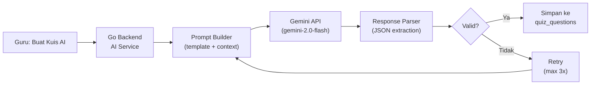

# 🤖 AI Integration Specification — AkuBelajar

> Spesifikasi lengkap integrasi Gemini AI untuk quiz generation: prompt engineering, response parsing, error handling, cost management.

---

## 1. Arsitektur



---

## 2. Konfigurasi Model

| Parameter | Nilai | Alasan |
|:---|:---|:---|
| Model | `gemini-2.0-flash` | Cost-effective, cukup cepat |
| Temperature | 0.7 | Balance kreativitas & akurasi |
| Max output tokens | 8192 | Cukup untuk 30 soal |
| Top-p | 0.95 | Untuk variasi jawaban |
| Response format | `application/json` | Structured output |

---

## 3. Prompt Engineering

### System Prompt (tetap untuk semua request)

```
Kamu adalah guru profesional di Indonesia yang membuat soal ujian.
Buatkan soal pilihan ganda sesuai kurikulum Indonesia.

ATURAN WAJIB:
1. Setiap soal HARUS memiliki tepat 4 pilihan jawaban (A, B, C, D)
2. Hanya boleh ada SATU jawaban benar per soal
3. Jawaban salah harus masuk akal (bukan jawaban konyol)
4. Soal harus sesuai tingkat kesulitan yang diminta
5. Bahasa Indonesia yang baku dan jelas
6. Tidak boleh mengandung konten SARA, kekerasan, atau tidak pantas
7. Sertakan penjelasan singkat untuk setiap jawaban benar

RESPONSE FORMAT (JSON array):
[
  {
    "question": "Teks soal",
    "options": [
      {"key": "A", "text": "Pilihan A"},
      {"key": "B", "text": "Pilihan B"},
      {"key": "C", "text": "Pilihan C"},
      {"key": "D", "text": "Pilihan D"}
    ],
    "correct_key": "B",
    "explanation": "Penjelasan mengapa B benar"
  }
]
```

### User Prompt Template

```
Mata pelajaran: {{subject_name}}
Tingkat kelas: {{grade_level}} (contoh: Kelas 8 SMP)
Topik/Bab: {{topic}}
Jumlah soal: {{question_count}}
Tingkat kesulitan: {{difficulty}} (mudah / sedang / sulit / campuran)

Konteks tambahan dari guru: {{teacher_notes}}
```

### Contoh Request Lengkap

```go
prompt := fmt.Sprintf(`
Mata pelajaran: Biologi
Tingkat kelas: Kelas 8 SMP
Topik/Bab: Struktur dan Fungsi Sel
Jumlah soal: 10
Tingkat kesulitan: campuran
`)
```

---

## 4. Response Parsing & Validation

### Go Implementation

```go
type AIQuestion struct {
    Question   string     `json:"question"    validate:"required,min=10,max=2000"`
    Options    []Option   `json:"options"     validate:"required,len=4"`
    CorrectKey string     `json:"correct_key" validate:"required,oneof=A B C D"`
    Explanation string    `json:"explanation" validate:"required,min=5"`
}

type Option struct {
    Key  string `json:"key"  validate:"required,oneof=A B C D"`
    Text string `json:"text" validate:"required,min=1,max=500"`
}

func ParseAIResponse(raw string) ([]AIQuestion, error) {
    // 1. Extract JSON dari response (bisa wrapped dalam markdown code block)
    jsonStr := extractJSON(raw)
    
    // 2. Parse JSON
    var questions []AIQuestion
    if err := json.Unmarshal([]byte(jsonStr), &questions); err != nil {
        return nil, fmt.Errorf("invalid JSON: %w", err)
    }
    
    // 3. Validate setiap soal
    for i, q := range questions {
        if err := validator.Validate(q); err != nil {
            return nil, fmt.Errorf("soal #%d invalid: %w", i+1, err)
        }
        // Cek duplikat option key
        // Cek correct_key ada di options
        // Cek semua options text unik
    }
    
    return questions, nil
}

func extractJSON(raw string) string {
    // Handle case: Gemini wraps JSON in ```json ... ```
    re := regexp.MustCompile("(?s)```json?\n?(.*?)```")
    if matches := re.FindStringSubmatch(raw); len(matches) > 1 {
        return matches[1]
    }
    return raw // Assume raw is already JSON
}
```

---

## 5. Error Handling & Retry

| Error | Retry? | Aksi |
|:---|:---|:---|
| `429 Resource Exhausted` (quota) | Ya, backoff 60s | Queue request, notify guru |
| `500 Internal Server Error` | Ya, 3× (1s, 5s, 15s) | Return `QUIZ_007` jika semua gagal |
| Response bukan JSON | Ya, 2× (ubah prompt) | Tambahkan "HANYA output JSON, tanpa penjelasan lain" |
| Jumlah soal tidak sesuai | Ya, 1× | Minta "generate X soal lagi" |
| Konten tidak pantas | Tidak | Filter & skip soal yang tidak lolos |
| API key invalid | Tidak | Return `SYS_004`, alert admin |

### Retry Flow

```go
func GenerateQuiz(ctx context.Context, req GenerateRequest) ([]AIQuestion, error) {
    for attempt := 0; attempt < 3; attempt++ {
        raw, err := callGeminiAPI(ctx, buildPrompt(req))
        if err != nil {
            if isRateLimited(err) {
                time.Sleep(60 * time.Second)
                continue
            }
            if isServerError(err) {
                time.Sleep(time.Duration(math.Pow(2, float64(attempt))) * time.Second)
                continue
            }
            return nil, err
        }
        
        questions, err := ParseAIResponse(raw)
        if err != nil {
            log.Warn("AI response invalid, retrying", zap.Error(err))
            continue
        }
        
        // Filter konten tidak pantas
        questions = filterUnsafeContent(questions)
        
        return questions, nil
    }
    return nil, ErrAIGenerationFailed
}
```

---

## 6. Content Safety Filter

### Blocked Keywords

```go
var blockedPatterns = []string{
    "(?i)(bunuh|membunuh|mati|suicide)",
    "(?i)(seks|porno|cabul)",
    "(?i)(sara|rasis|diskriminasi)",
    "(?i)(narkoba|obat terlarang)",
    "(?i)(teroris|bom|senjata)",
}

func filterUnsafeContent(questions []AIQuestion) []AIQuestion {
    var safe []AIQuestion
    for _, q := range questions {
        if !containsBlockedContent(q.Question) {
            safe = append(safe, q)
        }
    }
    return safe
}
```

---

## 7. Cost Management

| Model | Cost (per 1M tokens) | Avg tokens per 10 soal | Cost per 10 soal |
|:---|:---|:---|:---|
| gemini-2.0-flash | Input: $0.10, Output: $0.40 | ~1500 in, ~3000 out | ~$0.0014 |

### Budget Limits

| Limit | Nilai |
|:---|:---|
| Per guru per jam | 10 request (rate limit) |
| Per sekolah per hari | 100 request |
| Per sekolah per bulan | 2000 request |
| Alert admin | Saat usage > 80% monthly limit |

### Monitoring

```go
// Setiap request, catat usage
auditLog.Insert(AuditLog{
    Action:     "ai_quiz_generate",
    ActorID:    teacherID,
    EntityType: "quiz",
    NewValue:   map[string]any{
        "model":           "gemini-2.0-flash",
        "input_tokens":    resp.UsageMetadata.PromptTokenCount,
        "output_tokens":   resp.UsageMetadata.CandidatesTokenCount,
        "questions_count": len(questions),
    },
})
```

---

*Terakhir diperbarui: 21 Maret 2026*
