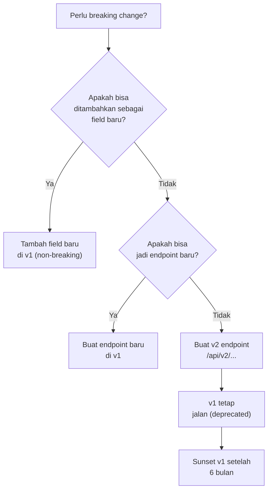

# 🔢 API Versioning Strategy — AkuBelajar

> Bagaimana menjaga API v1 tetap stabil saat evolusi fitur — terutama sebelum mobile app rilis.

---

## 1. Current Strategy

| Item | Detail |
|:---|:---|
| Format | URL prefix: `/api/v1/...` |
| Versi aktif | `v1` (satu-satunya) |
| Breaking change policy | **DILARANG** di v1 tanpa versi baru |

---

## 2. Apa yang Dianggap Breaking Change?

| Tipe Perubahan | Breaking? | Contoh |
|:---|:---|:---|
| Hapus endpoint | 🔴 Ya | `DELETE /api/v1/users/:id` dihapus |
| Hapus field dari response | 🔴 Ya | Field `phone` hilang dari user response |
| Ubah tipe field | 🔴 Ya | `grade: 85` → `grade: "85"` |
| Ubah field name | 🔴 Ya | `student_id` → `studentId` |
| Ubah status code | 🔴 Ya | Login gagal: 401 → 400 |
| Ubah error code | 🔴 Ya | `AUTH_001` → `LOGIN_001` |
| **Tambah** field baru ke response | ✅ Tidak | Field `avatar_url` ditambah |
| **Tambah** endpoint baru | ✅ Tidak | `POST /api/v1/reports/generate` |
| **Tambah** optional query param | ✅ Tidak | `?include_archived=true` |
| **Tambah** optional request field | ✅ Tidak | Field `notes` opsional di request body |

---

## 3. Rules

### ✅ BOLEH di v1 (Non-Breaking)

```
1. Tambah endpoint baru
2. Tambah field baru di response (client harus toleran terhadap field baru)
3. Tambah optional parameter/field di request
4. Tambah enum value baru (misalnya status baru)
5. Perbaiki bug (jika behavior sebelumnya jelas salah)
```

### ❌ TIDAK BOLEH di v1

```
1. Hapus / rename endpoint
2. Hapus / rename field di response
3. Ubah tipe data field
4. Ubah behavior yang sudah documented
5. Ubah error code yang sudah di ERROR_CODE_CATALOGUE.md
6. Ubah auth mechanism (Paseto → sesuatu lain)
```

---

## 4. Kapan Membuat v2?



---

## 5. Deprecation Process

```
1. Announce: tambahkan header `Deprecation: true` + `Sunset: {date}` di response
2. Log: catat semua client yang masih hit endpoint deprecated
3. Notify: email/notif ke developer 30 hari sebelum sunset
4. Sunset: return 410 Gone setelah tanggal sunset
```

```go
// Middleware untuk deprecated endpoints
func DeprecatedEndpoint(sunsetDate string) gin.HandlerFunc {
    return func(c *gin.Context) {
        c.Header("Deprecation", "true")
        c.Header("Sunset", sunsetDate)
        c.Header("Link", "</api/v2/...>; rel=\"successor-version\"")
        logger.Warn("deprecated_endpoint_hit",
            zap.String("path", c.Request.URL.Path),
            zap.String("sunset", sunsetDate),
        )
        c.Next()
    }
}
```

---

## 6. Client Contract

Frontend (Next.js) dan future mobile app HARUS:

```typescript
// ✅ Toleran terhadap field baru (jangan strict parse)
interface User {
  id: string;
  email: string;
  role: string;
  [key: string]: unknown; // Accept unknown fields
}

// ✅ Check API version header
const response = await fetch('/api/v1/users');
const apiVersion = response.headers.get('X-API-Version');
```

---

*Terakhir diperbarui: 21 Maret 2026*
