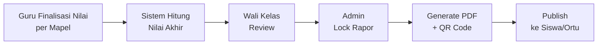
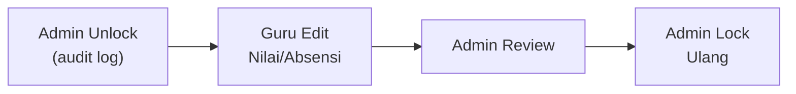

# 📐 Business Logic Full — AkuBelajar

> Semua aturan bisnis akademik yang merupakan "otak" dari sistem. Keputusan domain yang eksplisit — bukan teknis, melainkan kebijakan.

---

## 1. Kalkulasi Nilai Akhir

### Formula Utama

```
Nilai Akhir = (Rata-rata Tugas × Bobot Tugas%) + (Rata-rata Kuis × Bobot Kuis%)
```

Default: **60% tugas + 40% kuis** — configurable per sekolah di `schools.config`.

### Kondisi Khusus

| Kondisi | Formula | Hasil |
|:---|:---|:---|
| Tugas ada, kuis ada | `(avg_tugas × 0.6) + (avg_kuis × 0.4)` | Normal |
| Tugas ada, kuis **tidak ada** | `avg_tugas × 1.0` | 100% dari tugas |
| Tugas **tidak ada**, kuis ada | `avg_kuis × 1.0` | 100% dari kuis |
| Keduanya **tidak ada** | `NULL` | Tidak bisa dihitung — tandai "Data Tidak Lengkap" |

### Nilai Remedial

- Siswa dengan nilai < KKM bisa mengikuti **remedial (max 1× per semester)**
- Nilai remedial **mengganti** nilai asli **jika lebih tinggi**
- Nilai remedial di-cap maksimal = KKM (70). Contoh: remedial dapat 90, dicatat 70
- **Keputusan:** Cap berlaku — nilai remedial di-cap maksimal = KKM (70). Ini standar di sebagian besar sekolah Indonesia.

---

## 2. Predikat & KKM

### Konversi Huruf (Default)

| Rentang | Huruf | Predikat Rapor |
|:---|:---|:---|
| 90 – 100 | A | Sangat Baik |
| 80 – 89 | B | Baik |
| 70 – 79 | C | Cukup |
| 60 – 69 | D | Perlu Bimbingan |
| 0 – 59 | E | Sangat Kurang |

> Configurable per sekolah via `schools.config.grade_scale`

### KKM (Kriteria Ketuntasan Minimal)

- Default: **70** — configurable per mata pelajaran per sekolah
- Siswa dengan nilai akhir < KKM → status **"Belum Tuntas"**
- Tandai di rapor: mapel yang belum tuntas
- Dampak: siswa belum tuntas **tetap mendapat nilai** di rapor (tidak auto-fail)

---

## 3. Aturan Kehadiran

### Persentase Kehadiran

```
Hadir_Efektif = present + permission + sick
Total_Hari    = present + permission + sick + absent
Persentase    = (Hadir_Efektif / Total_Hari) × 100%
```

| Status | Dihitung Hadir? |
|:---|:---|
| `present` (Hadir) | ✅ Ya |
| `permission` (Izin) | ✅ Ya |
| `sick` (Sakit) | ✅ Ya |
| `absent` (Alfa) | ❌ Tidak |
| `late` (Terlambat) | ✅ Ya (hadir penuh, tapi dicatat waktunya) |

### Minimum Kehadiran

- Minimum: **75%** per semester (configurable: `schools.config.attendance_minimum_pct`)
- Siswa < 75% → **Tidak diizinkan mengikuti UAS/UKK**
- **Keputusan:** Dampak hanya larangan ikut UAS/UKK. Tidak ada dampak otomatis ke nilai akhir. Early warning system akan mengirim notifikasi ke guru dan wali kelas.

### Alert Otomatis

| Kondisi | Threshold | Penerima |
|:---|:---|:---|
| Alfa berturut-turut | ≥ 3 hari | Guru kelas + Wali kelas |
| Alfa dalam 1 minggu | ≥ 3 kali | Guru kelas + Admin |
| Kehadiran < 80% (bulan berjalan) | < 80% | Wali kelas |
| Kehadiran < 75% (semester) | < 75% | Admin + Wali kelas |

---

## 4. Aturan Deadline & Keterlambatan

### Timeline Deadline

```
Deadline = deadline_at (TIMESTAMPTZ di assignment)
```

- Deadline dihitung inklusif sampai **23:59:59 WIB hari H**
- Grace period sistem: **0 detik** (tepat waktu = tepat waktu)

### Penalti Keterlambatan

| Hari Terlambat | Penalti (default 10%/hari) | Contoh (nilai 85) |
|:---|:---|:---|
| 0 (tepat waktu) | 0% | 85 |
| 1 hari | -10% | 85 × 0.9 = 76.5 → 77 |
| 2 hari | -20% | 85 × 0.8 = 68 |
| 3 hari | -30% | 85 × 0.7 = 59.5 → 60 |
| 4 hari | -40% | 85 × 0.6 = 51 |
| 5 hari | -50% | 85 × 0.5 = 42.5 → 43 |
| > 5 hari | **Ditolak** | Tidak diterima |

- `late_penalty_pct` dan `max_late_days` configurable per assignment
- `allow_late = FALSE` → submit setelah deadline = **ditolak total**
- Guru bisa **override penalti** manual (audit log mencatat)

---

## 5. Aturan Kuis & CBT

### Attempt Policy

| Setting | Default | Configurable? |
|:---|:---|:---|
| Max attempts | 1 | ✅ Per kuis oleh guru |
| Yang dipakai (multi-attempt) | Nilai **tertinggi** | ✅ (tertinggi / terakhir / rata-rata) |
| Review mode | `immediately` | ✅ (immediately / after_all_submit / manual) |

### Timer Rules

| Rule | Detail |
|:---|:---|
| Timer source | **Server-only** |
| Server time | `quiz_sessions.expires_at = started_at + time_limit` |
| Auto-submit | Saat `NOW() > expires_at` — jawaban yang sudah ada di-grade |
| Grace period | 0 detik |
| Pause | **Tidak diizinkan** |

### Anti-Cheat Toleransi

| Event | Toleransi | Aksi Setelah Threshold |
|:---|:---|:---|
| Tab switch (`visibilitychange`) | 3× peringatan | Auto-submit + flag `session_locked` |
| Minimize (`blur`) | 2× peringatan | Auto-submit + flag `session_locked` |
| DevTools terbuka | 0 toleransi | Langsung `session_locked` |
| WebSocket disconnect | 30 detik | Session expired, auto-submit |
| IP berubah mid-session | 0 toleransi | Session expired |
| Login di device lain mid-session | 0 toleransi | Session lama expired |

### Scoring

| Tipe Soal | Cara Scoring |
|:---|:---|
| Pilihan Ganda | Auto-grade via `Argon2id.Verify(selected, answer_hash)` |
| Essay | Guru grade manual atau AI-assist (Gemini) + review guru |
| Tidak dijawab | Skor 0 |
| Score formula | `(correct / total) × 100` |

---

## 6. Aturan Rapor & Lock Data

### Lifecycle Rapor



### Lock Rules

| Langkah | Aksi | Siapa |
|:---|:---|:---|
| 1 | Guru klik "Finalisasi" per mapel | Guru |
| 2 | Sistem hitung `final_score = (avg_tugas × bobot) + (avg_kuis × bobot)` | Sistem |
| 3 | Wali kelas review semua nilai per siswa | Wali Kelas |
| 4 | Admin klik "Lock Rapor" → `grades.is_locked = TRUE` | Admin |
| 5 | Generate PDF dengan QR verifikasi | Sistem |
| 6 | Signed URL dikirim via notifikasi | Sistem |

### Post-Lock Rules

- ❌ Guru **tidak bisa** ubah nilai
- ❌ Absensi **tidak bisa** diubah
- ✅ Jika ada kesalahan → Admin **unlock** (audit log) → Guru edit → Admin lock ulang

### Unlock Alur



---

## 7. Early Warning System

### Trigger Rules

| # | Kondisi | Threshold | Penerima | Prioritas |
|:---|:---|:---|:---|:---|
| EW-1 | Nilai rata-rata siswa rendah | < 60 selama 2 minggu | Guru mapel + Wali kelas | 🟡 Medium |
| EW-2 | Alfa berturut-turut | ≥ 3 hari | Guru kelas + Wali kelas | 🔴 High |
| EW-3 | Tidak submit tugas berturut-turut | ≥ 3 tugas | Guru mapel | 🟡 Medium |
| EW-4 | Kehadiran semester rendah | < 80% (warning) / < 75% (critical) | Admin + Wali kelas | 🔴 High |
| EW-5 | Nilai kuis konsisten rendah | < 50 pada 3 kuis terakhir | Guru mapel | 🟡 Medium |

### Aksi

- Notifikasi in-app + WA ke penerima
- Dashboard "Siswa Berisiko" untuk guru dan admin
- Data digunakan Gemini AI untuk **rekomendasi intervensi** (roadmap)

---

*Terakhir diperbarui: 21 Maret 2026*
