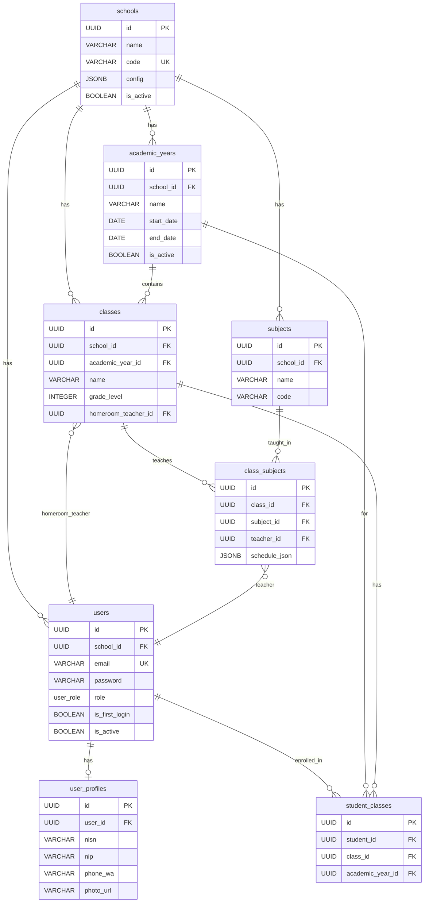
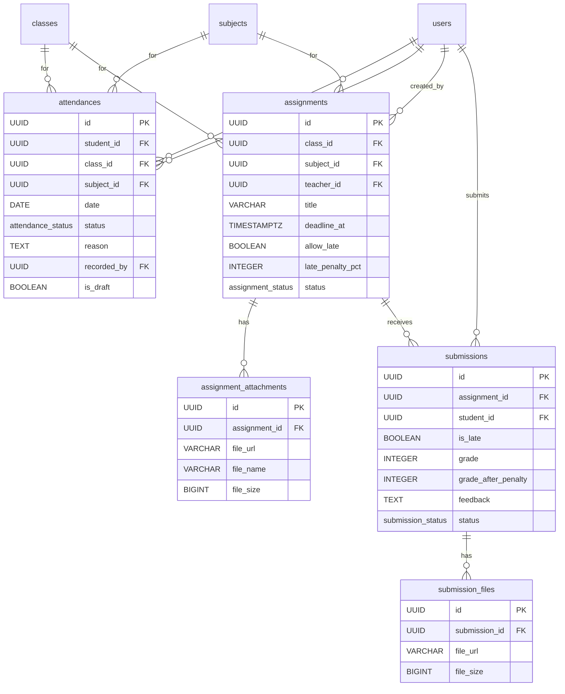
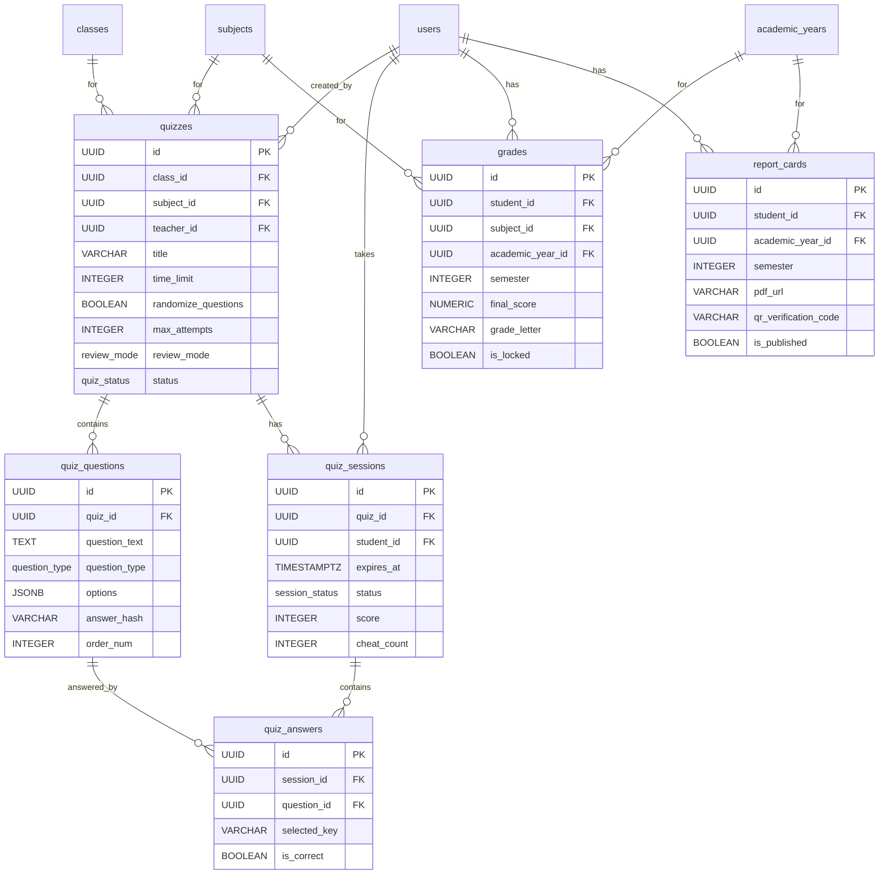
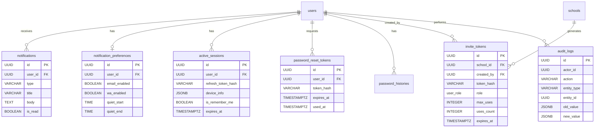

# 📊 Entity Relationship Diagram — AkuBelajar

> Visualisasi relasi antar semua tabel di database AkuBelajar menggunakan Mermaid erDiagram.

---

## Bagian 1 — Core & User Management

### Relasi yang Perlu Penjelasan

| Relasi | Penjelasan |
|:---|:---|
| `schools → users` | Semua user terkait dengan satu sekolah (multi-tenant) |
| `users → user_profiles` | 1:1 — profil terpisah agar tabel users tetap ringan |
| `classes → class_subjects` | Satu kelas bisa diajar beberapa mata pelajaran oleh guru berbeda |
| `student_classes` | Junction table — siswa bisa pindah kelas antar tahun ajaran |

---

## Bagian 2 — Attendance & Assignment

### Relasi yang Perlu Penjelasan

| Relasi | Penjelasan |
|:---|:---|
| `attendances.recorded_by` | Bisa guru atau ketua kelas — tergantung role |
| `attendances.is_draft` | TRUE jika diinput ketua kelas (belum diapprove guru) |
| `submissions` unique constraint | Satu siswa hanya bisa submit sekali per tugas |
| `grade_after_penalty` | Dihitung otomatis: `grade × (1 - late_penalty_pct × late_days / 100)` |

---

## Bagian 3 — Quiz & Grades

### Relasi yang Perlu Penjelasan

| Relasi | Penjelasan |
|:---|:---|
| `quiz_questions.answer_hash` | Jawaban benar di-hash Argon2id — tidak pernah plain text |
| `quiz_sessions.question_order` | Array integer untuk urutan soal yang sudah diacak per siswa |
| `grades` unique constraint | Satu siswa × satu mapel × satu tahun ajaran × satu semester |
| `report_cards.qr_verification_code` | QR code unik untuk verifikasi keaslian rapor online |

---

## Bagian 4 — Notifications & System

---

## Ringkasan Relasi

| Tabel | Relasi Ke |
|:---|:---|
| `schools` | users, academic_years, classes, subjects, invite_tokens |
| `users` | user_profiles, student_classes, attendances, assignments, submissions, quiz_sessions, grades, report_cards, notifications, active_sessions |
| `classes` | class_subjects, student_classes, attendances, assignments, quizzes |
| `quizzes` | quiz_questions, quiz_sessions |
| `assignments` | assignment_attachments, submissions |
| `audit_logs` | _(standalone — referensi by entity_type + entity_id)_ |

---

*Terakhir diperbarui: 21 Maret 2026*
