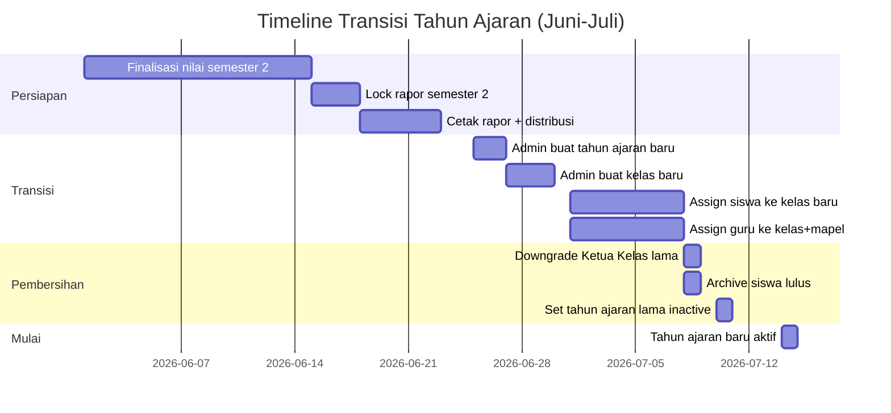
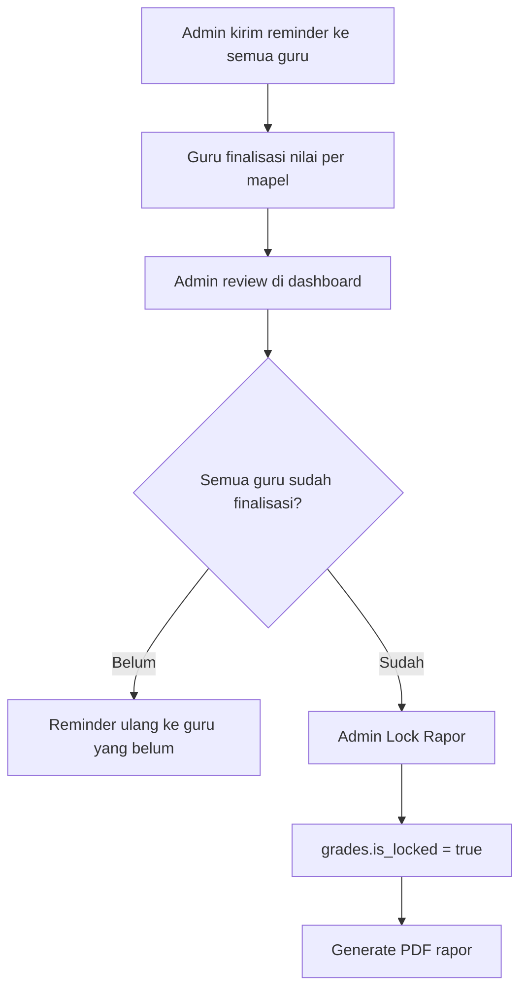
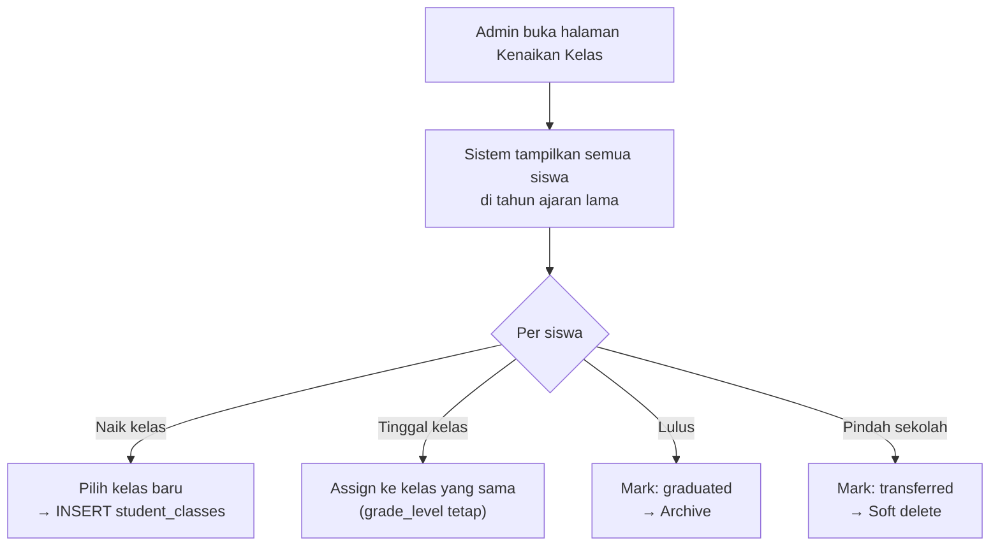

# 📅 Academic Year Transition — AkuBelajar

> Alur lengkap: apa yang terjadi saat tahun ajaran baru dimulai — kenaikan kelas, kelulusan, archiving, dan data carry-over.

---

## 1. Timeline Transisi



---

## 2. Step-by-Step

### Step 1: Finalisasi Nilai



- Validasi: semua siswa punya nilai untuk semua mapel
- Warning: siswa tanpa nilai → "Data tidak lengkap"

### Step 2: Admin Buat Tahun Ajaran Baru

```sql
INSERT INTO academic_years (school_id, name, start_date, end_date, is_active)
VALUES ('[school_id]', '2026/2027', '2026-07-14', '2027-06-30', false);

-- Belum aktif sampai transisi selesai
```

### Step 3: Admin Buat Kelas Baru

**Opsi A — Clone dari kelas lama:**

```
Admin pilih kelas tahun lalu → "Clone untuk tahun baru"
Sistem: buat kelas baru dengan nama + grade_level + 1
Contoh: "8A" → "9A" (grade_level: 8 → 9)
```

**Opsi B — Buat manual:**

```
Admin input nama kelas + grade_level + wali kelas
```

### Step 4: Assign Siswa ke Kelas Baru



- **Bulk assignment**: Admin bisa select 30 siswa sekaligus → assign ke kelas tujuan
- **Tidak pindah otomatis** — Admin harus assign manual (anti-error)

### Step 5: Auto-Cleanup Jobs

| Job | Aksi | Trigger |
|:---|:---|:---|
| Downgrade Ketua Kelas | `role: class_leader → student` untuk semua KK di tahun lama | `academic_years.end_date` passed |
| Archive siswa lulus | `is_active = false`, `archived_reason = 'graduated'` | Admin mark "Lulus" |
| Set tahun lama inactive | `academic_years.is_active = false` | Admin aktifkan tahun baru |
| Cleanup unused sessions | Delete `active_sessions` yang expired | Scheduled setiap jam |

### Step 6: Aktivasi Tahun Baru

```sql
-- Transaction: hanya 1 tahun aktif per sekolah
BEGIN;
UPDATE academic_years SET is_active = false WHERE school_id = '[school_id]';
UPDATE academic_years SET is_active = true WHERE id = '[new_ay_id]';
COMMIT;
```

---

## 3. Data Carry-Over Rules

| Data | Carry Over? | Detail |
|:---|:---|:---|
| Nilai semester lalu | ❌ Tidak | Tetap di tahun ajaran lama (read-only) |
| Absensi | ❌ Tidak | Tetap di tahun ajaran lama |
| Profil siswa | ✅ Ya | Profil sama, kelas baru |
| Rapor PDF | ✅ Ya | Tetap bisa diakses via history |
| Tugas & submission | ❌ Tidak | Tetap di tahun lama |
| Kuis & jawaban | ❌ Tidak | Tetap di tahun lama |
| Preferensi notifikasi | ✅ Ya | Mengikuti user, bukan tahun |
| Active sessions | ✅ Ya | Tidak berubah |

---

## 4. Edge Cases

| Skenario | Penanganan |
|:---|:---|
| Siswa belum di-assign ke kelas baru | Dashboard: warning "X siswa belum punya kelas" |
| Admin lupa lock rapor semester lama | System block aktivasi tahun baru jika ada rapor unlocked |
| Siswa pindah sekolah di tengah transisi | Soft delete + data tetap ada untuk sekolah lama |
| 2 tahun ajaran aktif bersamaan | Constraint: max 1 active per school_id |
| Guru mengajar di 2 tahun ajaran | Class_subjects terpisah per tahun ajaran — aman |

---

## 5. API Endpoints Khusus Transisi

| Method | Path | Deskripsi |
|:---|:---|:---|
| `POST` | `/admin/academic-years` | Buat tahun ajaran baru |
| `POST` | `/admin/academic-years/:id/activate` | Aktifkan tahun baru |
| `POST` | `/admin/classes/clone` | Clone kelas dari tahun lalu |
| `POST` | `/admin/student-promotions` | Bulk assign siswa naik kelas |
| `POST` | `/admin/student-graduations` | Mark siswa lulus (archive) |
| `GET`  | `/admin/transition-status` | Dashboard transisi: siswa belum assign, guru belum assign, dll |

---

*Terakhir diperbarui: 21 Maret 2026*
