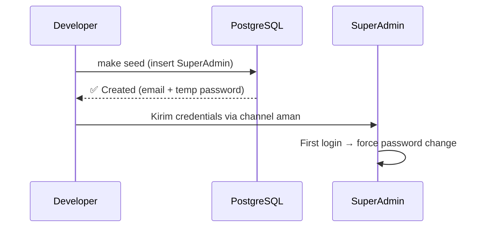
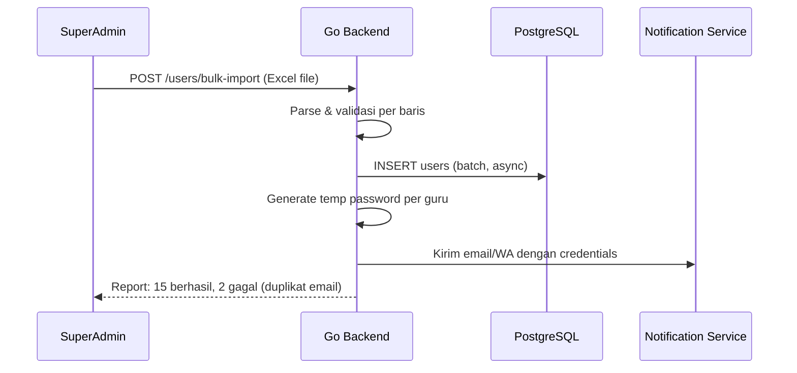
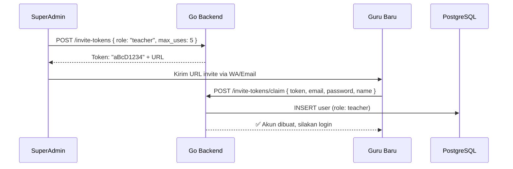
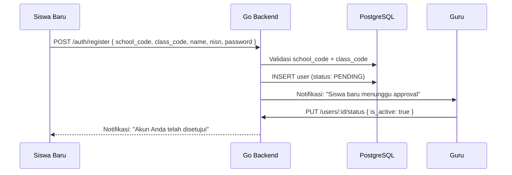
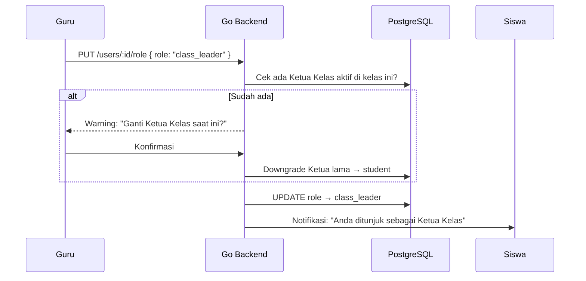
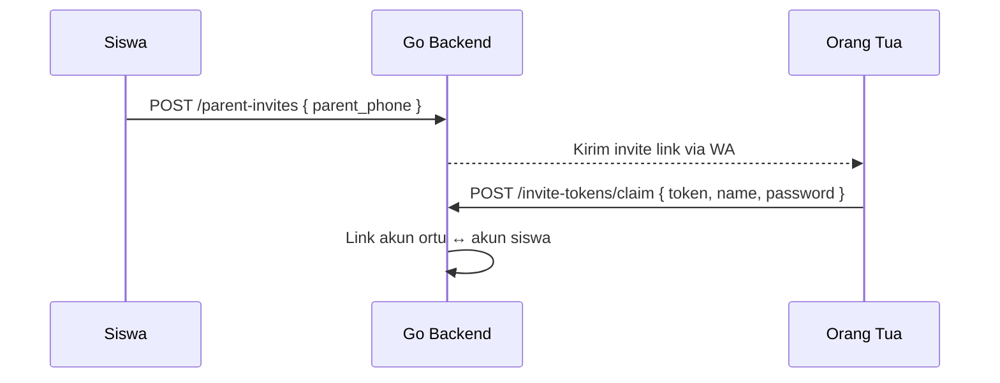

# 👤 Account Creation Flow — AkuBelajar

> Alur pembuatan akun per role. Setiap role memiliki jalur masuk yang berbeda.

---

## Ringkasan Jalur per Role

| Role | Jalur Utama | Jalur Alternatif | Status Awal |
|:---|:---|:---|:---|
| SuperAdmin | Database seed (instalasi) | — | `active`, `is_first_login: true` |
| Guru | Bulk import Excel | Invite token | `active`, `is_first_login: true` |
| Siswa | Bulk import Excel | Invite token / Self-register | `active` atau `pending` |
| Ketua Kelas | Upgrade dari Siswa | — | `active` (sudah punya akun) |
| Orang Tua | Invite dari akun Siswa | — | `active` _(roadmap Fase 2)_ |

---

## 1. SuperAdmin



- Dibuat saat **instalasi awal** (`make seed`)
- **Tidak bisa** self-register
- Credentials dikirim ke developer/owner sekolah via channel aman
- `is_first_login: true` → dipaksa ganti password saat login pertama

---

## 2. Guru

### Jalur A — Bulk Import Excel



**Format Excel wajib:**

| Kolom | Required | Contoh |
|:---|:---|:---|
| `name` | ✅ | Budi Santoso |
| `email` | ✅ | budi@akubelajar.id |
| `nip` | ❌ | 198501012010011001 |
| `phone_wa` | ❌ | +6281234567890 |
| `subjects` | ❌ | Matematika, Fisika |

### Jalur B — Invite Token



---

## 3. Siswa

### Jalur A — Bulk Import Excel (Awal Tahun Ajaran)

Format Excel wajib:

| Kolom | Required | Contoh |
|:---|:---|:---|
| `name` | ✅ | Andi Pratama |
| `nisn` | ✅ | 0012345678 |
| `email` | ❌ | andi@email.com |
| `class_name` | ✅ | 8A |
| `parent_name` | ❌ | Ibu Siti |
| `parent_phone` | ❌ | +6289876543210 |

- Jika email tidak diisi → auto-generate: `{nisn}@student.akubelajar.id`
- Status: `active`, `is_first_login: true`

### Jalur B — Invite Token (Siswa Pindahan)

Sama seperti guru, tetapi dengan `role: "student"` dan `class_id` wajib diisi.

### Jalur C — Self-Register (Kode Kelas)



- Status awal: **`pending`** sampai diapprove Guru/Admin
- NISN harus unik per sekolah

---

## 4. Ketua Kelas



- **Bukan register baru** — upgrade dari akun Siswa
- Maks **1 Ketua Kelas per kelas per tahun ajaran**
- Otomatis downgrade kembali ke Siswa saat tahun ajaran berakhir (scheduled job)

---

## 5. Orang Tua _(Roadmap Fase 2)_



- Satu akun Ortu bisa linked ke **beberapa anak** (kakak-adik)
- Akses **read-only**: lihat nilai, absensi, tugas anak

---

## Schema: invite_tokens

```sql
CREATE TABLE invite_tokens (
    id          UUID PRIMARY KEY DEFAULT gen_random_uuid(),
    school_id   UUID NOT NULL REFERENCES schools(id),
    created_by  UUID NOT NULL REFERENCES users(id),
    token_hash  VARCHAR(255) NOT NULL,    -- SHA-256 hash
    role        user_role NOT NULL,
    class_id    UUID REFERENCES classes(id),
    max_uses    INTEGER DEFAULT 1,
    uses_count  INTEGER DEFAULT 0,
    expires_at  TIMESTAMPTZ NOT NULL,
    created_at  TIMESTAMPTZ DEFAULT NOW()
);
```

---

## Error Scenarios

| Skenario | Error Code | HTTP | Response |
|:---|:---|:---|:---|
| Email sudah terdaftar | `USER_002` | 409 | "Email sudah terdaftar" |
| NISN sudah ada di sekolah | `USER_003` | 409 | "NISN sudah terdaftar" |
| Token expired | `AUTH_010` | 400 | "Token telah kedaluwarsa" |
| Token sudah dipakai max | `AUTH_004` | 400 | "Token tidak valid" |
| School code tidak ditemukan | `USER_006` | 404 | "Sekolah tidak ditemukan" |

---

*Terakhir diperbarui: 21 Maret 2026*
