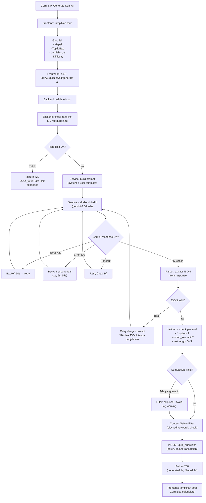
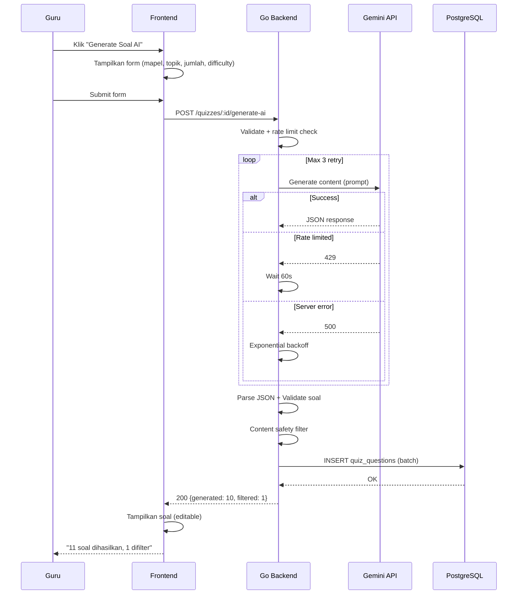

# 🤖 AI Quiz Generation Flow — AkuBelajar

> Flowchart lengkap: dari guru klik "Generate AI" sampai soal tersimpan di database. Termasuk error handling Gemini.

---

## 1. Flow Lengkap



---

## 2. Sequence Diagram



---

## 3. Error Handling Matrix

| Error | HTTP | Error Code | User Message | Aksi Backend |
|:---|:---|:---|:---|:---|
| Rate limit guru (10/jam) | 429 | `QUIZ_008` | "Anda sudah generate 10x dalam 1 jam. Tunggu X menit." | — |
| Gemini quota habis | 503 | `QUIZ_007` | "Layanan AI sedang sibuk. Coba 5 menit lagi." | Retry 60s |
| Gemini return error | 502 | `QUIZ_007` | "Gagal generate soal. Coba lagi." | Retry 3x |
| Response bukan JSON | 502 | `QUIZ_007` | "Gagal generate soal. Coba lagi." | Retry + modified prompt |
| Jumlah soal tidak sesuai | 200 | — | "Diminta 10, berhasil generate 8." | Return partial |
| Konten tidak pantas | 200 | — | "11 soal dihasilkan, 1 difilter karena tidak sesuai." | Filter + log |
| API key invalid | 500 | `SYS_004` | "Konfigurasi sistem error. Hubungi admin." | Alert admin |
| Semua retry gagal | 503 | `QUIZ_007` | "Tidak bisa generate soal saat ini." | Log + alert |

---

## 4. Rate Limit Detail

```go
// Redis key: ai_quiz_rate:{teacher_id}
// Limit: 10 requests per jam
// Window: sliding window 1 hour

func CheckAIRateLimit(ctx context.Context, teacherID string) error {
    key := fmt.Sprintf("ai_quiz_rate:%s", teacherID)
    count, _ := redis.Incr(ctx, key)
    if count == 1 {
        redis.Expire(ctx, key, 1*time.Hour)
    }
    if count > 10 {
        ttl, _ := redis.TTL(ctx, key)
        return fmt.Errorf("rate limited, retry in %v", ttl)
    }
    return nil
}
```

---

## 5. Post-Generation: Guru Review

Setelah AI generate, guru WAJIB review sebelum publish:

```
Generate → Review → Edit (opsional) → Save Draft → Publish
```

- Guru bisa **edit** teks soal, opsi, dan jawaban benar
- Guru bisa **delete** soal yang tidak sesuai
- Guru bisa **tambah** soal manual ke kuis yang sama
- Kuis tetap `status: draft` sampai guru klik Publish

---

*Terakhir diperbarui: 21 Maret 2026*
