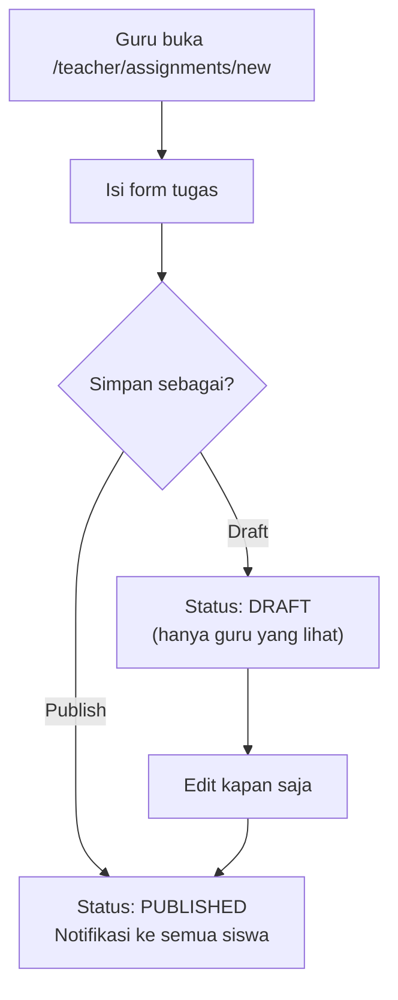
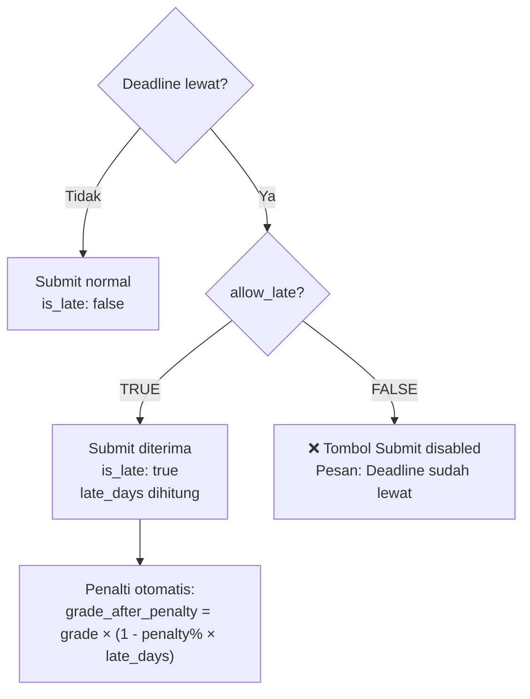
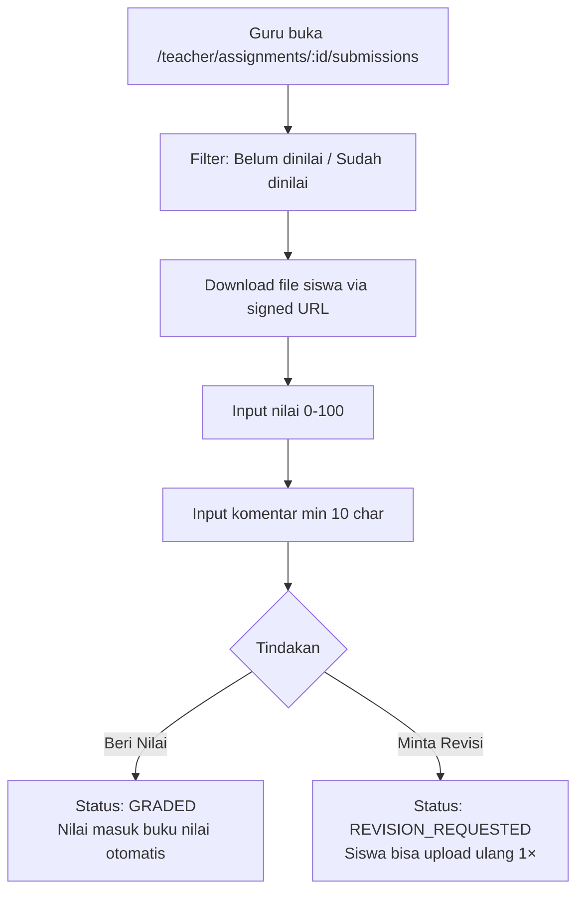

# 📝 Assignment Flow — AkuBelajar

> Siklus hidup tugas: pembuatan → submit → penilaian, termasuk keterlambatan dan file upload.

---

## 1. Guru Membuat Tugas

### Form Fields

| Field | Required | Validasi |
|:---|:---|:---|
| Judul | ✅ | Min 5, max 200 char |
| Deskripsi | ✅ | Max 10.000 char, HTML sanitized |
| Mata pelajaran | ✅ | Dropdown dari class_subjects |
| Kelas target | ✅ | Dropdown (multiple select) |
| Deadline | ✅ | Tanggal di masa depan |
| Bobot nilai | ✅ | 1-100% |
| Izinkan terlambat | ❌ | Boolean, default: false |
| Penalti per hari | ❌ | 0-50%, default: 10% |
| Lampiran materi | ❌ | Max 50MB, PDF/DOCX/PPTX/MP4 |

---

## 2. Siswa Mengerjakan & Submit

```mermaid
sequenceDiagram
    participant Siswa
    participant FE as Next.js
    participant API as Go Backend
    participant MinIO

    Siswa->>FE: Buka /student/assignments/:id
    FE->>API: GET /assignments/:id
    API-->>FE: Assignment detail + deadline
    Siswa->>FE: Download materi (jika ada)
    FE->>API: GET signed URL
    API-->>FE: Signed URL (TTL 15 min)
    FE->>MinIO: Download file

    Siswa->>FE: Upload submission files
    FE->>API: Request presigned upload URL
    API-->>FE: Presigned PUT URL (TTL 5 min)
    FE->>MinIO: Upload file langsung
    FE->>API: POST /assignments/:id/submissions
    API->>API: Validate + rename file
    API-->>FE: 201 Created (is_late, status)
```

### Upload Rules

| Parameter | Nilai |
|:---|:---|
| Max files per submission | 3 |
| Max size per file | 20MB |
| Format yang diterima | PDF, DOCX, PPTX, XLSX, JPG, PNG, ZIP |
| Rename otomatis | `{student_id}_{assignment_id}_{timestamp}.ext` |
| Status setelah submit | `SUBMITTED` |

---

## 3. Submit Terlambat

| Hari Terlambat | Penalti 10%/hari | Nilai asli 85 |
|:---|:---|:---|
| 1 | -10% | 77 |
| 2 | -20% | 68 |
| 3 | -30% | 60 |
| > max_late_days | **Ditolak** | N/A |

---

## 4. Guru Mengoreksi & Memberi Nilai

- Nilai otomatis masuk ke perhitungan `grades.assignment_avg`
- Notifikasi ke siswa saat dinilai atau diminta revisi

---

## 5. Edge Cases

| Skenario | Penanganan |
|:---|:---|
| File terinfeksi malware | ClamAV scan → file status QUARANTINE → tolak upload |
| Guru hapus tugas setelah ada submission | Soft delete. Submissions tetap ada di DB. Nilai tetap valid |
| Siswa submit file 0 byte | ❌ Reject: `VAL_008` — file size minimum 1 byte |
| Deadline diubah setelah ada submission | Submissions yang sudah masuk = tetap valid, `is_late` dihitung ulang |
| Guru edit nilai setelah rapor di-lock | ❌ Block: rapor harus di-unlock dulu oleh SuperAdmin |

---

*Terakhir diperbarui: 21 Maret 2026*
