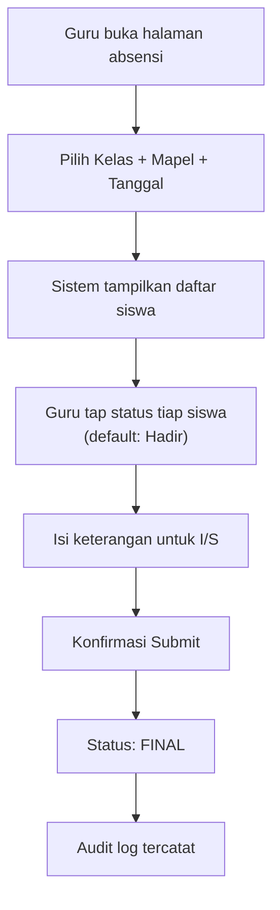
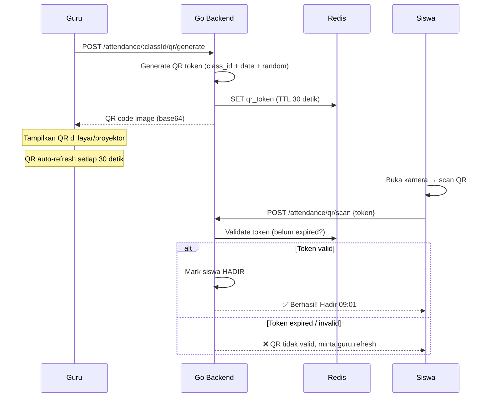
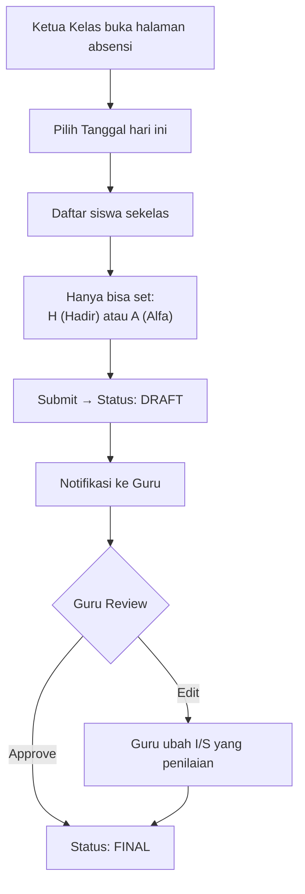
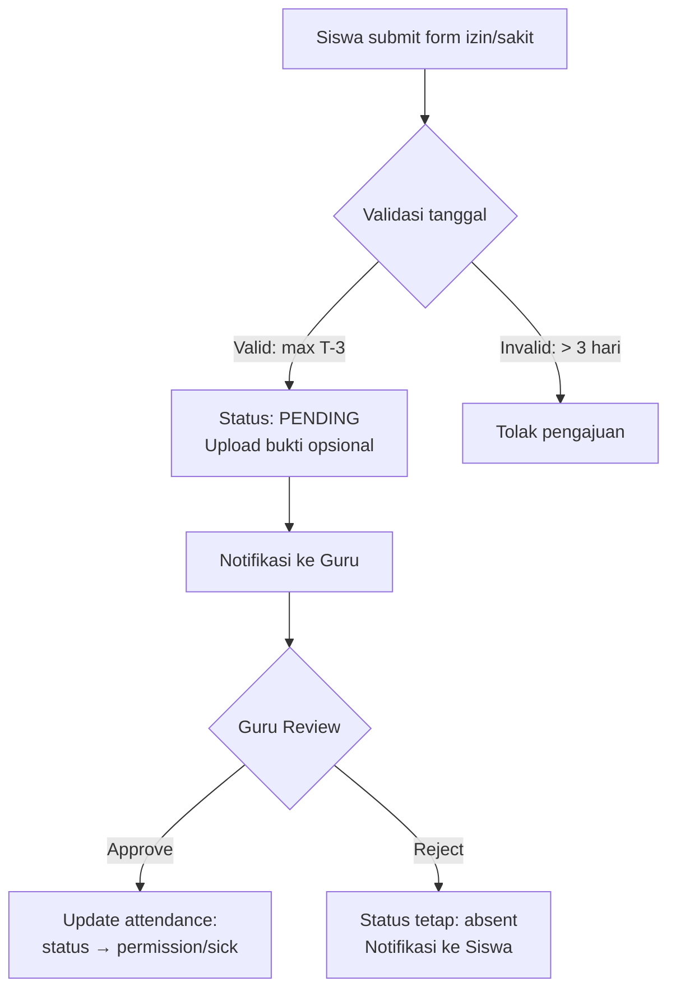

# ✅ Attendance Flow — AkuBelajar

> Sistem absensi dari awal hingga akhir: input, approval, edit, pengajuan izin, dan rekap.

---

## Kode Status Absensi

| Kode | Status | Dihitung Hadir? | Keterangan Wajib? |
|:---|:---|:---|:---|
| `present` | Hadir | ✅ | ❌ |
| `permission` | Izin | ✅ | ✅ (disetujui Guru) |
| `sick` | Sakit | ✅ | ✅ (bisa upload surat dokter) |
| `absent` | Alfa | ❌ | ❌ |
| `late` | Terlambat | ✅ (hadir penuh) | ❌ (waktu dicatat otomatis) |

---

## 1. Input Absensi oleh Guru



- Default status semua siswa: **Hadir** (guru hanya perlu tandai yang tidak hadir)
- Tanggal: hanya T+0 (hari ini) atau T-1 (kemarin)
- Setelah submit: **tidak bisa diedit sendiri tanpa alasan** (jika > 24 jam)

---

## 1b. QR Code Absensi (🟡 P1 — Sprint 4)



### QR Anti-Cheat

| Mekanisme | Detail |
|:---|:---|
| QR rotate | Berubah setiap **30 detik** — mencegah screenshot sharing |
| TTL pendek | Token expire di Redis setelah 30 detik |
| 1 scan per siswa | Siswa hanya bisa scan 1× per sesi absensi |
| Validasi kelas | Siswa harus terdaftar di kelas yang bersangkutan |
| Fallback | Guru tetap bisa input manual jika QR bermasalah |

### Camera untuk QR Scan

| Parameter | Nilai |
|:---|:---|
| Library | `html5-qrcode` (~50KB, free) |
| Default kamera | **Belakang** (`facingMode: 'environment'`) |
| Mirror | **TIDAK** — `transform: none` |
| Auto-close | Kamera mati otomatis setelah scan berhasil |

---

## 2. Input Absensi oleh Ketua Kelas



- Ketua Kelas **tidak bisa** set `permission` atau `sick` (memerlukan validasi Guru)
- Data berstatus **DRAFT** sampai Guru approve/finalisasi

---

## 3. Edit Absensi (Koreksi)

| Siapa | Bisa Edit Apa | Batasan |
|:---|:---|:---|
| Guru | Absensi **miliknya sendiri** | < 24 jam: bebas. > 24 jam: wajib isi `reason` |
| SuperAdmin | **Semua** absensi | Wajib isi `reason` |
| Ketua Kelas | ❌ Tidak bisa edit | — |
| Siswa | ❌ Tidak bisa edit | — |

Setiap edit dicatat di `audit_logs`: siapa, kapan, dari status apa ke status apa.

---

## 4. Pengajuan Izin/Sakit oleh Siswa



- Siswa bisa submit izin/sakit **maksimal 3 hari setelah tanggal**
- Upload bukti (surat dokter, foto): opsional, max 5MB, PDF/JPG/PNG
- Guru menerima notifikasi saat ada pengajuan baru

---

## 5. Rekap & Statistik

### Rekap Harian (per kelas)

```json
{
  "class_id": "uuid",
  "date": "2026-03-21",
  "summary": { "present": 28, "permission": 1, "sick": 1, "absent": 2, "late": 0 },
  "total": 32
}
```

### Alert Otomatis

| Kondisi | Threshold | Notifikasi Ke |
|:---|:---|:---|
| Alfa berturut-turut | ≥ 3 hari | Guru kelas + Wali kelas |
| Alfa dalam 1 minggu | ≥ 3 kali | Guru kelas + Admin |
| Kehadiran semester < 80% | Warning | Wali kelas |
| Kehadiran semester < 75% | **Critical** — tidak bisa ikut UAS | Admin + Wali kelas |

### Persentase Kehadiran

```
Persentase = (present + permission + sick + late) / total_hari × 100%
```

**Keputusan:** Kehadiran rendah **TIDAK** otomatis mempengaruhi nilai akhir. Dampaknya hanya: siswa < 75% tidak diizinkan ikut UAS/UKK. Nilai tetap dihitung dari tugas + kuis yang ada.

---

*Terakhir diperbarui: 22 Maret 2026*
