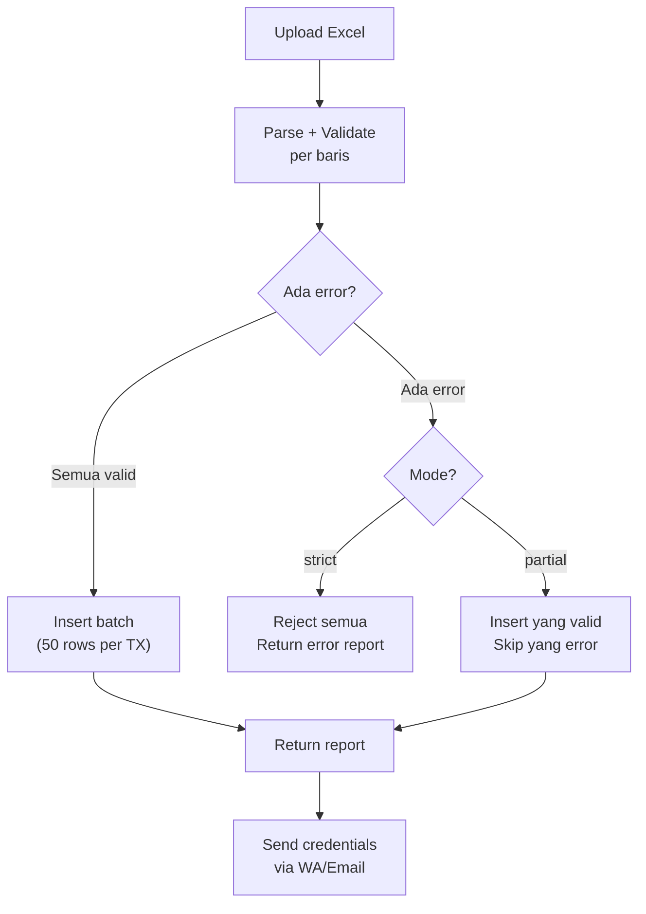

# 📦 Bulk Operations Specification — AkuBelajar

> Format Excel, validasi per baris, error reporting, progress tracking, dan partial failure handling.

---

## 1. Endpoints Bulk

| Endpoint | Deskripsi | Max Rows | Timeout |
|:---|:---|:---|:---|
| `POST /users/bulk-import` | Import guru/siswa dari Excel | 500 | 60s |
| `POST /attendances/bulk` | Input absensi 1 kelas sekaligus | 40 | 10s |
| `POST /grades/bulk-update` | Update nilai per kelas per mapel | 40 | 10s |
| `POST /admin/student-promotions` | Bulk naik kelas | 500 | 60s |

---

## 2. Format Excel — Import Siswa

### Template Download

`GET /users/bulk-import/template?role=student` → download `.xlsx` template

### Kolom Wajib & Opsional

| Kolom | Header Excel | Required | Validasi | Contoh |
|:---|:---|:---|:---|:---|
| A | `nama` | ✅ | min 2, max 100 char | Andi Pratama |
| B | `nisn` | ✅ | tepat 10 digit angka | 0012345678 |
| C | `email` | ❌ | valid email format | andi@email.com |
| D | `kelas` | ✅ | harus ada di DB | 8A |
| E | `tanggal_lahir` | ❌ | YYYY-MM-DD | 2010-05-15 |
| F | `nama_ortu` | ❌ | min 2, max 100 char | Ibu Siti |
| G | `no_wa_ortu` | ❌ | +62xxxx format | +6289876543210 |

### Auto-Generate Rules

- Jika `email` kosong → `{nisn}@student.akubelajar.id`
- Password: auto-generated 12 char random
- `is_first_login`: selalu `true`
- `role`: sesuai parameter request (`student` / `teacher`)

---

## 3. Format Excel — Import Guru

| Kolom | Header | Required | Validasi | Contoh |
|:---|:---|:---|:---|:---|
| A | `nama` | ✅ | min 2, max 100 char | Budi Santoso |
| B | `email` | ✅ | valid email, unique | budi@akubelajar.id |
| C | `nip` | ❌ | 18 digit angka | 198501012010011001 |
| D | `no_wa` | ❌ | +62xxxx | +6281234567890 |
| E | `mata_pelajaran` | ❌ | pisahkan dengan koma | Matematika, Fisika |

---

## 4. Processing Flow



### Processing Modes

| Mode | Query Param | Behavior |
|:---|:---|:---|
| `strict` (default) | `?mode=strict` | Jika ada 1 baris error → semua gagal, tidak ada data yang masuk |
| `partial` | `?mode=partial` | Baris valid diproses, baris error di-skip |

---

## 5. Validasi per Baris

```go
type RowValidation struct {
    Row     int      `json:"row"`
    Valid   bool     `json:"valid"`
    Errors  []string `json:"errors"`
}

// Contoh output validasi
[
    {"row": 1, "valid": true,  "errors": []},
    {"row": 2, "valid": false, "errors": ["NISN harus 10 digit", "Email format tidak valid"]},
    {"row": 3, "valid": false, "errors": ["NISN sudah terdaftar: 0012345678"]},
    {"row": 4, "valid": true,  "errors": []}
]
```

---

## 6. Response Format

### Success (all rows)

```json
{
  "data": {
    "total_rows": 100,
    "success": 100,
    "failed": 0,
    "mode": "strict",
    "duration_ms": 12500,
    "credentials_sent_via": "email"
  }
}
```

### Partial Success

```json
{
  "data": {
    "total_rows": 100,
    "success": 95,
    "failed": 5,
    "mode": "partial",
    "errors": [
      {"row": 12, "errors": ["NISN sudah terdaftar"]},
      {"row": 34, "errors": ["Email format tidak valid"]},
      {"row": 56, "errors": ["Kelas 'XY' tidak ditemukan"]},
      {"row": 78, "errors": ["NISN harus 10 digit"]},
      {"row": 99, "errors": ["Nama terlalu panjang"]}
    ],
    "download_error_report": "/api/v1/users/bulk-import/report/uuid-report-id"
  }
}
```

---

## 7. Progress Tracking (WebSocket)

Untuk import > 100 rows, kirim progress via WebSocket:

```json
{ "type": "bulk:progress", "payload": { "job_id": "uuid", "processed": 50, "total": 200, "success": 48, "failed": 2, "percentage": 25 } }
```

```json
{ "type": "bulk:complete", "payload": { "job_id": "uuid", "success": 195, "failed": 5, "duration_ms": 25000 } }
```

---

## 8. Batch Processing Strategy

```go
const batchSize = 50

func BulkInsertUsers(users []User) (Report, error) {
    report := Report{}
    
    for i := 0; i < len(users); i += batchSize {
        end := min(i+batchSize, len(users))
        batch := users[i:end]
        
        tx, _ := db.Begin(ctx)
        for _, u := range batch {
            _, err := tx.Exec(ctx, "INSERT INTO users ...", u.Fields()...)
            if err != nil {
                report.Failed++
                report.Errors = append(report.Errors, RowError{Row: i, Err: err.Error()})
                continue
            }
            report.Success++
        }
        tx.Commit(ctx)
        
        // Rate limit: 100ms antara batch (agar tidak overload DB)
        time.Sleep(100 * time.Millisecond)
        
        // Send WebSocket progress
        sendProgress(report)
    }
    return report, nil
}
```

---

*Terakhir diperbarui: 21 Maret 2026*
