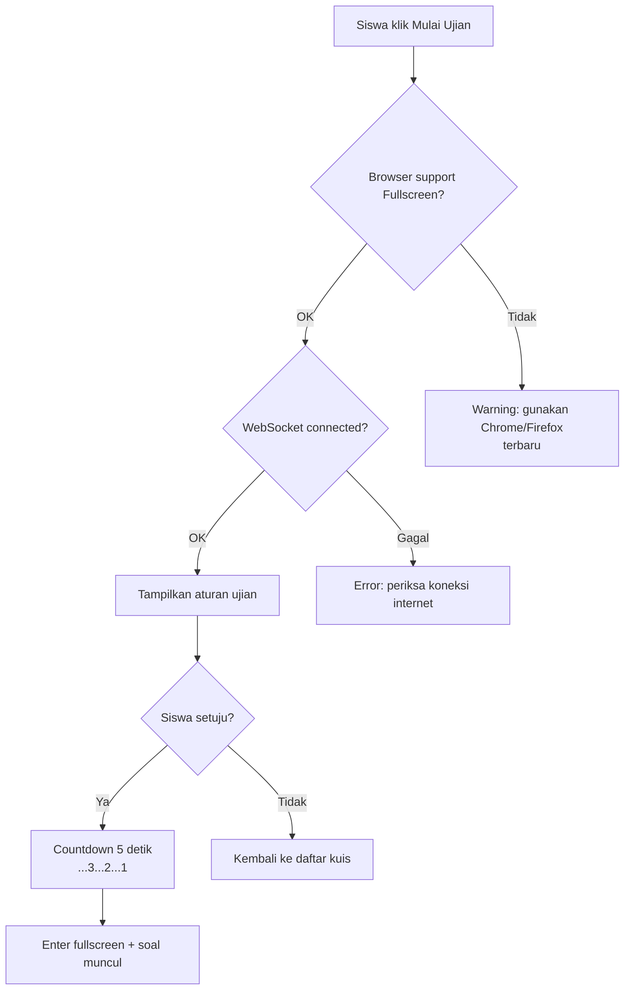
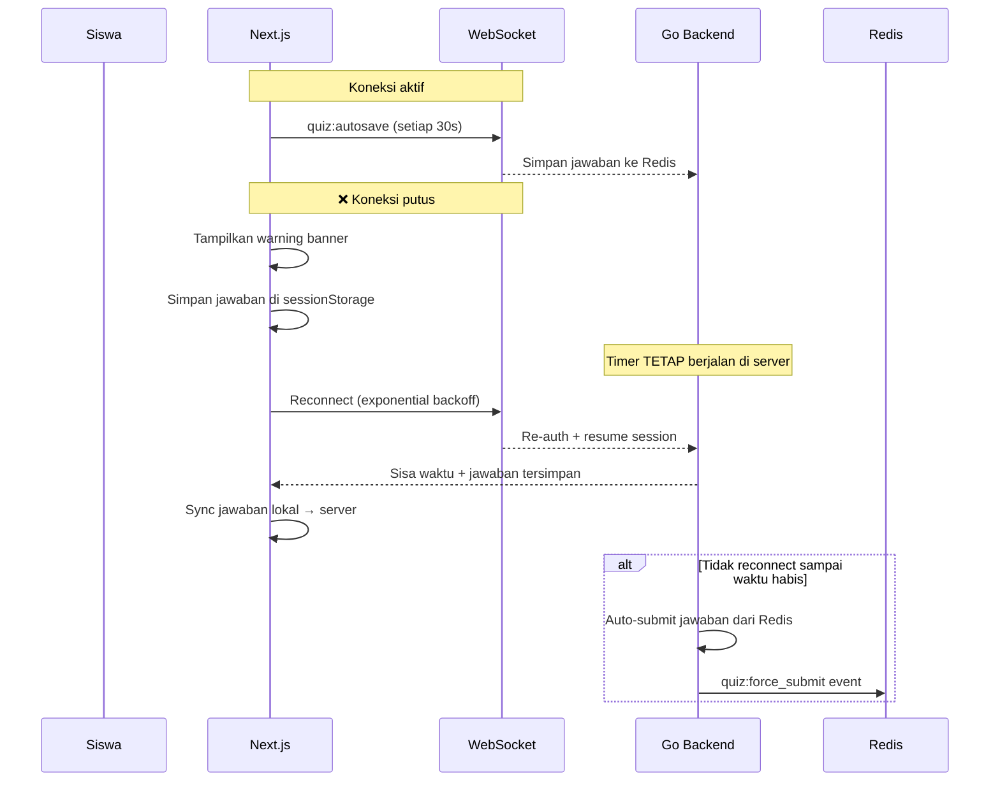
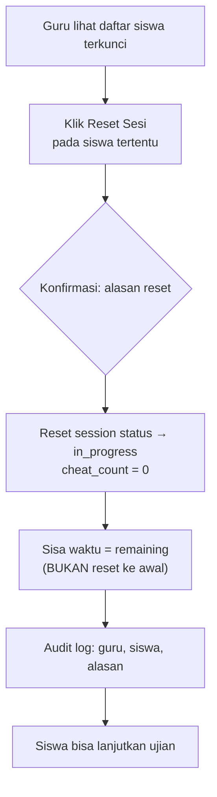

# 📋 CBT Detail Flow — AkuBelajar

> Detail Computer-Based Test: pre-exam, pengacakan, reconnect, anti-cheat, reset sesi, dan review.

---

## 1. Pre-Exam Checklist



### Aturan Ujian (Ditampilkan Sebelum Mulai)

1. Tidak boleh membuka tab/aplikasi lain
2. Jawaban otomatis tersimpan setiap 30 detik
3. Jika koneksi terputus, waktu **tetap berjalan** di server
4. Kecurangan terdeteksi akan mengunci sesi
5. Timer dihitung oleh server, bukan browser

---

## 2. Pengacakan Soal

### Algoritma

- Pengacakan dilakukan **di server** saat `POST /quizzes/:id/sessions`
- Seed: `SHA-256(quiz_id + student_id + server_secret)`
- Metode: **Fisher-Yates shuffle** menggunakan seed

```go
func ShuffleQuestions(questions []Question, seed int64) []Question {
    r := rand.New(rand.NewSource(seed))
    shuffled := make([]Question, len(questions))
    copy(shuffled, questions)
    for i := len(shuffled) - 1; i > 0; i-- {
        j := r.Intn(i + 1)
        shuffled[i], shuffled[j] = shuffled[j], shuffled[i]
    }
    return shuffled
}
```

### Pengacakan Opsi Jawaban

- Opsi jawaban juga diacak per siswa
- **Pengecualian:** opsi yang mengandung "Semua benar" atau "Tidak ada yang benar" → selalu di posisi terakhir
- Order disimpan di `quiz_sessions.question_order`

---

## 3. Koneksi Putus di Tengah Ujian



### Autosave Strategy

| Trigger | Aksi |
|:---|:---|
| Setiap 30 detik | WebSocket `quiz:autosave` ke server |
| Pindah soal | Immediate save jawaban soal saat ini |
| Koneksi putus | Simpan ke `sessionStorage` (fallback) |
| Reconnect | Sync `sessionStorage` → server |

---

## 4. Deteksi Kecurangan (Anti-Cheat)

| Event | Aksi Sistem | Toleransi | Notif ke Guru |
|:---|:---|:---|:---|
| `visibilitychange` (tab switch) | Warning popup + counter++ | 3× → lock | ✅ "Siswa X berpindah tab" |
| `blur` (minimize) | Warning popup + counter++ | 2× → lock | ✅ "Siswa X minimize browser" |
| DevTools terbuka | **Langsung lock** | 0 | ✅ "DevTools terdeteksi" |
| Copy/paste attempt | Block + warning | ∞ (tidak lock) | ❌ |
| IP berubah mid-session | **Langsung lock** | 0 | ✅ "IP berubah mid-ujian" |
| Login di device lain | Session lama **expired** | 0 | ✅ "Multi-device terdeteksi" |

### Saat Session Di-Lock

1. Soal disembunyikan, tampilkan pesan: *"Sesi dikunci karena terdeteksi aktivitas mencurigakan"*
2. Guru menerima real-time notification
3. Jawaban yang sudah ada **tetap tersimpan**
4. Hanya **Guru** yang bisa reset sesi

---

## 5. Guru Reset Sesi



- Waktu **dilanjutkan** dari sisa waktu (bukan di-reset ke awal)
- Jika sisa waktu sudah 0 → guru bisa **extend waktu** (maks +30 menit)

---

## 6. Hasil & Review Pasca Ujian

### Kapan Siswa Bisa Lihat Jawaban?

| `review_mode` | Kapan Tersedia |
|:---|:---|
| `immediately` | Langsung setelah submit |
| `after_all_submit` | Setelah semua siswa submit atau waktu habis |
| `manual` | Setelah guru menekan tombol "Buka Review" |

### Halaman Review

- Soal + jawaban siswa (highlighted benar/salah)
- Kunci jawaban yang benar
- Penjelasan AI (Gemini) per soal
- Distribusi jawaban per soal (bar chart untuk guru)

### Guru Analytics

- **Mean score** per kuis
- **Distribusi nilai** (histogram)
- **Soal tersulit** (% salah tertinggi)
- **Soal teracak tebak** (distribusi merata = sulit dibedakan dari tebakan)

---

*Terakhir diperbarui: 21 Maret 2026*
