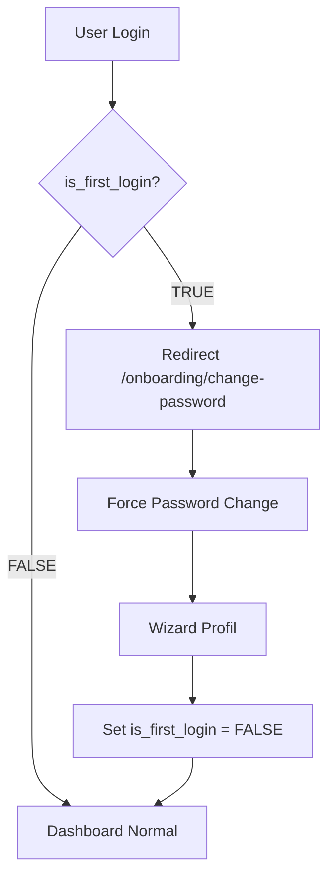
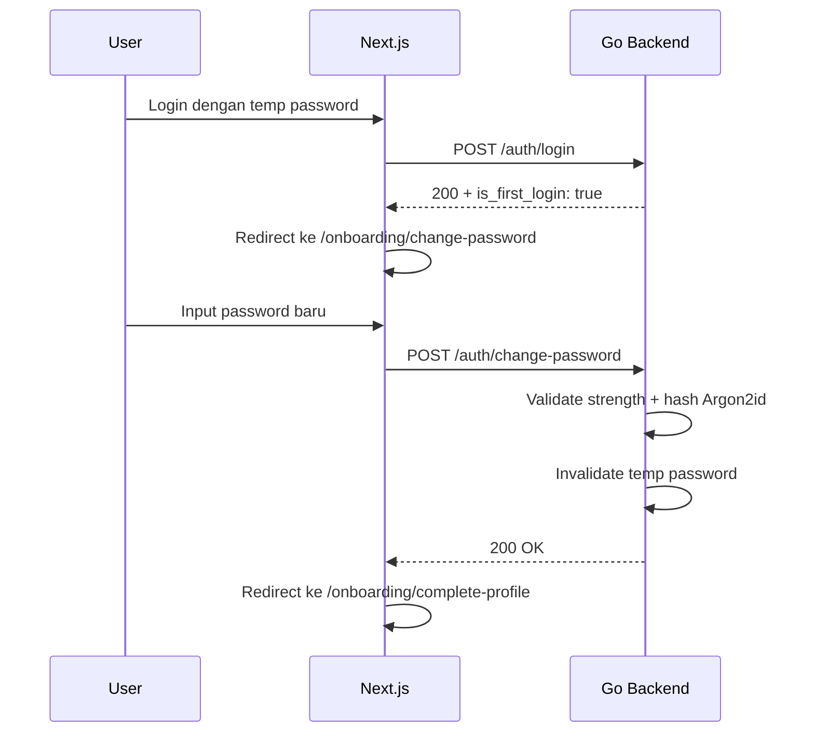
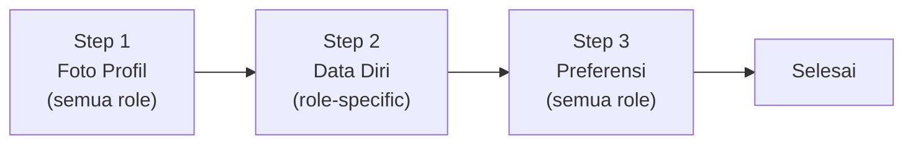

# 🚪 First Login Flow — AkuBelajar

> Apa yang terjadi saat pengguna login PERTAMA KALI setelah akun dibuat oleh admin/sistem.

---

## 1. Deteksi First Login

- Kolom: `users.is_first_login BOOLEAN DEFAULT TRUE`
- Next.js middleware cek flag ini pada setiap request authenticated
- Flag di-set `FALSE` **hanya setelah semua langkah onboarding selesai**

---

## 2. Force Password Change

### Password sementara
- Generated: 12 karakter random (`crypto/rand` Go)
- Format: campuran uppercase + lowercase + angka
- Contoh: `xK9mR2pL4wQs`

### Validasi password baru
- Min 8 karakter, max 72 karakter
- Wajib: 1 huruf besar, 1 huruf kecil, 1 angka, 1 simbol
- Tidak boleh sama dengan password sementara
- Tidak boleh mengandung nama/email/NISN user
- Cek terhadap 10.000 common passwords

### Keamanan
- Halaman lain **tidak bisa diakses** sebelum password diganti (middleware Next.js block semua route kecuali `/onboarding/*`)
- Tidak bisa skip atau kembali ke login

---

## 3. Wizard Kelengkapan Profil

### Step 1 — Foto Profil (Semua Role)

| Field | Required | Validasi |
|:---|:---|:---|
| Foto profil | ❌ Opsional | Max 2MB, JPG/PNG/WebP, 100×100 – 2000×2000 px |

- Upload via presigned URL MinIO
- Bisa skip (menggunakan avatar default)

### Step 2 — Data Diri (Role-Specific)

**Siswa:**

| Field | Required | Validasi |
|:---|:---|:---|
| NISN | ✅ | 10 digit angka, unik per sekolah |
| Tanggal lahir | ✅ | Tidak di masa depan, max 100 tahun lalu |
| Nama orang tua | ✅ | Min 2, max 100 char |
| No. WA orang tua | ✅ | Format E.164 (+62xxx) |
| Pilih kelas aktif | ✅ (jika belum di-assign) | Dropdown kelas di sekolahnya |

**Guru:**

| Field | Required | Validasi |
|:---|:---|:---|
| NIP | ❌ | 18 digit angka |
| Mata pelajaran | ✅ | Multi-select dari daftar subjects sekolah |
| No. WA | ✅ | Format E.164 |

### Step 3 — Preferensi Notifikasi (Semua Role)

| Field | Default |
|:---|:---|
| Notifikasi WA | ✅ Aktif |
| Notifikasi Email | ✅ Aktif |
| Notifikasi In-app | ✅ Aktif |
| Jam tenang mulai | 22:00 |
| Jam tenang selesai | 06:00 |

---

## 4. Landing Setelah Onboarding

| Role | Halaman Pertama | Konten Welcome |
|:---|:---|:---|
| SuperAdmin | `/admin/users` | Tour: "Mulai dengan import data guru dan siswa" |
| Guru | `/teacher/dashboard` | Tour: "Buat kuis pertama Anda atau input absensi" |
| Ketua Kelas | `/student/dashboard` | Tour: "Anda bisa input absensi kelas" |
| Siswa | `/student/dashboard` | Tour: "Lihat tugas dan kuis yang tersedia" |

---

## 5. Edge Cases

| Skenario | Penanganan |
|:---|:---|
| Browser ditutup di tengah onboarding | `is_first_login` masih `TRUE` → redirect lagi saat login berikutnya. Progress step disimpan di `user_profiles` |
| Foto profil gagal upload | Show error, bisa retry atau skip. Sistem tidak block progress |
| No. WA orang tua sudah terdaftar di akun lain | ⚠️ Warning (bukan error): "Nomor ini terhubung dengan akun lain." Izinkan — satu ortu bisa untuk beberapa anak |
| NISN sudah ada | ❌ Error: `USER_003` — NISN harus unik per sekolah |

---

*Terakhir diperbarui: 21 Maret 2026*
