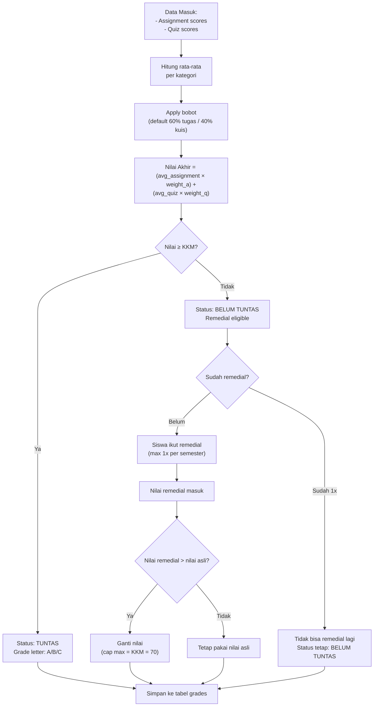
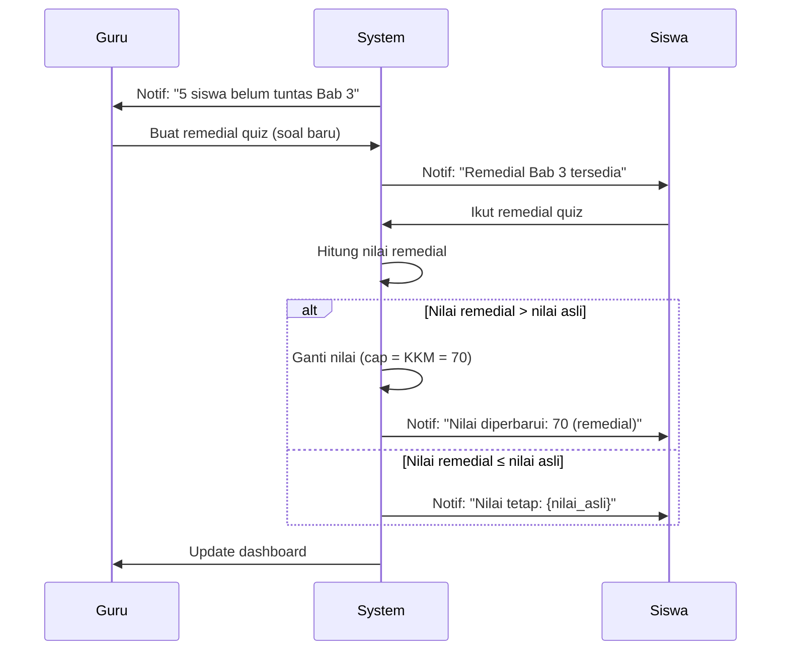

# 📊 Grade Calculation Flow — AkuBelajar

> Flowchart lengkap: dari input nilai mentah sampai rapor akhir. Termasuk remedial, KKM, dan bobot configurable.

---

## 1. Flow Perhitungan Nilai



---

## 2. Formula

### Nilai Akhir

```
final_score = (avg_assignment × assignment_weight) + (avg_quiz × quiz_weight)
```

| Variable | Sumber | Default |
|:---|:---|:---|
| `avg_assignment` | `AVG(assignment_submissions.grade) WHERE status='graded'` | — |
| `avg_quiz` | `AVG(quiz_sessions.score) WHERE status='completed'` | — |
| `assignment_weight` | `schools.config.grading_weights.assignment` | 0.60 |
| `quiz_weight` | `schools.config.grading_weights.quiz` | 0.40 |

### Contoh Perhitungan

```
Siswa Rina, Matematika:
- Tugas: [80, 75, 90] → avg = 81.67
- Kuis:  [70, 85]     → avg = 77.50

Bobot: 60/40
final = (81.67 × 0.6) + (77.50 × 0.4) = 49.00 + 31.00 = 80.00

KKM = 70 → TUNTAS ✅
Grade letter = B (lihat tabel di bawah)
```

---

## 3. Grade Letter & Predikat

| Range | Letter | Predikat |
|:---|:---|:---|
| 90 – 100 | A | Sangat Baik |
| 80 – 89 | B | Baik |
| 70 – 79 | C | Cukup |
| < 70 | D | Perlu Bimbingan |

```go
func GradeLetter(score float64) (string, string) {
    switch {
    case score >= 90: return "A", "Sangat Baik"
    case score >= 80: return "B", "Baik"
    case score >= 70: return "C", "Cukup"
    default:          return "D", "Perlu Bimbingan"
    }
}
```

---

## 4. Remedial Flow



### Rules Remedial

| Rule | Nilai |
|:---|:---|
| Max remedial per semester | 1 kali per mapel |
| Cap nilai remedial | Max = KKM (70) |
| Remedial mengganti? | Ya, jika lebih tinggi dari asli |
| Guru buat soal baru? | Ya, soal remedial harus berbeda |

---

## 5. Edge Cases

| Skenario | Handling |
|:---|:---|
| Siswa tidak punya nilai tugas | `avg_assignment = 0`, hitung dari kuis saja |
| Siswa tidak punya nilai kuis | `avg_quiz = 0`, hitung dari tugas saja |
| Siswa tidak punya nilai sama sekali | `final_score = null`, status "Belum Ada Nilai" |
| Bobot diubah setelah nilai masuk | Recalculate semua nilai di kelas tersebut |
| Guru belum beri nilai semua tugas | Warning: "3 tugas belum dinilai, kalkulasi belum final" |

---

## 6. SQL Query Kalkulasi

```sql
WITH assignment_avg AS (
    SELECT student_id, subject_id, AVG(grade) AS avg_score
    FROM assignment_submissions
    WHERE status = 'graded'
    GROUP BY student_id, subject_id
),
quiz_avg AS (
    SELECT student_id, subject_id, AVG(score) AS avg_score
    FROM quiz_sessions
    WHERE status = 'completed'
    GROUP BY student_id, subject_id
)
SELECT
    s.id AS student_id,
    sub.id AS subject_id,
    COALESCE(a.avg_score, 0) AS avg_assignment,
    COALESCE(q.avg_score, 0) AS avg_quiz,
    ROUND(
        COALESCE(a.avg_score, 0) * (sc.config->>'assignment_weight')::NUMERIC +
        COALESCE(q.avg_score, 0) * (sc.config->>'quiz_weight')::NUMERIC
    , 2) AS final_score
FROM students s
CROSS JOIN subjects sub
LEFT JOIN assignment_avg a ON a.student_id = s.id AND a.subject_id = sub.id
LEFT JOIN quiz_avg q ON q.student_id = s.id AND q.subject_id = sub.id
JOIN schools sc ON sc.id = s.school_id;
```

---

*Terakhir diperbarui: 21 Maret 2026*
