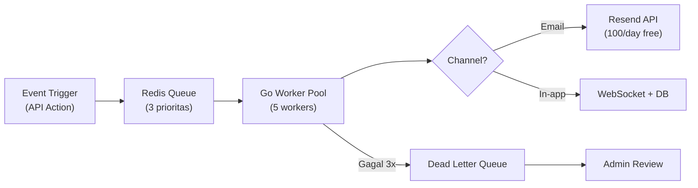

# 🔔 Notification Flow — AkuBelajar

> Sistem notifikasi end-to-end: arsitektur queue, preferensi user, katalog event, template pesan, failure handling.

---

## 1. Arsitektur Queue



> **Demo Mode:** WA channel (Fonnte) dinonaktifkan untuk demo. Semua notifikasi dikirim via **In-app + Email (Resend)**. Fonnte bisa diaktifkan untuk production ($25K/bulan).

### Prioritas Queue

| Prioritas | Contoh Event | Processing |
|:---|:---|:---|
| 🔴 HIGH | Security alert, session locked, password changed | Immediate |
| 🟡 MEDIUM | Deadline reminder, nilai keluar, izin disetujui | < 5 menit |
| 🟢 LOW | Info umum, tips, pengumuman sekolah | < 30 menit |

### Retry Strategy

- Retry: 3 kali dengan exponential backoff (1s, 5s, 15s)
- Setelah gagal 3×: masuk Dead Letter Queue
- Admin bisa retry manual dari dashboard

---

## 2. Preferensi per User

Setiap user bisa mengatur channel dan quiet hours:

| Setting | Default | Pilihan |
|:---|:---|:---|
| WA enabled | ✅ | On/Off |
| Email enabled | ✅ | On/Off |
| In-app enabled | ✅ | On/Off |
| Quiet hours start | 22:00 | Time picker |
| Quiet hours end | 06:00 | Time picker |

- Notifikasi **HIGH priority** mengabaikan quiet hours (security critical)
- Admin sekolah bisa set default preferensi untuk user baru

---

## 3. Katalog Event Notifikasi

| Event | Trigger | Channel | Penerima | Prioritas |
|:---|:---|:---|:---|:---|
| `assignment_new` | Tugas dipublish | WA + In-app | Siswa di kelas | 🟡 |
| `assignment_deadline_24h` | 24 jam before deadline | WA + In-app | Siswa yang belum submit | 🟡 |
| `assignment_graded` | Guru beri nilai | In-app | Siswa | 🟡 |
| `quiz_published` | Kuis dipublish | WA + In-app | Siswa di kelas | 🟡 |
| `quiz_session_locked` | Anti-cheat trigger | In-app | Guru | 🔴 |
| `grade_published` | Nilai akhir keluar | WA + Email + In-app | Siswa | 🟡 |
| `report_card_ready` | Rapor tersedia | WA + Email + In-app | Siswa + Ortu | 🟡 |
| `account_created` | Akun baru dibuat | WA + Email | User baru | 🟡 |
| `login_new_device` | Login dari device baru | WA + In-app | User | 🔴 |
| `password_changed` | Password berhasil diubah | WA + Email | User | 🔴 |
| `attendance_absent_streak` | Alfa ≥ 3 hari | In-app + WA | Guru + Wali | 🔴 |
| `permission_request` | Siswa ajukan izin | In-app | Guru | 🟡 |
| `permission_approved` | Izin disetujui | In-app | Siswa | 🟢 |
| `low_score_warning` | Nilai < 60 x2 minggu | In-app | Guru | 🟡 |
| `invite_token_claimed` | Token diklaim | In-app | Admin/Guru pembuat | 🟢 |

---

## 4. Template Pesan

### Tugas Baru — WA

```
📚 *Tugas Baru: {{title}}*

Mata pelajaran: {{subject}}
Kelas: {{class}}
Deadline: {{deadline}}

Kerjakan di: {{url}}
```

### Tugas Baru — Email (HTML)

```html
<h2>📚 Tugas Baru</h2>
<p><strong>{{title}}</strong></p>
<table>
  <tr><td>Mata pelajaran</td><td>{{subject}}</td></tr>
  <tr><td>Kelas</td><td>{{class}}</td></tr>
  <tr><td>Deadline</td><td>{{deadline}}</td></tr>
</table>
<a href="{{url}}">Kerjakan Sekarang</a>
```

### Tugas Baru — In-app

```json
{ "title": "Tugas Baru: {{title}}", "body": "Deadline: {{deadline}} — Klik untuk lihat detail" }
```

### Alert Keamanan — WA

```
🔒 *Peringatan Keamanan AkuBelajar*

Terdeteksi login dari device baru:
- Waktu: {{time}}
- Device: {{device_info}}
- IP: {{ip}}

Jika ini bukan Anda, segera ganti password.
```

### Nilai Keluar — WA

```
📊 *Nilai Baru*

Mata pelajaran: {{subject}}
Tugas: {{title}}
Nilai: {{grade}}

Lihat detail: {{url}}
```

---

## 5. Unsubscribe & Compliance

| Channel | Cara Unsubscribe |
|:---|:---|
| WA | Reply "STOP" atau ubah di /settings/notifications |
| Email | Link unsubscribe di footer setiap email |
| In-app | Ubah di /settings/notifications |

### Compliance Rules

- Tidak kirim lebih dari **5 WA per user per hari** (kecuali HIGH priority)
- Tidak kirim di luar quiet hours (kecuali HIGH priority)
- Hormat preferensi user — auto-disable channel jika user unsubscribe
- Footer email wajib: nama sekolah, alamat, link unsubscribe

---

## 6. Failure Handling

| Skenario | Penanganan |
|:---|:---|
| Email hard bounce | Mark email invalid di user_profiles. Stop kirim email ke alamat ini |
| Email soft bounce | Retry 2×. Jika tetap gagal → mark as failed |
| Semua channel gagal | Simpan sebagai in-app notification (selalu sukses) |
| Resend API down | Queue tetap di Redis, retry saat API kembali |
| Resend rate limit (100/day) | Sisanya masuk queue, kirim besok. In-app tetap langsung |

---

*Terakhir diperbarui: 21 Maret 2026*
