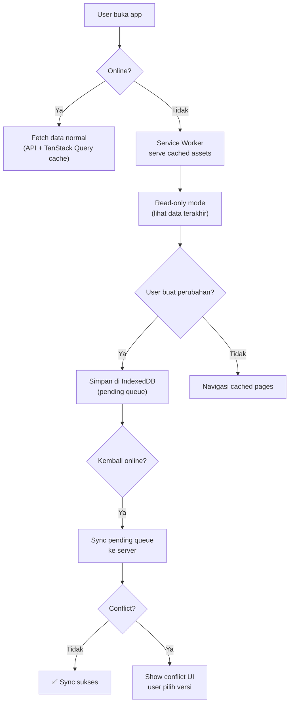

# 📴 Offline Sync Flow — AkuBelajar

> PWA offline strategy: apa yang tersedia offline, bagaimana sync, dan conflict resolution.

> **Status: ⚪ P3 (Fase 2)** — Dokumen ini disiapkan untuk implementasi di masa depan.

---

## 1. Offline Strategy Overview



---

## 2. Apa yang Tersedia Offline?

| Fitur | Offline? | Detail |
|:---|:---|:---|
| Login | ❌ | Butuh server untuk token |
| Lihat dashboard | ✅ Read-only | Cache terakhir dari TanStack Query |
| Lihat jadwal | ✅ Read-only | Cached di Service Worker |
| Lihat nilai | ✅ Read-only | Cached |
| Input absensi | ✅ Queue | Simpan di IndexedDB, sync saat online |
| Submit tugas | ⚠️ Partial | Teks di-queue, file upload harus online |
| Ikut kuis/CBT | ❌ | Butuh timer server + anti-cheat |
| AI generate soal | ❌ | Butuh Gemini API |
| Notifikasi | ❌ | Butuh WebSocket |

---

## 3. Service Worker Config

```javascript
// service-worker.js (next-pwa)
const CACHE_NAME = 'akubelajar-v1';

// Pre-cache: app shell
const PRECACHE = [
  '/',
  '/dashboard',
  '/offline',
  '/manifest.json',
  '/icons/icon-192.png',
];

// Runtime cache: API responses
workbox.routing.registerRoute(
  /\/api\/v1\/(users\/me|dashboard|schedules)/,
  new workbox.strategies.StaleWhileRevalidate({
    cacheName: 'api-cache',
    plugins: [
      new workbox.expiration.ExpirationPlugin({
        maxEntries: 50,
        maxAgeSeconds: 24 * 60 * 60, // 24 jam
      }),
    ],
  })
);

// Offline fallback
workbox.routing.setCatchHandler(({ event }) => {
  if (event.request.destination === 'document') {
    return caches.match('/offline');
  }
});
```

---

## 4. Pending Queue (IndexedDB)

```typescript
interface PendingAction {
  id: string;          // UUID v7
  type: 'attendance' | 'assignment_submit' | 'grade_update';
  payload: unknown;    // request body
  createdAt: string;   // ISO timestamp
  retryCount: number;
  status: 'pending' | 'syncing' | 'synced' | 'conflict';
}

// Saat kembali online
async function syncPendingQueue() {
  const pending = await db.getAll('pending_actions');
  
  for (const action of pending) {
    try {
      await api.post(actionToEndpoint(action.type), action.payload);
      await db.delete('pending_actions', action.id);
    } catch (err) {
      if (err.status === 409) { // Conflict
        action.status = 'conflict';
        await db.put('pending_actions', action);
      } else {
        action.retryCount++;
      }
    }
  }
}
```

---

## 5. Conflict Resolution

| Skenario | Strategi |
|:---|:---|
| Absensi: guru edit offline, guru lain edit online | **Last-write-wins** + notif ke guru pertama |
| Nilai: guru edit offline, sudah di-lock oleh admin | **Server wins** — notify guru bahwa nilai sudah locked |
| Profile: user edit offline, admin edit online | **User sees diff** — pilih versi mana yang disimpan |

---

*Terakhir diperbarui: 21 Maret 2026*
