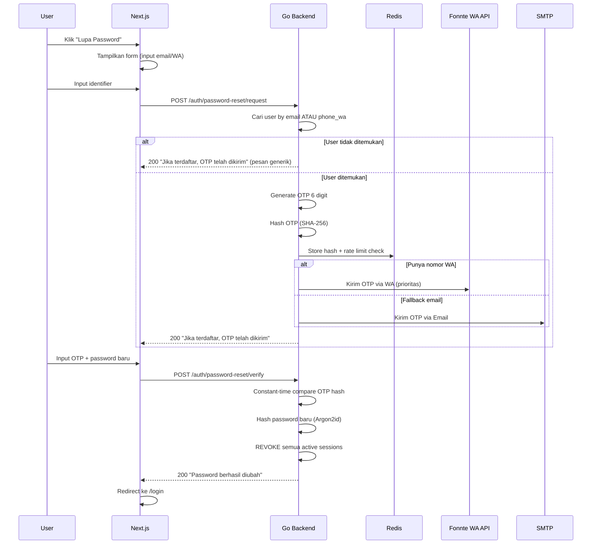
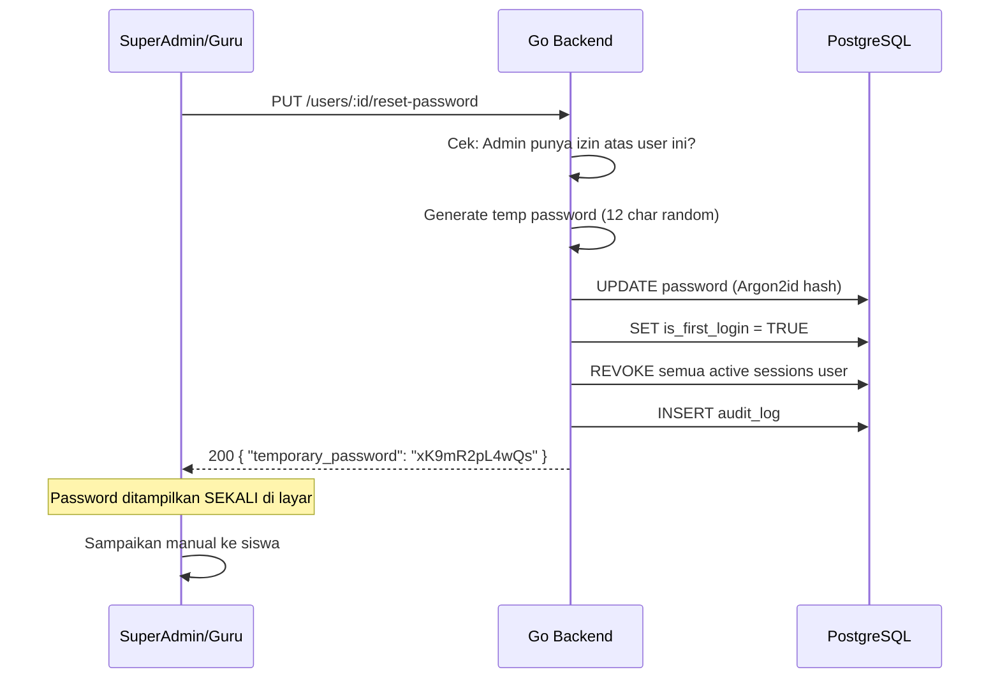

# 🔑 Password Reset Flow — AkuBelajar

> Semua skenario reset password: self-service via OTP dan admin reset.

---

## 1. Self-Service Reset (via Halaman Login)



### Batasan OTP

| Parameter | Nilai |
|:---|:---|
| Panjang OTP | 6 digit angka |
| TTL | 5 menit |
| Rate limit | 3 request per jam per IP |
| Penyimpanan | SHA-256 hash (BUKAN plain text) |
| Validasi | Constant-time comparison |

---

## 2. Reset oleh Admin



- SuperAdmin bisa reset **semua user** di sekolahnya
- Guru bisa reset **siswa di kelasnya**
- Password sementara ditampilkan **sekali saja** (tidak dikirim ulang)
- `is_first_login = TRUE` → siswa dipaksa ganti saat login
- Audit log mencatat: admin ID, user ID, timestamp, IP

---

## 3. Schema: password_reset_tokens

```sql
CREATE TABLE password_reset_tokens (
    id          UUID PRIMARY KEY DEFAULT gen_random_uuid(),
    user_id     UUID NOT NULL REFERENCES users(id),
    token_hash  VARCHAR(255) NOT NULL,     -- SHA-256 hash of OTP
    expires_at  TIMESTAMPTZ NOT NULL,      -- NOW() + 5 menit
    used_at     TIMESTAMPTZ,               -- NULL = belum dipakai
    ip_address  INET,
    created_at  TIMESTAMPTZ DEFAULT NOW()
);

CREATE INDEX idx_prt_user ON password_reset_tokens(user_id, created_at);
```

---

## 4. Security Constraints

| Constraint | Detail |
|:---|:---|
| OTP storage | SHA-256 hash, BUKAN plain text |
| Anti-enumeration | Response selalu generik ("Jika terdaftar...") |
| Constant-time comparison | Mencegah timing attack |
| Token cleanup | Scheduled job hapus token expired setiap 1 jam |
| Session revocation | Semua session aktif di-revoke setelah reset |
| Password history | Tidak boleh reuse 3 password terakhir |

---

## 5. Edge Cases

| Skenario | Penanganan |
|:---|:---|
| OTP yang sudah dipakai | Error `AUTH_009`: "Kode OTP salah" (pesan generik) |
| Request OTP berulang cepat | Rate limit: 3/jam per IP → `AUTH_011` |
| User ganti password lalu lupa lagi | Flow normal — bisa request OTP lagi (setelah cooldown habis) |
| Email/WA tidak ditemukan | Tetap tampilkan pesan sukses generik (anti-enumeration) |
| OTP dikirim via WA tapi nomor tidak valid | Fallback ke email. Jika email juga gagal → OTP tidak terkirim, user harus hubungi admin |

---

*Terakhir diperbarui: 21 Maret 2026*
