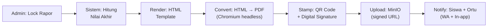
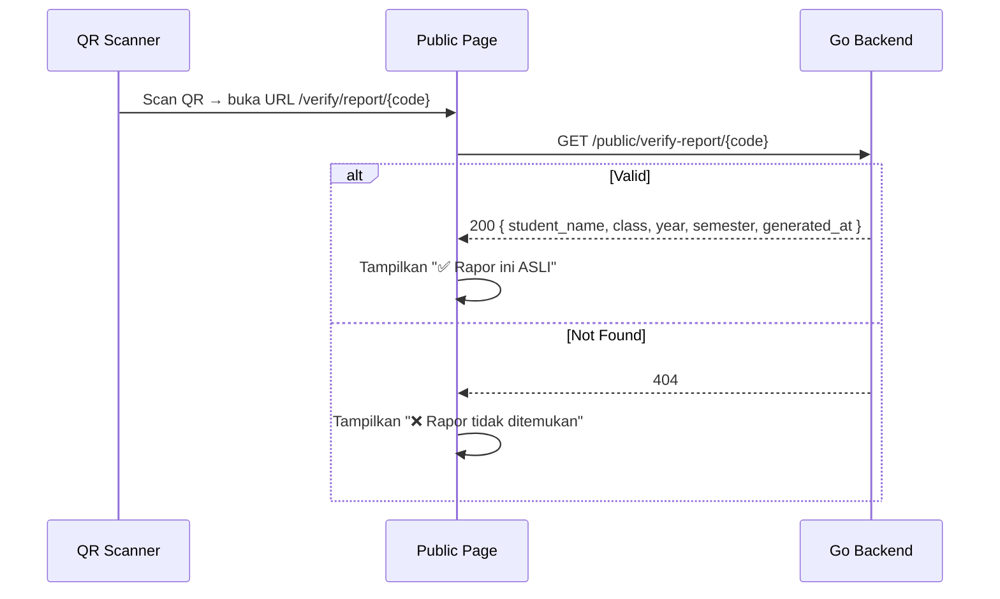

# 📄 Report Card Generation — AkuBelajar

> Alur lengkap generate rapor: kalkulasi → template → PDF → QR → distribusi.

---

## 1. Pipeline Rapor



---

## 2. PDF Engine

| Item | Detail |
|:---|:---|
| Engine | Chromium headless via `rod` (Go library) |
| Alternatif | `wkhtmltopdf` (fallback) |
| Template | Go `html/template` → HTML → PDF |
| Ukuran kertas | A4 portrait |
| DPI | 150 (balance quality vs size) |
| Max size per PDF | ~500KB |

### Mengapa Chromium, Bukan LaTeX?

- Template bisa di-edit oleh non-developer (HTML/CSS)
- Flexbox/Grid untuk layout tabel
- Mendukung gambar (logo sekolah)
- Go library `rod` sudah proven di production

---

## 3. Data yang Masuk ke Rapor

```go
type ReportCardData struct {
    School      SchoolInfo
    Student     StudentInfo
    Year        string          // "2025/2026"
    Semester    int             // 1 atau 2
    Subjects    []SubjectGrade
    Attendance  AttendanceSummary
    Ranking     *int            // nil jika sekolah tidak pakai ranking
    Notes       string          // Catatan wali kelas
    GeneratedAt time.Time
    QRCode      string          // base64 QR image
}

type SubjectGrade struct {
    Name          string
    TeacherName   string
    AssignmentAvg float64
    QuizAvg       float64
    FinalScore    float64
    GradeLetter   string
    Predicate     string  // "Sangat Baik", "Baik", "Cukup", "Perlu Bimbingan"
    IsPassing     bool    // >= KKM
}

type AttendanceSummary struct {
    TotalDays  int
    Present    int
    Permission int
    Sick       int
    Absent     int
    Late       int
    Percentage float64
}
```

---

## 4. Template HTML Rapor

```html
<!DOCTYPE html>
<html lang="id">
<head>
  <style>
    @page { size: A4; margin: 2cm; }
    body { font-family: 'Inter', sans-serif; font-size: 11pt; }
    .header { text-align: center; border-bottom: 2px solid black; }
    .logo { width: 60px; }
    table.nilai { width: 100%; border-collapse: collapse; }
    table.nilai th, table.nilai td { border: 1px solid #333; padding: 6px 8px; }
    .qr-code { position: fixed; bottom: 2cm; right: 2cm; }
  </style>
</head>
<body>
  <div class="header">
    
    <h2>{{.School.Name}}</h2>
    <h3>LAPORAN HASIL BELAJAR PESERTA DIDIK</h3>
    <p>Tahun Pelajaran {{.Year}} — Semester {{.Semester}}</p>
  </div>

  <table class="identitas">
    <tr><td>Nama</td><td>: {{.Student.Name}}</td></tr>
    <tr><td>NISN</td><td>: {{.Student.NISN}}</td></tr>
    <tr><td>Kelas</td><td>: {{.Student.ClassName}}</td></tr>
  </table>

  <table class="nilai">
    <thead>
      <tr>
        <th>No</th><th>Mata Pelajaran</th><th>Nilai</th>
        <th>Huruf</th><th>Predikat</th><th>Ket</th>
      </tr>
    </thead>
    <tbody>
      {{range $i, $s := .Subjects}}
      <tr>
        <td>{{inc $i}}</td>
        <td>{{$s.Name}}</td>
        <td>{{printf "%.0f" $s.FinalScore}}</td>
        <td>{{$s.GradeLetter}}</td>
        <td>{{$s.Predicate}}</td>
        <td>{{if $s.IsPassing}}Tuntas{{else}}Belum Tuntas{{end}}</td>
      </tr>
      {{end}}
    </tbody>
  </table>

  <table class="kehadiran">
    <tr>
      <td>Hadir: {{.Attendance.Present}}</td>
      <td>Izin: {{.Attendance.Permission}}</td>
      <td>Sakit: {{.Attendance.Sick}}</td>
      <td>Alfa: {{.Attendance.Absent}}</td>
    </tr>
  </table>

  <div class="qr-code">
    
    <p style="font-size: 8pt">Scan untuk verifikasi</p>
  </div>
</body>
</html>
```

---

## 5. QR Code Verification

| Item | Detail |
|:---|:---|
| QR content | URL: `https://app.akubelajar.id/verify/report/{unique_code}` |
| Code format | 32 char random alphanumeric |
| Storage | `report_cards.qr_verification_code` (hashed) |
| Verifikasi | Public endpoint (tanpa login) → tampilkan: nama siswa, kelas, semester, tanggal cetak |

### Verification Flow



---

## 6. API Endpoints

| Method | Path | Deskripsi | Role |
|:---|:---|:---|:---|
| `POST` | `/grades/report-card/:student_id/generate` | Generate PDF rapor | SuperAdmin |
| `POST` | `/grades/report-card/bulk-generate` | Generate batch per kelas | SuperAdmin |
| `GET` | `/grades/report-card/:student_id` | Download PDF (signed URL) | SuperAdmin, Guru, Siswa (own) |
| `GET` | `/public/verify-report/:code` | Verifikasi QR (public) | Semua (tanpa login) |

### Bulk Generate

```json
// POST /grades/report-card/bulk-generate
{
  "class_id": "uuid",
  "academic_year_id": "uuid",
  "semester": 1
}

// Response
{
  "data": {
    "total": 32,
    "generated": 32,
    "failed": 0,
    "download_all_url": "https://...zip" // ZIP berisi semua PDF
  }
}
```

---

*Terakhir diperbarui: 21 Maret 2026*
