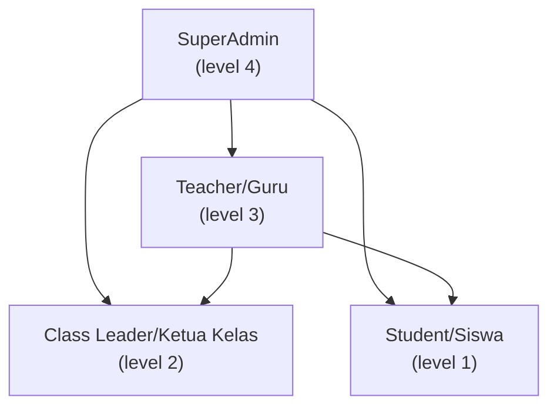
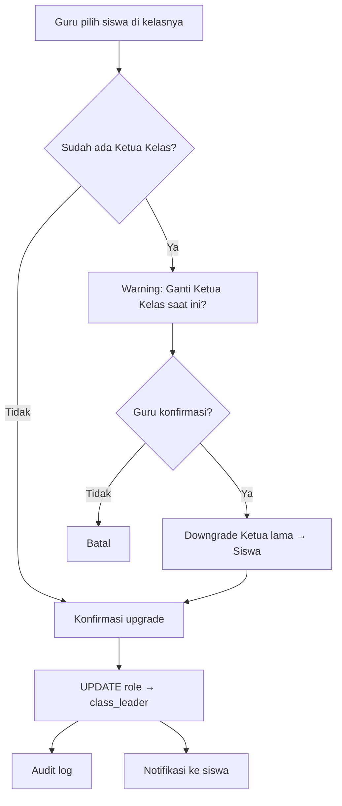
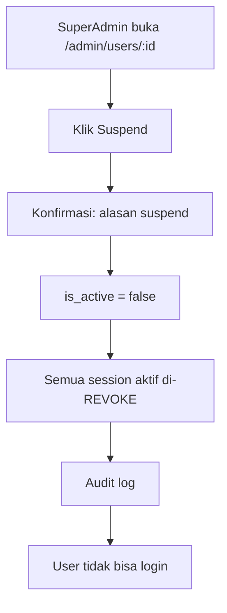
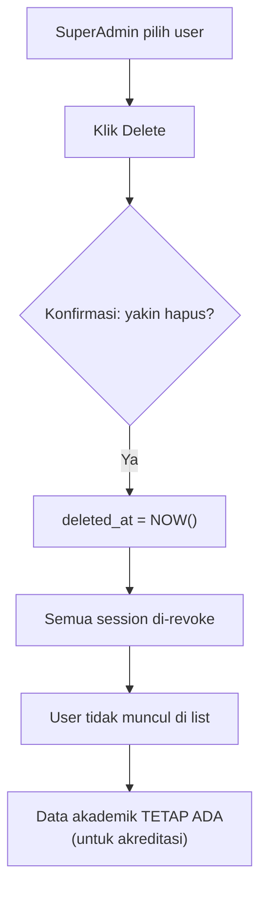

# 🔄 Role Management Flow — AkuBelajar

> Pengelolaan role pengguna selama siklus hidup akun: upgrade, downgrade, suspend, delete, auto-lifecycle.

---

## 1. Hierarki Role & Permission Matrix

| Aksi | SuperAdmin | Guru | Ketua Kelas | Siswa |
|:---|:---|:---|:---|:---|
| Ubah role Guru | ✅ | ❌ | ❌ | ❌ |
| Upgrade Siswa → Ketua Kelas | ✅ | ✅ (kelasnya) | ❌ | ❌ |
| Downgrade Ketua Kelas | ✅ | ✅ (kelasnya) | ❌ | ❌ |
| Suspend akun | ✅ | ❌ | ❌ | ❌ |
| Soft delete akun | ✅ | ❌ | ❌ | ❌ |
| Ubah role sendiri | ❌ | ❌ | ❌ | ❌ |

---

## 2. Upgrade Siswa → Ketua Kelas

**Batasan:**
- Maks **1 Ketua Kelas per kelas per tahun ajaran aktif**
- Otomatis **downgrade** kembali ke Siswa saat tahun ajaran berakhir

---

## 3. Downgrade Ketua Kelas → Siswa

| Trigger | Siapa | Proses |
|:---|:---|:---|
| Manual oleh Guru | Guru | PUT /users/:id/role |
| Manual oleh Admin | SuperAdmin | PUT /users/:id/role |
| Akhir tahun ajaran | Scheduled job | Cron: June 30 + Dec 31 |

- Data yang dibuat saat jadi Ketua Kelas **tetap tersimpan** (absensi draft, dll.)
- Notifikasi ke user yang bersangkutan

---

## 4. Suspend Akun

- **Hanya SuperAdmin** yang bisa suspend
- Data historis (nilai, absensi) **tetap tersimpan**
- Bisa **reaktivasi** kapan saja: `PUT /users/:id/status { is_active: true }`

---

## 5. Hapus Akun (Soft Delete)

- **Hard delete tidak diizinkan** — data akademik wajib disimpan min 5 tahun
- SuperAdmin bisa akses data historis siswa yang sudah dihapus
- Soft deleted user bisa di-restore (set `deleted_at = NULL`)

---

## 6. Auto Role Lifecycle (Scheduled Jobs)

| Job | Kapan Jalan | Aksi |
|:---|:---|:---|
| Downgrade Ketua Kelas | Akhir tahun ajaran (`academic_years.end_date`) | `class_leader → student` untuk semua KK di tahun ajaran itu |
| Archive siswa lulus | Setelah kelulusan | `is_active = false`, data read-only |
| Cleanup expired tokens | Setiap 1 jam | DELETE expired `invite_tokens` dan `password_reset_tokens` |

**Jika job gagal:**
- Retry 3× dengan exponential backoff
- Alert ke SuperAdmin via notifikasi
- Manual trigger tersedia: `POST /admin/jobs/:job_name/run`

---

*Terakhir diperbarui: 21 Maret 2026*
