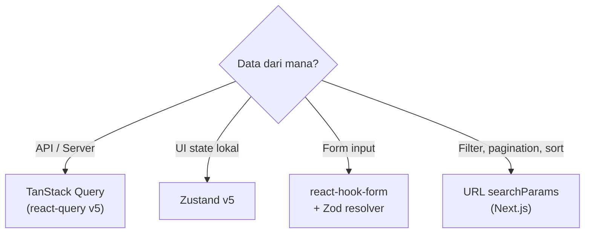

# 🧠 State Management — AkuBelajar

> Arsitektur state management: Zustand (client), TanStack Query (server), react-hook-form (form), URL searchParams.

---

## 1. Prinsip: Kapan Pakai Apa?



| Tipe State | Tool | Contoh |
|:---|:---|:---|
| Server state | TanStack Query | Users list, assignments, grades |
| Client state | Zustand | Sidebar open, theme, notification count |
| Form state | react-hook-form | Create assignment, login form |
| URL state | searchParams | `?page=2&sort=name&role=student` |

---

## 2. Zustand Stores

### authStore

```typescript
interface AuthStore {
  user: User | null;
  isAuthenticated: boolean;
  isOnboarding: boolean;
  
  setUser: (user: User) => void;
  clearAuth: () => void;
}

// Persistence: NONE (token di httpOnly cookie)
```

### uiStore

```typescript
interface UIStore {
  sidebarOpen: boolean;
  theme: 'light' | 'dark';
  activeNotifCount: number;
  
  toggleSidebar: () => void;
  setTheme: (t: 'light' | 'dark') => void;
  setNotifCount: (n: number) => void;
}

// Persistence: localStorage (theme only)
```

### quizSessionStore

```typescript
interface QuizSessionStore {
  sessionId: string | null;
  quizId: string | null;
  currentIndex: number;
  answers: Map<string, string>;     // questionId → selectedKey
  timeRemaining: number;            // seconds
  status: 'idle' | 'active' | 'locked' | 'submitted';
  
  initSession: (data: SessionData) => void;
  answerQuestion: (qId: string, key: string) => void;
  nextQuestion: () => void;
  prevQuestion: () => void;
  setTime: (seconds: number) => void;
  submitSession: () => void;
}

// Persistence: sessionStorage (survive refresh, not close tab)
```

### notificationStore

```typescript
interface NotificationStore {
  unreadCount: number;
  recentNotifs: Notification[];
  
  addNotification: (n: Notification) => void;
  markAsRead: (id: string) => void;
  setUnreadCount: (n: number) => void;
}
```

---

## 3. TanStack Query Patterns

### Query Key Convention

```typescript
// Format: ['entity', 'action', { params }]
['users', 'list', { page: 1, role: 'student' }]
['assignments', 'detail', { id: 'uuid' }]
['grades', 'my', { semester: 1 }]
['notifications', 'list', { page: 1 }]
```

### Cache & Stale Time

| Entity | Stale Time | Cache Time | Rationale |
|:---|:---|:---|:---|
| User profile | 5 min | 30 min | Rarely changes |
| Assignments list | 1 min | 10 min | Teacher may publish anytime |
| Quiz sessions | 0 (always stale) | 0 | Real-time critical |
| Grades | 5 min | 30 min | Changes infrequently |
| Notifications | 30 sec | 5 min | Near real-time needed |

### Mutation + Cache Invalidation

```typescript
const createAssignment = useMutation({
  mutationFn: (data: CreateAssignmentInput) => api.post('/assignments', data),
  onSuccess: () => {
    // Invalidate assignments list cache
    queryClient.invalidateQueries({ queryKey: ['assignments', 'list'] });
    toast.success('Tugas berhasil dibuat');
  },
});
```

### Optimistic Updates

```typescript
const markNotifRead = useMutation({
  mutationFn: (id: string) => api.put(`/notifications/${id}/read`),
  onMutate: async (id) => {
    // Cancel outgoing refetches
    await queryClient.cancelQueries({ queryKey: ['notifications'] });
    // Snapshot previous value
    const prev = queryClient.getQueryData(['notifications']);
    // Optimistically update
    queryClient.setQueryData(['notifications'], (old) =>
      old.map(n => n.id === id ? { ...n, is_read: true } : n)
    );
    return { prev };
  },
  onError: (err, id, ctx) => {
    queryClient.setQueryData(['notifications'], ctx.prev); // Rollback
  },
});
```

---

## 4. Loading, Error, Empty States

| Component | Usage |
|:---|:---|
| `<PageSkeleton />` | Full page loading (initial SSR load) |
| `<TableSkeleton rows={10} />` | Loading tabel data |
| `<CardSkeleton />` | Loading card component |
| `<ErrorBoundary>` | Unexpected JS error (crash) |
| `<ApiError error={e} onRetry={fn} />` | API error with retry button |
| `<EmptyState icon title description action />` | No data to display |

---

## 5. WebSocket → State Updates

```typescript
// hooks/useWebSocket.ts
ws.onmessage = (event) => {
  const msg = JSON.parse(event.data);
  
  switch (msg.type) {
    case 'notification:new':
      // Update Zustand store
      useNotificationStore.getState().addNotification(msg.payload);
      // Invalidate TanStack Query cache
      queryClient.invalidateQueries({ queryKey: ['notifications'] });
      break;
      
    case 'quiz:time_update':
      useQuizSessionStore.getState().setTime(msg.payload.remaining_seconds);
      break;
      
    case 'quiz:force_submit':
      useQuizSessionStore.getState().submitSession();
      queryClient.invalidateQueries({ queryKey: ['quizzes'] });
      break;
      
    case 'grade:published':
      queryClient.invalidateQueries({ queryKey: ['grades'] });
      break;
  }
};
```

---

*Terakhir diperbarui: 21 Maret 2026*
