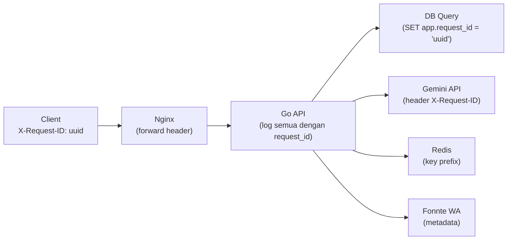

# 📝 Logging Standard — AkuBelajar

> Standar structured logging: format, levels, sensitive data masking, correlation ID, dan retention.

---

## 1. Library & Format

| Item | Detail |
|:---|:---|
| Go backend | `go.uber.org/zap` (structured JSON) |
| Next.js frontend | `pino` (JSON ke server, console ke dev) |
| Output | Stdout (container → Loki) |
| Format | JSON — satu baris per log entry |

---

## 2. Structured Log Format

```json
{
  "level": "info",
  "ts": "2026-03-21T10:15:30.123Z",
  "caller": "handler/auth.go:67",
  "msg": "login_success",
  "request_id": "019516a2-uuid-v7",
  "user_id": "uuid",
  "school_id": "uuid",
  "ip": "103.123.x.x",
  "user_agent": "Chrome/120 Windows",
  "method": "POST",
  "path": "/api/v1/auth/login",
  "status": 200,
  "duration_ms": 245,
  "response_size": 1234
}
```

### Required Fields (Semua Log)

| Field | Type | Sumber |
|:---|:---|:---|
| `level` | string | Log call |
| `ts` | ISO 8601 | Otomatis |
| `caller` | string | Otomatis (file:line) |
| `msg` | string | Log call |
| `request_id` | UUID v7 | Middleware |

### Contextual Fields (Jika Tersedia)

| Field | Type | Sumber |
|:---|:---|:---|
| `user_id` | UUID | Auth context |
| `school_id` | UUID | Auth context |
| `ip` | string | Request |
| `method` | string | Request |
| `path` | string | Request |
| `status` | int | Response |
| `duration_ms` | int | Middleware timer |

---

## 3. Log Level Guidelines

| Level | Production | Kapan Digunakan | Contoh |
|:---|:---|:---|:---|
| `debug` | ❌ | Development: detail teknis | SQL query, full request body |
| `info` | ✅ | Operasi normal berhasil | "User logged in", "Quiz started" |
| `warn` | ✅ | Anomali non-fatal, perlu perhatian | "Rate limit 80%", "AI retry #2" |
| `error` | ✅ | Kegagalan yang harus di-investigate | "DB connection failed", "Panic recovered" |

### Log Level di Production

```go
// cmd/api/main.go
var logger *zap.Logger
if os.Getenv("ENV") == "production" {
    logger, _ = zap.NewProduction() // INFO+
} else {
    logger, _ = zap.NewDevelopment() // DEBUG+
}
```

---

## 4. Sensitive Data Masking

### 🔴 DILARANG di Log

| Data | Contoh |
|:---|:---|
| Password (plain/hash) | `password`, `password_hash`, `argon2id$...` |
| Token | `access_token`, `refresh_token`, `paseto_key` |
| OTP | `123456` |
| Secret key | `GEMINI_API_KEY`, `MINIO_SECRET` |
| Full credit card | — (tidak ada di AkuBelajar, tapi tetap diblokir) |

### ✅ Cara yang Benar

```go
// Mask email: gu***@akubelajar.id
func maskEmail(email string) string {
    parts := strings.Split(email, "@")
    if len(parts[0]) <= 2 { return "***@" + parts[1] }
    return parts[0][:2] + "***@" + parts[1]
}

// Mask phone: +6281****3210
func maskPhone(phone string) string {
    if len(phone) < 8 { return "****" }
    return phone[:4] + strings.Repeat("*", len(phone)-8) + phone[len(phone)-4:]
}

// Mask NISN: 00****5678
func maskNISN(nisn string) string {
    return nisn[:2] + "****" + nisn[6:]
}

// Usage
logger.Info("login_success",
    zap.String("email", maskEmail(user.Email)),
    zap.String("ip", request.IP),
)
```

### Forbidden Patterns Linter

```go
// Tambahkan custom linter rule:
// REJECT: logger.*.("password", ...) / logger.*.("token", ...) / logger.*.("otp", ...)
```

---

## 5. Correlation ID Propagation



```go
// Setiap DB query include request_id
func (r *repo) FindUser(ctx context.Context, id string) (User, error) {
    requestID := ctx.Value("request_id").(string)
    _, _ = r.db.Exec(ctx, "SET LOCAL app.request_id = $1", requestID)
    return r.db.QueryRow(ctx, "SELECT * FROM users WHERE id = $1", id).Scan(...)
}
```

---

## 6. Retention Policy

| Environment | Retention | Storage |
|:---|:---|:---|
| Development | 3 hari | Local stdout |
| Staging | 14 hari | Loki |
| Production | 90 hari | Loki + S3 archive |

---

*Terakhir diperbarui: 21 Maret 2026*
