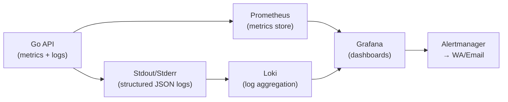

# 📊 Monitoring & Observability — AkuBelajar

> Metrics, logging, alerting, dan tracing agar production bisa di-debug dan dipantau.

---

## 1. Stack Observability



---

## 2. Metrics (Prometheus)

### Application Metrics

| Metric | Type | Label | Deskripsi |
|:---|:---|:---|:---|
| `http_requests_total` | Counter | method, path, status | Total HTTP request |
| `http_request_duration_seconds` | Histogram | method, path | Latency per endpoint |
| `active_websocket_connections` | Gauge | — | WS connections aktif |
| `quiz_sessions_active` | Gauge | — | Ujian yang sedang berjalan |
| `ai_generation_total` | Counter | status (success/fail) | AI quiz generation attempts |
| `ai_generation_duration_seconds` | Histogram | — | AI response time |
| `notification_sent_total` | Counter | channel, status | Notifikasi terkirim per channel |
| `file_upload_total` | Counter | status, type | Upload file |
| `db_query_duration_seconds` | Histogram | query_name | DB query latency |
| `login_attempts_total` | Counter | status (success/fail/locked) | Login attempts |

### Go Implementation

```go
import "github.com/prometheus/client_golang/prometheus"

var httpRequestsTotal = prometheus.NewCounterVec(
    prometheus.CounterOpts{
        Name: "http_requests_total",
        Help: "Total HTTP requests",
    },
    []string{"method", "path", "status"},
)

// Middleware
func PrometheusMiddleware() gin.HandlerFunc {
    return func(c *gin.Context) {
        start := time.Now()
        c.Next()
        duration := time.Since(start).Seconds()
        
        httpRequestsTotal.WithLabelValues(c.Request.Method, c.FullPath(), strconv.Itoa(c.Writer.Status())).Inc()
        httpRequestDuration.WithLabelValues(c.Request.Method, c.FullPath()).Observe(duration)
    }
}
```

### Endpoint

```
GET /metrics  — Prometheus scrape target (internal only, tidak exposed ke public)
```

---

## 3. Structured Logging

### Format (JSON)

```json
{
  "level": "info",
  "ts": "2026-03-21T10:00:00.000Z",
  "caller": "handler/quiz.go:45",
  "msg": "quiz session started",
  "request_id": "019516a2-uuid",
  "user_id": "uuid",
  "school_id": "uuid",
  "quiz_id": "uuid",
  "ip": "103.123.x.x",
  "duration_ms": 45
}
```

### Log Level Guidelines

| Level | Kapan Digunakan | Contoh |
|:---|:---|:---|
| `debug` | Development only | SQL query, request body |
| `info` | Normal operations | "User logged in", "Quiz started" |
| `warn` | Anomali non-fatal | "Rate limit almost reached", "Retry AI call" |
| `error` | Kegagalan yang harus di-investigate | "DB connection failed", "AI generation failed" |

### Sensitive Data Masking

```go
// ✅ WAJIB — Mask data sensitif
logger.Info("login_attempt", zap.String("email", maskEmail(email)))
// Output: "email": "gu***@akubelajar.id"

// ❌ DILARANG
logger.Info("login", zap.String("password", password))
logger.Info("token", zap.String("jwt", token))
```

### Correlation ID

Setiap request harus memiliki `request_id` yang di-propagate ke semua log, DB query, dan external API call:

```go
func RequestIDMiddleware() gin.HandlerFunc {
    return func(c *gin.Context) {
        requestID := c.GetHeader("X-Request-ID")
        if requestID == "" {
            requestID = uuid.NewV7().String()
        }
        c.Set("request_id", requestID)
        c.Header("X-Request-ID", requestID)
        c.Next()
    }
}
```

---

## 4. Health Check Endpoints

| Endpoint | Scope | Response |
|:---|:---|:---|
| `GET /health` | Liveness: "app berjalan" | `200 { "status": "ok" }` |
| `GET /health/ready` | Readiness: "DB + Redis + MinIO connected" | `200` atau `503` |

```go
func HealthReady(c *gin.Context) {
    checks := map[string]error{
        "postgres": db.PingContext(ctx),
        "redis":    redis.Ping(ctx).Err(),
        "minio":    minio.BucketExists(ctx, "akubelajar-files"),
    }
    
    allOK := true
    status := map[string]string{}
    for name, err := range checks {
        if err != nil {
            status[name] = "unhealthy: " + err.Error()
            allOK = false
        } else {
            status[name] = "healthy"
        }
    }
    
    if !allOK {
        c.JSON(503, gin.H{"status": "unhealthy", "checks": status})
        return
    }
    c.JSON(200, gin.H{"status": "healthy", "checks": status})
}
```

---

## 5. Alerting Rules

| Alert | Kondisi | Severity | Notif Ke |
|:---|:---|:---|:---|
| API Down | `/health` fail > 1 menit | 🔴 Critical | WA + Email admin |
| High Error Rate | 5xx > 5% dari total dalam 5 menit | 🔴 Critical | WA admin |
| High Latency | P95 > 3 detik selama 5 menit | 🟡 Warning | Email admin |
| DB Connection Pool Full | Active conn > 90% pool | 🟡 Warning | Email admin |
| Disk Space Low | > 80% used | 🟡 Warning | Email admin |
| Quiz Session Anomaly | > 50 sessions locked dalam 1 jam | 🟡 Warning | WA admin |
| AI API Quota | Usage > 80% monthly limit | 🟡 Warning | Email admin |

---

## 6. Grafana Dashboards

### Dashboard 1: API Overview

- Request rate (req/sec) by endpoint
- Error rate (%) by endpoint
- P50, P95, P99 latency
- Active WebSocket connections

### Dashboard 2: Business Metrics

- Quiz sessions active (real-time)
- Logins per hour
- Submissions per hour
- AI generation success rate
- Notification delivery rate per channel

### Dashboard 3: Infrastructure

- CPU / Memory per container
- DB connections (active vs pool)
- Redis memory usage
- MinIO storage usage per school

---

*Terakhir diperbarui: 21 Maret 2026*
