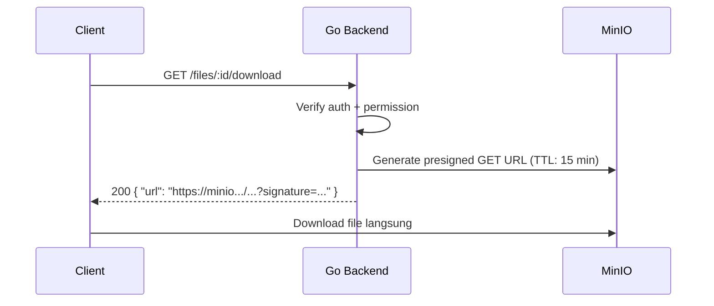
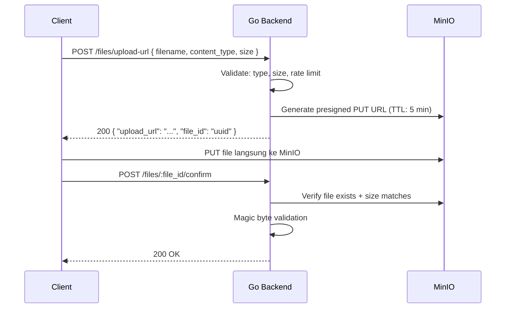
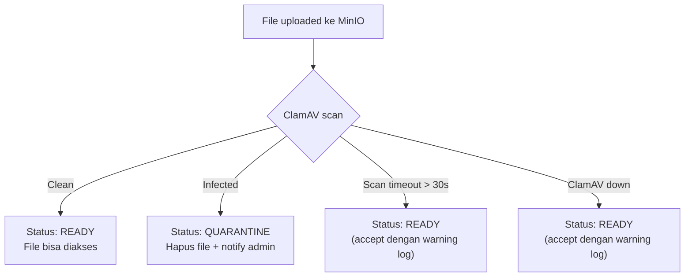

# 📁 File Upload Security — AkuBelajar

> Proteksi file upload: magic byte validation, signed URL workflow, rate limiting, malware scan, cleanup.

---

## 1. Validasi File di Backend (Go)

### Magic Bytes Detection

**Jangan percaya Content-Type dari client** — selalu detect dari isi file:

| Type | Extension | Magic Bytes (hex) |
|:---|:---|:---|
| JPEG | .jpg/.jpeg | `FF D8 FF` |
| PNG | .png | `89 50 4E 47 0D 0A 1A 0A` |
| WebP | .webp | `52 49 46 46 ...  57 45 42 50` |
| PDF | .pdf | `25 50 44 46` (`%PDF`) |
| ZIP | .zip | `50 4B 03 04` |
| DOCX | .docx | `50 4B 03 04` (ZIP-based, check internal) |
| PPTX | .pptx | `50 4B 03 04` (ZIP-based, check `[Content_Types].xml`) |

```go
func ValidateFileType(file io.Reader, expectedExt string) error {
    buf := make([]byte, 512)
    n, _ := file.Read(buf)
    
    detectedType := http.DetectContentType(buf[:n])
    
    allowed := map[string][]string{
        ".jpg":  {"image/jpeg"},
        ".png":  {"image/png"},
        ".webp": {"image/webp"},
        ".pdf":  {"application/pdf"},
        ".zip":  {"application/zip"},
        ".docx": {"application/zip"}, // then check internal structure
    }
    
    validTypes, ok := allowed[expectedExt]
    if !ok { return ErrInvalidFileType }
    
    for _, t := range validTypes {
        if detectedType == t { return nil }
    }
    return ErrMismatchedContent
}
```

### Additional Checks

- **Reject** jika extension tidak cocok dengan actual content
- **Strip EXIF** metadata dari gambar (privacy + potential exploit)
- **Size limits** per endpoint:
  - Avatar: 2 MB
  - Assignment submission: 20 MB/file
  - Bukti izin: 5 MB

---

## 2. Penamaan & Penyimpanan

| Rule | Detail |
|:---|:---|
| Rename | **Selalu** — tidak pernah simpan nama asli |
| Format | `{uuid_v7}.{ext_lowercase}` |
| Path MinIO | `{bucket}/{school_id}/{entity_type}/{entity_id}/{filename}` |
| Public access | ❌ Tidak ada — semua via **signed URL** |

Contoh path:
```
akubelajar-files/
  school-uuid-123/
    submissions/
      assignment-uuid-456/
        019516a2-uuid-v7.pdf
```

---

## 3. Signed URL Workflow

### Download



### Upload (Presigned PUT)



---

## 4. Rate Limiting Upload

| Limit | Nilai |
|:---|:---|
| Max upload per user per jam | 20 file |
| Max storage per sekolah | **1 GB** (Supabase Storage free tier — upgrade ke 10GB saat production) |
| Alert admin | Storage > 80% |
| Response jika limit | `429 Too Many Requests` |

---

## 5. Malware Scanning (ClamAV)



- Scan berjalan **async** setelah upload
- File berstatus `QUARANTINE` sampai scan selesai
- Jika scan gagal/timeout: **accept** file (bisnis harus tetap jalan) tapi log warning

---

## 6. Cleanup

| Skenario | Aksi | Kapan |
|:---|:---|:---|
| File orphan (upload tapi tidak di-attach) | Hapus dari MinIO | Scheduled job: setiap 24 jam |
| Entity di-soft-delete | File **tetap ada** selama 90 hari | Scheduled job: setiap 7 hari |
| Setelah 90 hari soft-delete | Hapus file fisik | Scheduled job |

---

*Terakhir diperbarui: 21 Maret 2026*
