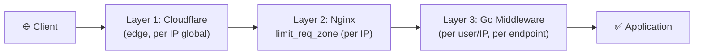

# ⏱️ Rate Limit Policy — AkuBelajar

> Kebijakan rate limiting per endpoint dengan layered defense.

---

## 1. Strategi

| Item | Detail |
|:---|:---|
| Algoritma | Token Bucket (burst-friendly) |
| Koordinasi | Redis sebagai shared counter |
| Key (authenticated) | `user_id + endpoint` |
| Key (unauthenticated) | `IP + endpoint` |
| Response | HTTP 429 + `Retry-After` header |

---

## 2. Limit per Endpoint

| Endpoint | Limit | Window | Key | Burst | Notes |
|:---|:---|:---|:---|:---|:---|
| `POST /auth/login` | 5 | 1 menit | IP | 2 | Account lockout setelah 5× gagal |
| `POST /auth/password-reset/request` | 3 | 1 jam | IP | 0 | Anti brute-force OTP |
| `POST /auth/password-reset/verify` | 5 | 1 menit | token | 0 | Anti brute-force OTP |
| `POST /invite-tokens/claim` | 10 | 1 jam | IP | 2 | — |
| `POST /quizzes/generate-ai` | 10 | 1 jam | user_id | 2 | Gemini API cost |
| `POST */submissions` (upload) | 20 | 1 jam | user_id | 5 | Storage cost |
| `GET /api/*` (general read) | 120 | 1 menit | user_id | 20 | — |
| `POST/PUT/DELETE /*` (write) | 30 | 1 menit | user_id | 5 | — |
| WebSocket connections | 3 | simultaneous | user_id | 0 | Max concurrent |

---

## 3. Layer Rate Limiting



| Layer | Scope | Menangani |
|:---|:---|:---|
| **Cloudflare** | Global per IP | DDoS, bot traffic |
| **Nginx** | Per IP, general | Burst protection, connection limits |
| **Go middleware** | Per user + endpoint | Business logic limits |

---

## 4. Response Format (HTTP 429)

```http
HTTP/1.1 429 Too Many Requests
Content-Type: application/json
Retry-After: 30
X-RateLimit-Limit: 5
X-RateLimit-Remaining: 0
X-RateLimit-Reset: 1711043400

{
  "error": {
    "code": "SYS_006",
    "message": "Terlalu banyak permintaan. Silakan coba lagi dalam 30 detik.",
    "details": [],
    "request_id": "019516a2-uuid"
  }
}
```

---

## 5. Whitelist & Bypass

| Skenario | Mekanisme |
|:---|:---|
| Health check (`GET /health`) | Skip semua rate limit |
| Monitoring (Prometheus scrape) | IP whitelist di Nginx |
| SuperAdmin bulk import | Elevated limit: 500/hour |
| Internal service-to-service | API key + skip rate limit |

---

*Terakhir diperbarui: 21 Maret 2026*
