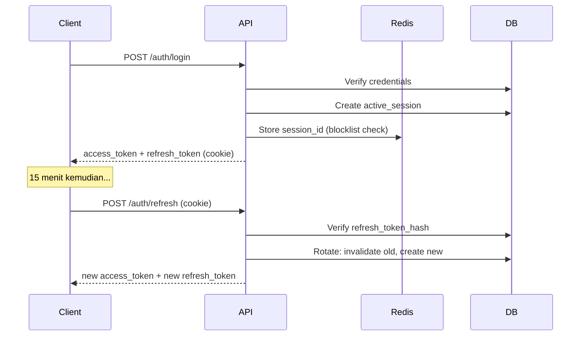

# 🔐 Session & Token Specification — AkuBelajar

> Spesifikasi lengkap pengelolaan session dan token Paseto v4 di seluruh sistem.

---

## 1. Token Lifecycle

### Access Token (Paseto v4 Local)

| Property | Nilai |
|:---|:---|
| Type | Paseto v4.local (symmetric encryption) |
| TTL | 15 menit |
| Storage (client) | Memory only (BUKAN localStorage/sessionStorage) |
| Payload | `user_id, role, school_id, session_id, iat, exp` |

### Refresh Token

| Property | Nilai |
|:---|:---|
| TTL (remember me OFF) | 24 jam |
| TTL (remember me ON) | 7 hari |
| Storage (client) | `httpOnly` + `Secure` + `SameSite=Strict` cookie |
| Rotation | Di-rotate setiap kali digunakan (single-use) |



---

## 2. Concurrent Session Management

| Setting | Nilai |
|:---|:---|
| Max device per user | **3** ✅ |
| Saat melebihi batas | Oldest session di-revoke |
| User bisa lihat sessions | ✅ `GET /users/me/sessions` |
| User bisa revoke session | ✅ `DELETE /users/me/sessions/:id` |

### Schema: active_sessions

```sql
CREATE TABLE active_sessions (
    id                  UUID PRIMARY KEY DEFAULT gen_random_uuid(),
    user_id             UUID NOT NULL REFERENCES users(id),
    refresh_token_hash  VARCHAR(255) NOT NULL,
    device_info         JSONB,    -- {"browser":"Chrome","os":"Windows","device":"Desktop"}
    ip_address          INET,
    is_remember_me      BOOLEAN DEFAULT FALSE,
    expires_at          TIMESTAMPTZ NOT NULL,
    created_at          TIMESTAMPTZ DEFAULT NOW()
);
```

---

## 3. Token Revocation

### Kapan Di-Revoke

| Event | Scope | Mekanisme |
|:---|:---|:---|
| Logout | Session ini saja | Delete dari `active_sessions` + blocklist di Redis |
| Ganti password | **Semua** session | Delete all + blocklist all |
| Admin suspend | **Semua** session | Delete all + blocklist all |
| Admin ubah role | **Semua** session | Delete all + blocklist all |
| "Logout semua device" | **Semua** session | Delete all + blocklist all |

### Redis Blocklist

```
Key:   "blocked:{session_id}"
Value: "1"
TTL:   sisa TTL access token (max 15 menit)
```

### Middleware Validation Flow

```go
func AuthMiddleware() gin.HandlerFunc {
    return func(c *gin.Context) {
        // 1. Extract token from Authorization header
        token := extractBearerToken(c)
        
        // 2. Verify Paseto signature + expiry
        claims, err := paseto.Verify(token, symmetricKey)
        if err != nil { return Unauthorized(c) }
        
        // 3. Check blocklist (Redis)
        blocked, _ := redis.Exists(ctx, "blocked:"+claims.SessionID)
        if blocked { return Unauthorized(c) }
        
        // 4. Set context
        c.Set("user_id", claims.UserID)
        c.Set("role", claims.Role)
        c.Set("school_id", claims.SchoolID)
        c.Next()
    }
}
```

---

## 4. Remember Me

| Checkbox State | Refresh Token TTL | Trusted? |
|:---|:---|:---|
| ❌ Tidak centang | 24 jam | Session cookie (hilang saat browser tutup) |
| ✅ Centang | 7 hari | Persistent cookie (device trusted) |

---

## 5. Security Events → Auto-Revoke

| Event | Aksi |
|:---|:---|
| Ganti password (manual/reset) | Revoke semua session kecuali current |
| Admin suspend akun | Revoke semua session |
| Admin ubah role | Revoke semua session |
| Login dari IP sangat berbeda dalam waktu singkat | **Warning** — kirim notifikasi ke user, bukan auto-revoke (menghindari false positive di jaringan seluler Indonesia yang sering ganti IP) |
| User klik "Logout semua device" | Revoke semua session |

---

## 6. Paseto v4 Implementation

```go
import "github.com/o1ecc8o/paseto"

func GenerateAccessToken(user User, sessionID string) (string, error) {
    now := time.Now()
    claims := paseto.JSONToken{
        Issuer:     "akubelajar",
        Subject:    user.ID.String(),
        IssuedAt:   now,
        Expiration: now.Add(15 * time.Minute),
    }
    claims.Set("role", string(user.Role))
    claims.Set("school_id", user.SchoolID.String())
    claims.Set("session_id", sessionID)

    return paseto.Encrypt(symmetricKey, claims, nil)
}
```

### Key Management

- Private key disimpan di **HashiCorp Vault**
- Path: `secret/data/akubelajar/paseto-key`
- Key rotation: generate key baru → deploy dengan kedua key aktif → remove old key setelah semua token lama expired (max 15 menit)

---

*Terakhir diperbarui: 21 Maret 2026*
